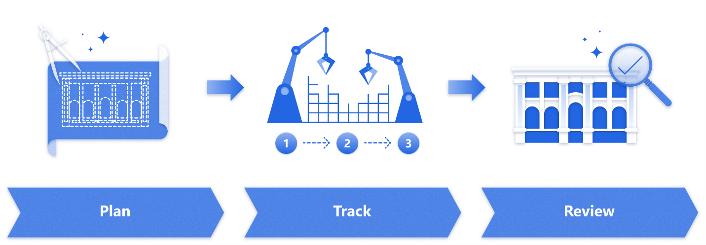
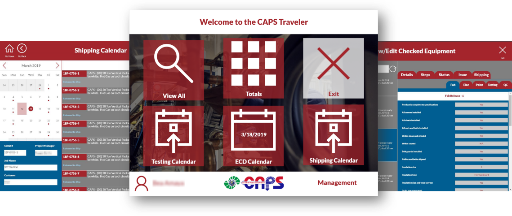
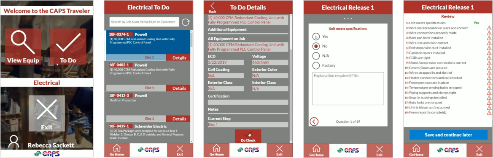
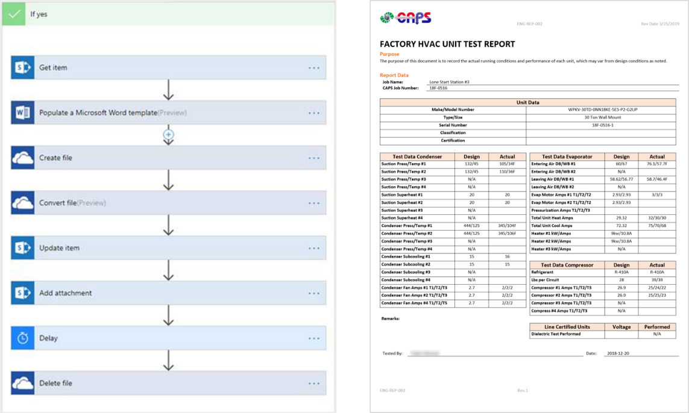
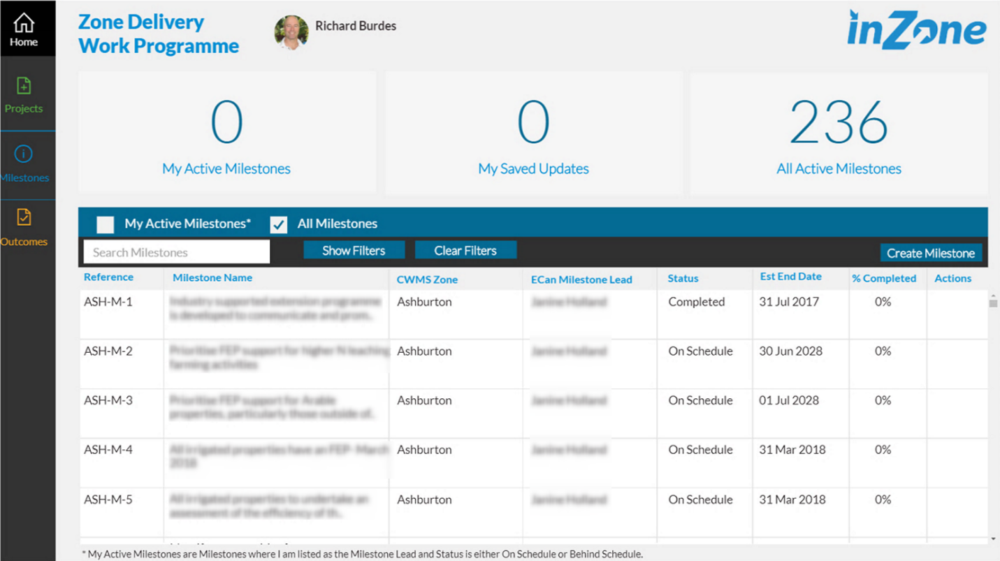
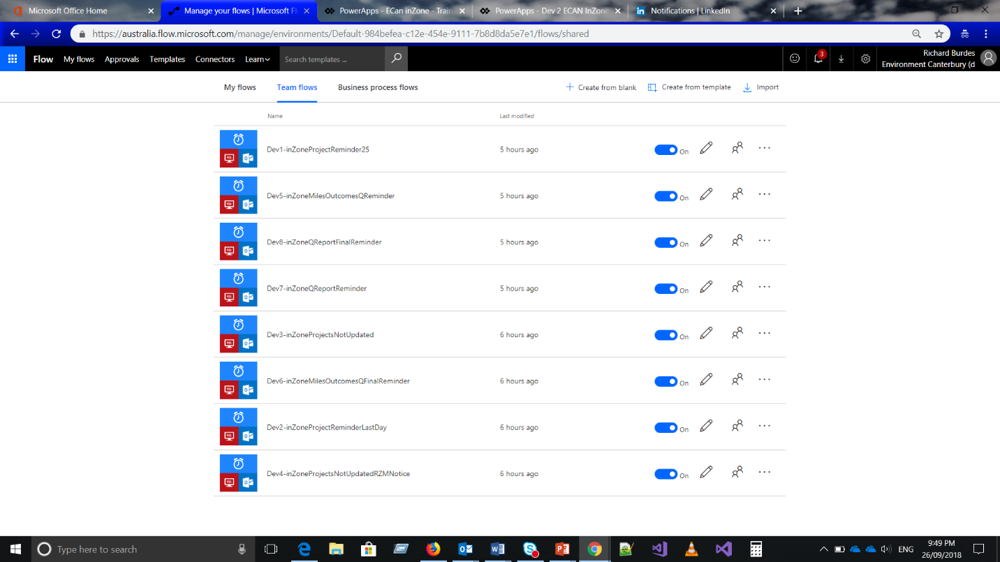
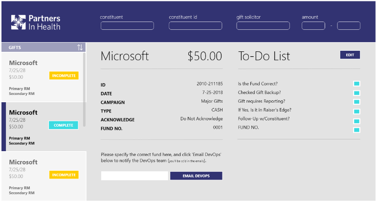
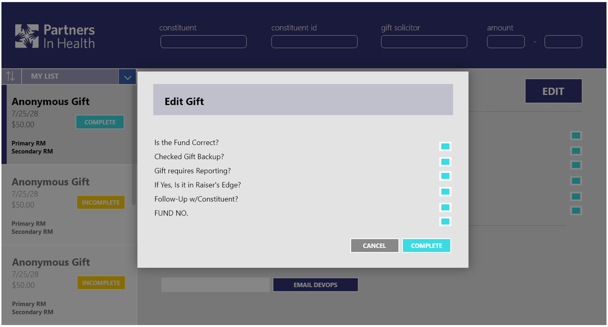
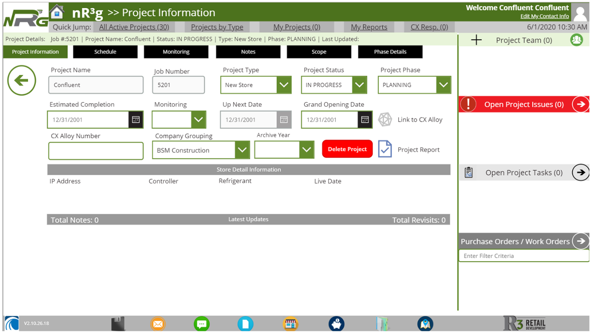
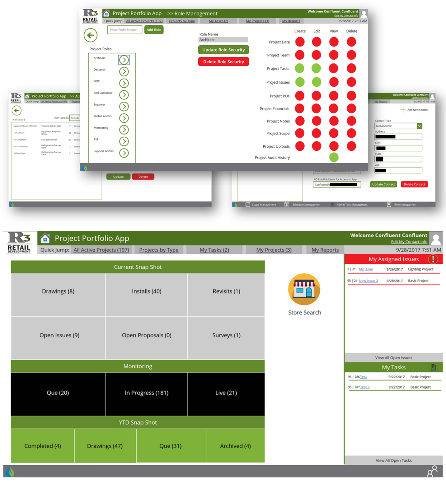

# Pattern: Project management

<!---->

Organizations need a central place to manage multiple projects as they ensure
various teams achieve their goals and meet success criteria as planned.

Some common use cases for project management include managing new product
ideas, creating project plans and tracking milestones, and team performance management.

Microsoft Power Platform provides a no-code, low-code solution for organizations to create
easy-to-use solutions to manage projects throughout their lifecycle. This article provides
several real-world examples of how customers have used Microsoft Power Platform to create
efficient project management applications and workflows.

## How to recognize the project management pattern

Business groups within organizations see the need for a tool to manage projects,
track progress, and monitor outcomes.

In a typical project management scenario, you:

1. Plan your work to manage ideas, plans, tasks, and milestones.

2. Track progress against the plan, notify stakeholders of project status, and escalate blockers if needed.

3. Review progress, monitor outcomes, and visualize key aspects of the progress of the project.

## How customers are using the project management pattern

### Custom Air Products and Services Traveler app

[Read the whole story.](https://powerapps.microsoft.com/blog/custom-air-products-services-manages-hvac-manufacturing-process-using-the-power-platform/)

Custom Air Products & Services, Inc. (CAPS) is a Houston-based provider of
heating, ventilation, and air conditioning (HVAC) solutions that specializes in
the design, construction, installation, modification, and servicing of air
conditioning equipment in both the industrial and commercial segments of the
HVAC industry.

The CAPS Project Management team needed a customized solution to track the
entire lifecycle of HVAC units as they passed through the manufacturing process,
with a focus on quality construction. The solution needed to be customized to
meet the needs of each department, and to track quality checks and allow for
respective owners to sign off on each stage in the process. Moreover, the team
wanted to empower anyone in the organization to report on issues via their
mobile devices. One of the key problems they were facing was that the "traveler"
document&mdash;a paper document that was used to track quality checks&mdash;was getting lost.

Rebecca Sackett, a data analyst assistant, found Power Apps in her Office
365 subscription and began experimenting with creating apps against SharePoint
lists to replace manual processes. She built a Power Apps solution to digitize the
traveler document, named CAPS Traveler. Project managers and stakeholders use the main Traveler management app to get an overview of all active projects, see key statistics, and manage the testing and shipping calendars.

Project managers initiate projects and add details for each required step, such as Fab,
Paint, Electrical, and Testing. Personnel from each department then use a
companion mobile app that has been custom-built with specific questions for their
department. Later, the central team collates the data and uses the reports to
identify common reasons why a particular step wasn't done.

There are ten such sign-off apps in addition to the main management app, and they all
read and write data to the same set of SharePoint lists. After all the steps are
completed, someone on the Quality Control team performs a final sign-off. A
flow is then automatically triggered to generate a PDF report.

### Environment Canterbury InZone app

[Read the whole story.](https://powerapps.microsoft.com/blog/environment-canterbury-speeds-up-outcome-tracking-with-the-power-platform/)

Environment Canterbury (ECan) works in partnership with the communities of
Canterbury, New Zealand, on long-term environmental outcome programs that consist of multiple
milestones and related projects. They needed an affordable solution that
would provide greater consistency across projects, higher levels of visibility,
and quicker access to data.

Using an app, freshwater zone managers and project participants can view the status of their projects.
All projects are tagged with the zone and specific milestones, and all
milestones are tagged with the long-term outcomes. The app provides a customized
color scheme, which makes it easy to differentiate and navigate between
projects, milestones, and outcomes. All screens for projects are green,
milestones are blue, and outcomes are orange.

Notifications are sent to prompt data updates and provide escalations if
projects aren't updated at the required time. The flows are also used to call
specific views and generate HTML table&ndash;based digest emails listing all items
relating to a specific person in a single email.

### Partners In Health Gift Review app

[Read the whole story.](https://customers.microsoft.com/story/775258-partners-in-health-nonprofit-power-apps)

Partners In Health (PIH) relies on individual donors for about half of its
funding each year, while the other half comes mainly from government grants,
corporations, and foundations. The nonprofit has about 10 gift officers who are
responsible for stewarding 1,000-plus of their most generous individual donors. PIH
wanted to improve the gift officers' ability to manage their portfolios by
showing them gifts as they arrive and by giving officers a 360-degree view of
their donor portfolios.

Bella Chih-Ning, Analytics and Applications manager at PIH, built a Gift Review
app and dashboard for gift officers to manage and visualize many aspects of
donations. With the Gift Review app, gift officers can view donations
immediately as they come in, add relevant notes, and ensure that the donations are
assigned to the appropriate fund. This creates a To-Do List checklist where the
gift officer reviews the donation to ensure it's assigned to the appropriate
campaign, coded to the correct gift type, and assigned to the right fund. The
gift officer can email questions to the PIH DevOps team directly within the app.
After everything is clear, the gift officers mark the checklist as "done," which
becomes visible to their managers.

"The App in a Day training really opened my eyes to how easy it can be to build
tools that streamline processes and empower our colleagues to be better at their
jobs," says Bella Chih-Ning.

### R3 Retail Project Portfolio app

[Read the whole story.](https://customers.microsoft.com/story/809496-r3-retail-development)

The company R3 Retail Development provides deep expertise in project management
consulting to maximize profits for supermarket, grocery, food processing,
commercial, retail, and small industrial customers across the United States. R3
needed a highly customized approach for its end-to-end project management needs.

The Project Portfolio app was built within just 120 hours and now manages more
than 200 projects. R3 project managers and the regional store managers that they
serve now use the new Project Portfolio app. The app has a rich set of
capabilities that include:

- A dashboard that displays summary stats based on the signed-in user.

- Project tracking information including dates, tasks, issues, purchase
    orders, and people.

- IP address tracking for all installed devices, such as refrigerators.

- File-uploading capabilities for documents like architectural files for HVAC
    systems.

- Extensive custom business logic, such as automatically setting date values
    based on status entries.

Administrators can assign security clearances to specific app users according to
their roles. Administrators can also configure the list of task types and
the expected time for each task, which in turn is used to generate due dates
automatically.

R3 uses [Power Automate](https://flow.microsoft.com/) to send automated
notifications and reminders. All data is stored in Microsoft Dataverse.

### Capitol Music Group scheduling tools

[Read the whole story.](https://customers.microsoft.com/story/768079-capitol-records-media-entertainment-power-platform)

Capitol Music Group (CMG) saw an opportunity to modernize its marketing workflow
and scheduling tools, previously built using InfoPath. A business-critical app
managed schedules for new releases, and&mdash;over time&mdash;evolved to capture data for
different types of releases and media. CMG wanted to automate routine processes,
broaden visibility and collaboration between partner labels, and adapt more quickly to
new marketing channels online. But its Capitol Scheduling app had become deeply
integrated into its process flows and consisted entirely of XML data that
required a lot of tribal knowledge to manage. Wanting a streamlined, low-code
approach to app development and management, CMG ultimately decided to migrate
its app from InfoPath to Microsoft Power Platform, including Power Apps and
Power Automate.

Capitol wanted their teams to use the new scheduling interface to easily
communicate, get approvals, and collaborate on marketing for different types of
releases—be it the physical, digital, or video side of things.

"With Microsoft Power Platform, Capitol has an easy way to share marketing
information across the whole product life cycle," says Karen Reali, Senior Manager at
Universal Music Group. "It even helps them facilitate
and streamline cross-label projects."

[!INCLUDE[footer-include](../../includes/footer-banner.md)]