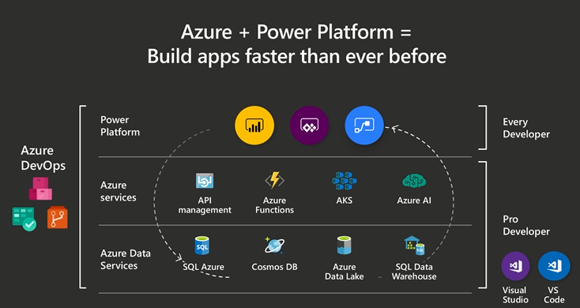
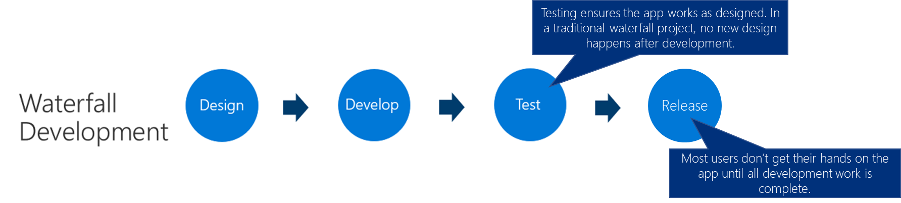
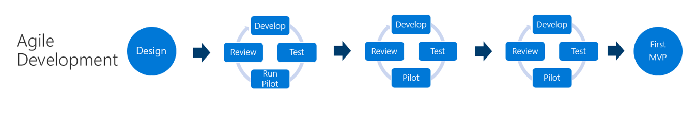
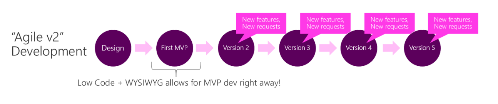

# Differences between Power Apps and traditional app development approaches

Compared to traditional app development, Power Apps projects are different in
two key areas:<!--Suggested.-->

- How various members of the organization work together to create the solution

- Development methodology

## Differences in who develops the app

Power Apps is a platform that benefits both "pro developers" and "citizen
developers."

In a traditional development environment<!--Suggested.-->, only pro developers could be involved with the
actual making of an app. With Power Apps, everyone has the power to build
the apps they need by using advanced functionality that was previously available only to
professional developers. Power Apps "democratizes" the custom business app
building experience by enabling users to build feature-rich, custom business
apps without writing code.

## Differences in development methodology

With traditional app development such as the "waterfall" model, where the process flows downward from the designing phase through release, there's a long lead time
before a user actually sees the working app. As a result, there's an increased risk
that there will be gaps between what the user initially requested as a requirement and what
the app developer created.<!--Suggested.-->

Even with more modern development approaches such as agile development,
a significant amount time can pass<!--Suggested.--> before the first minimum viable product (MVP) is
delivered to users.

With Power Apps, you can quickly create a usable version of your app, because
Power Apps provides a WYSIWYG (what you see is what you get) development
experience. Users experience the actual working app very early in the
development process, and if new requirements arise, new features can be added to
the next version.

