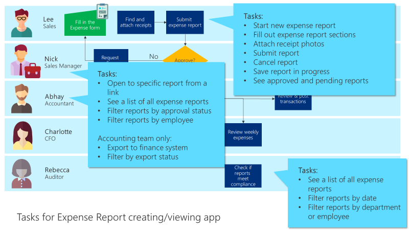

# Identifying the tasks to be done in the app

To identify the tasks that are required in the app, you should refer to the
business process flowchart that you created in the planning phase and add
detail. Organize the information and list the tasks that are to be accomplished
on each screen.

When you write the tasks, remember to consider tasks for each persona who will
be using the screen or app. Try to separate them into sections.

Along with the tasks that users need to do, refer to your notes about what
information is required to complete each task. That will help you define what
information you need to store and display.

If you're working with multiple people, using tools like Microsoft Planner or the
Microsoft Whiteboard app will help you efficiently collaborate and work together on
listing the tasks.

## Example: Tasks for creating and viewing expense reports

We considered the tasks done by people who will be creating and viewing the
expense reports. We'll separately consider the tasks for approvals and for
weekly budget reporting.

Based on the above, we think the expense report create/view app needs these
screens and components:

- A list of reports, with filtering

- A single report view, with edit and view-only modes

- Buttons in the editing view to cancel, save, and submit

- Button for Accounting to use to export data

- Various submit/cancel/save messages

- The ability to attach a photo of a receipt and to view attachments

> [!div class="nextstepaction"]
> [Next step: Sketching the screens](sketching.md)

[!INCLUDE[footer-include](../../includes/footer-banner.md)]