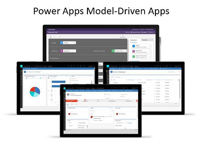
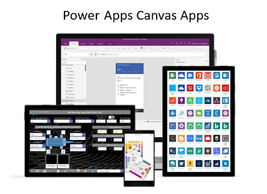
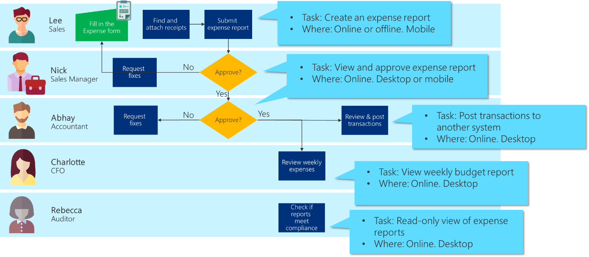
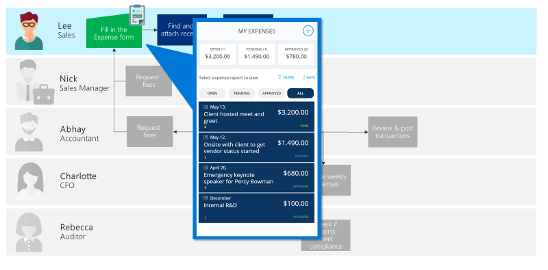
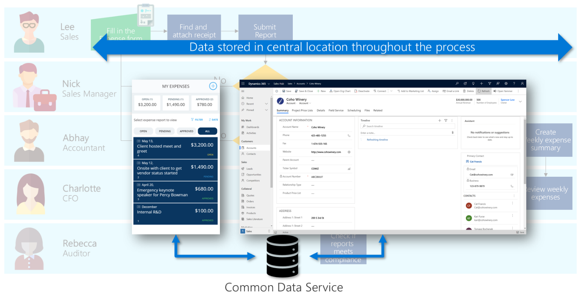

# Determining which type of app to make

In Power Apps, you have two options when creating apps for your employees to
use: model-driven apps and canvas apps.

[This article goes into detail about types of Power Apps apps.](../../maker/index.md)

Here is a basic comparison:

:::row:::
    :::column:::
        
        
        Model-driven apps require a Common Data Service database and are built on top of
the data modeled in that database environment. Model-driven apps views and
detail screens are based on the data structure. Because of this, they offer
users a more consistent look and feel from one screen to the next without much
effort by the creator.

        Model-driven apps are good for scenarios where the [business logic](logic.md) is complex.

        -   Sophisticated data models

        -   Business process management

        -   Track activities associated with the data
    :::column-end:::
    :::column:::
        
        
        Canvas apps on the other hand can be built with or without a Common Data Service
database. They use connectors to access data and services. Canvas apps start
with a blank screen like an artist’s canvas and the creator manually lays out
each screen. This allows the creator to have complete control of placements of
controls on the canvas. 

        Use Canvas apps if the user is expecting a customized user
experience.

        -   Graphical, intuitive interface

        -   Tailor made to user’s required UI

        -   Integration spanning multiple systems using connectors
    :::column-end:::
:::row-end:::

Consider creating a model-driven app unless there is a specific need for a
canvas app. Model-driven apps enable you to make your app quickly because they
don’t require you to build out the UI yourself.

> [!NOTE]
> If you are creating an app to be used by your customers on the web, you
can also create a third type of app: [portal apps](../../maker/portals/overview).

## Building an end-to-end solution with multiple apps

Your business process may require more than one app.

For example, our expense report project has several task sets that are quite
different, so we will consider making several apps. The data they use is the
same, but the user experience is tailored to the specific scenario and personas.

As you can see from the example above, there are multiple types of people
handling the same set of data. Canvas apps would be the best fit for employees
filling in the expense form, which enables people like Lee to submit an expense
report using an attractive mobile app that is intuitive to use and can be used
when offline.

Referring back to the section on [Documenting the business proces](understanding-current-business-process.md), you could see
that Abhay’s requirements were:

-   Must be able to review all expense reports and receipts

-   Responsible for ensuring compliance for every expense report

-   Large volume of work; needs to be able to process information quickly

-   Must be able to report on how expenses are balancing up to the budget

To be able to process large volume of work and process information quickly, the
best fit would be a model-driven app. It allows Abhay to quickly view all of the
details of the submitted expense report, see how it impacts the budget, and look
for related information such as vendor information.

In this example scenario, you can see a combination of both canvas app and
model-driven app. Although they are two different types of apps, all the data
can be centralized to one place (Common Data Service).

