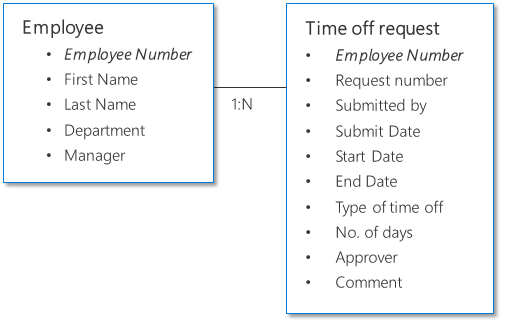

# Data modeling: Designing your data structure

When you're storing or viewing data for your app, an important part of the
design is the data structure. Consider not just how the data will be used in one
specific app or screen but also how others will use the data. Referring back to
your personas, tasks, business process and goals will help you define what data
to store and how to structure it.

> [!TIP]
> Although it was written for the Access database, this article about data
design basics has a good general discussion of data modeling principles: [Database design basics](https://support.office.com/article/Database-design-basics-EB2159CF-1E30-401A-8084-BD4F9C9CA1F5)

Let's take the expense report below as an example.

You see the main part of the expense report, which has to the employee name and
department details. Below the main part of it, you see multiple rows of
descriptions for each purchased item. Let's call these the line items. The line
items have a different structure from the main part of the expense report. So we
can say for every expense report, there are several line items.

To store this kind of data to a database, we need to model the data structure in
the database design.

## One-to-many (1:N) data structure

This is the type of data structure that was described with the example above
with expenses. The main part of the expense report is linked to several line
items. (You can also see the relationship from the perspective of the line
items: many line items to one expense report (N:1).)

## Many-to-many (N:N) data structure

Multiple to multiple data structure is a special type. This is for cases where
multiple records can be associated with multiple set of other records. A good
example would be your network of business partners. You have multiple business
partners (customers and vendors) that you work with, and those business partners
also work with multiple of your colleagues.

## Data modeling examples

There are several types of modeling which could happen with a system. Let's go
through couple of examples below.

### Example 1: Time off approval request

This simple example show two sets of data. One is the employee, and the other is
the time off request. As each employee would submit multiple requests, the
relationship here is one-to-many where “one” is the employee, and “many” is the
request. The employee data and time off request data are related to one another
by having employee number as the common field (also known as the key).

### Example 2: Purchase approval

Here, the data structure is looks quite sophisticated but is very similar to the
expense report example that was used at the beginning of this section. Each
vendor or supplier is associated with multiple purchase orders. Each employee is
in charge of multiple purchase orders, and hence both of these sets of data have
a one to many data structure.

As employees may not always use the same vendor or supplier every time, vendors
are used by multiple employees, and each employee works with multiple vendors.
Hence, the relationship between employees and vendors is many to many.

### Example 3: Expense reporting

