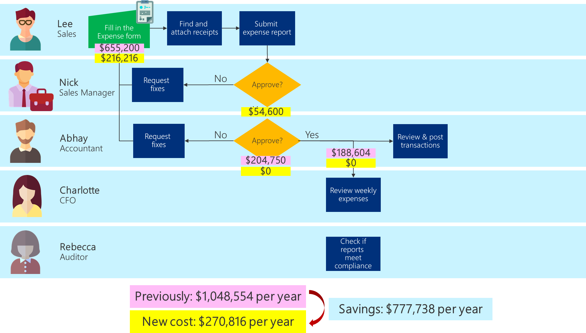

# Defining the business value of solving the problem

Business value falls into one of four categories, easily remembered as
REVO:

- **Revenue**: This solution brings in revenue that wouldn't otherwise be
    realized, through a new line of business or a service that hasn't been
    offered before.

- **Efficiency**: Efficiency is effectively cost savings. This solution
    allows participants who execute the process to do it faster.

- **Volume**: Cost avoidance is achieved by enabling current users to process more
    transactions, in turn avoiding the cost of additional resources.

- **Other**: The solution helps the organization comply with its "must do" requirements, which may result in avoiding financial penalties.

After the category has been defined, we need to define the value that we'll achieve:

- Revenue

  - Determine what will be charged for the service

  - Determine how many customers will buy the service or product

  - Determine the time horizon to measure (monthly, quarterly, annually)

  - Revenue = (price &times; customers) for the time horizon

- Efficiency

  - Determine the number of people doing the job today

  - Determine the amount of direct time they take to do the job today ("old time")

  - Determine the number of people who will do the job after the Microsoft Power
        Platform solution has been built

  - Determine the amount of direct time it will take to use the new solution ("new time")

  - Time savings = old time &ndash; new time (To convert this to dollars, multiply
        the time savings by the fully loaded cost of the people for the time unit you're measuring in (for example, hours).)

- Volume

  - Determine the volume of transactions that a single person can
        process for a certain unit of time ("transactions per person")

  - Determine the volume of transactions that the new solution will be able
        to process in that time ("new transactions per person")

  - Determine the volume of transactions that need to be processed in that time ("volume")

  - Cost avoidance = (volume &divide; transactions per person) &ndash; (volume &divide; new transactions per person) 
        This calculates the number of people who won't have to process
        transactions to achieve the volume processed by the solution.

- Other

  - Determine the penalty that can be avoided by having the information
        captured and available in the solution

If the business value you'll receive by automating the process doesn't compare favorably to
[the cost of doing nothing](worth-automating-process.md), you must ask yourself whether this is the right business problem to focus on.

However, if the business value you receive by solving the business problem is
greater than the cost of doing nothing&mdash;plus your development time and the
monthly cost of any [software license](/power-platform/admin/pricing-billing-skus)&mdash;it makes sense to automate the
process.

## Example: The business value of automating the expense process

In the case of our example app, the main category of business value is efficiency. The new app will reduce
the amount of time it takes to process the same number of expense reports each
week, month, and year. We reviewed the new process and what we'd like the app to
accomplish with our future users. We asked them how much time they expect to save with
the new process and being able to build in some of the rules in the expense
report app.

- We'll still have 140 expense reports being submitted each week; that
    hasn't changed. However, when we talked with the people submitting reports, we
    found that we'd be able to reduce the time they spent down to 20 minutes&mdash;by their
    being able to enter information immediately and take pictures of
    receipts when a receipt was required. The fully loaded cost also remains
    the same.

    >   (140 expense reports a week &times; 20 minutes) &times; \$90/hr = \$4,158 a week = \$216,216 a year

- Nick will be reviewing the expense reports of his team (roughly 100
    salespeople) and estimated that it will take roughly 5 minutes to review
    each expense report. His review is limited to the type of expenses being
    submitted, recognizing that the need for receipts&mdash;and the need to
    include the names of guests at meals and distribute hotel expenses into the
    appropriate categories&mdash;will be controlled by the app.

    >   (100 expense reports a week &times; 5 minutes) &times; \$90/hr = \$750 a week =  \$39,000 a year

- Other managers will review and approve the expense reports from their
    departments going forward, so the remaining 40 expense reports will cost \$15,600 a year.

- The work for Abhay and his team has now shifted to spot checking reports. They shouldn't need
    to do any rework; in fact, Abhay's team might be able to be
    tasked with other activities due to the reduction in effort needed for
    reviewing expense reports.

- We optimized the process to associate the correct general ledger accounting code to each
    of the expense categories. Now Abhay and his team can extract the data to
    create the payment journal, reducing the 40.3 (16.5 for coding + 23.8 for
    posting) hours a week down to a few minutes, saving \$188,604 (\$77,220 for
    coding and \$111,384 for posting) a year. Abhay might be able to task some of his
    team with other, more important, work in his department.

- With the new process, Abhay and his team can consider posting the
    expense reports every day, which will provide Charlotte with an updated view of the
    budget each day and allow her to respond more quickly as budget constraints
    approach.

- The new cost to the company using the automated app is roughly:

    >   \$216,216 + \$39,000 + \$15,600 = \$270,816 a year
    >
    >   Saving the company roughly **\$777,738 each year**

> [!div class="nextstepaction"]
> [Next step: Measuring success](measuring-success.md)

[!INCLUDE[footer-include](../../includes/footer-banner.md)]