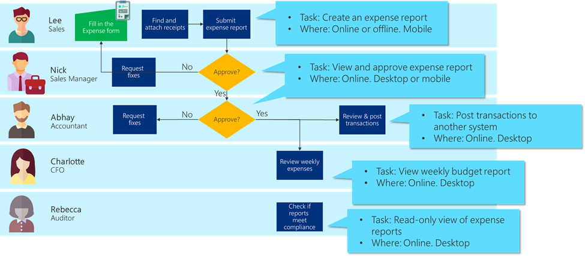

# Defining the project scope

Make sure you scope the project so that you know how much you'll be trying to
achieve from the project. Keep a clear roadmap on what you define as
complete, what is outside the scope (and possibly to be done in the next
version). Your scope directly affects and determines which [features to include and not
to include](prioritizing-features.md) when making the app.

To define the project scope, you should consider the following constraints.

- **Time**: Set a deadline of when you would like to accomplish the project
    objectives. With smaller projects, it could be as little as a few weeks,
    whereas larger projects could take several months.

- **People**: How many people do you have available for the project?

- **Budget**: If you need to account for time spent by you and your
    co-workers, or if you need to hire expertise, you’ll need to establish a
    budget.

- **Feasibility**: You may find you're constrained by available expertise, by
    lack of access to the data you need, or by the amount of change your
    organization has appetite for.

You should also consider what functional pieces you can deliver in usable
chunks. It won’t do anybody any good to get halfway on several things; plan to
deliver each component in a working end-to-end form. Even if it doesn’t yet have
every feature you want, deliver something that can be used. Your project plan
should specify what will be delivered in each phase.

## Example: Expense report project scope

Looking at our business process, we see that it's divided into five main tasks:

1. Creating the expense report

2. Approving the expense report

3. Getting the data into the financial payment system

4. Weekly budget analytics

5. Auditing

We think we have the expertise to create an expense report app and the approvals
process. The auditing requirements seem to have quite a bit of overlap with what
we need for expense report approvals.

After we deliver the creation of expense reports, we think we’ll be ready to
tackle the budget analysis; in fact once we get the data model set up, we should
be able to have our separate team of Power BI experts start on that project in
parallel.

We’re unsure about getting the data directly into the finance system, because it
requires system expertise we don’t have access to right now, so that's
currently outside the scope of the project but will most likely be added in a
later phase.

Always coming back to our overall project mission (“Create a process that's
efficient for employees and the accounting department, allows faster budget
tracking, and reduces our exposure in audits”) we think our project scope is
appropriate.
