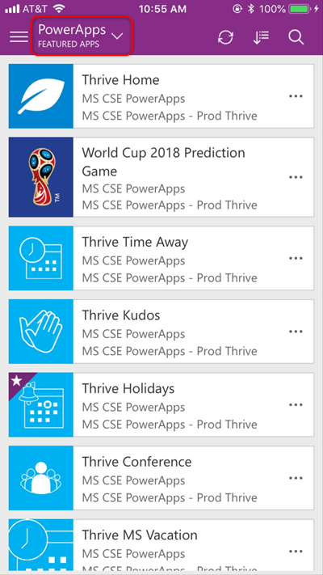
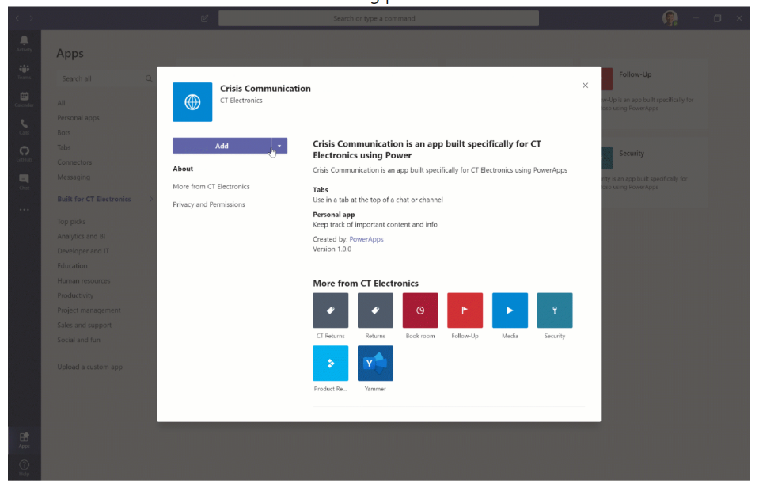

# Making apps discoverable

Congratulations! You made your first app and it’s tested and ready to go!

Completing making the first version of your app is not the end of the Power Apps journey. 
You need to get your app into the hands of your users, by making the app ready for production use. 

After you launch the app, you’ll want to make sure your app is working well and meeting your objectives. In the majority of cases, there will be requests for new features or fixes, or a business process has changed. 

In this section, you will learn how to:
- [Deploy your app](#sharing-the-app) and [help users discover it](#featured-apps)

- Get [feedback](feedback-telemetry.md) and [usage information](feedback-telemetry.md#analyzing-telemetry) to help refine your app

## Sharing the app

Once your app is ready to be used, you need to publish and share it.

Follow the instructions for your app type:

:::row:::
    :::column:::
        **Model-driven apps**

        -   [Publishing a model-driven
    app](../../maker/model-driven-apps/validate-app.md)

        -   [Sharing a model-driven
    app](../../maker/model-driven-apps/share-model-driven-app.md)

    :::column-end:::
    :::column:::
        **Canvas apps**

        -   [Publishing a Canvas
    app](../../maker/canvas-apps/save-publish-app.md)

        -   [Sharing a canvas
    app](../../maker/canvas-apps/share-app.md)

    :::column-end:::
:::row-end:::

After you publish and share the app, it’s important to make sure your apps are
discoverable so that people will start using your apps. There are several ways
of making the apps discoverable as described below.

## Featured Apps

“[Featured
Apps](https://powerapps.microsoft.com/blog/powerapps-discoverability-in-the-enterprise/)”
is a good way of showcasing your app if the app created is intended to be used
for the entire company - such as the employee search, company news etc.

When a user opens the Power Apps mobile player for the first time, they’ll see
the My Apps view, showing any apps that they’ve launched in the past. If this is
their first exposure to Power Apps, this may be a lonely place. A quick tap on
the dropdown at the top reveals different views for ‘All apps’, ‘Sample apps’,
‘Favorites’, and ‘Featured apps’. Getting your enterprise apps into the Featured
App list is a great way to increase your discoverability.

[Read this document to learn how to use PowerShell scripts with Power Apps in
order to set up “Featured
Apps.”](https://docs.microsoft.com/power-platform/admin/powerapps-powershell#power-apps-cmdlets-for-administrators-preview)

## QR Codes

QR codes are the fastest way to get users to install Power Apps apps on their
mobile devices.

iOS devices natively recognize QR codes when using the camera. Android users can
similarly hold the Home button while using the camera to recognize QR codes.

Bing conveniently has a QR code generator where you can paste in a URL and it
will instantly generate a QR code image for you. Right-click the
QR code image, copy it, then paste it into your marketing materials. You can
also create unique URLs and QR codes for each method of communication so you can
measure the effectiveness of your campaigns.

## Deep Linking

Deep linking from one app to another is a great way of letting users know of
apps that are related to their work.

Users can launch the first app and move to the relevant apps without having to
exit the first app, return to the player, and search for another app. It’s
faster and makes the experience more immersive.

To deep link, you can use the [Launch
equation](../../maker/canvas-apps/functions/function-param.md)
and Param equation in Power Apps.

[This blog post explains how to deep
link](https://powerapps.microsoft.com/blog/powerapps-deep-linking/).

## Microsoft Teams

You can embed your Power Apps app as one of the tabs inside of Microsoft Teams.
This is a great way of increasing user satisfaction if this app is to be used in
scenarios that requires going back and forth between Teams and the existing
process.

[Learn how to embedd an app in
Teams](../../maker/canvas-apps/embed-teams-app.md).

## Tie-Ins to Existing Web Apps and Portals

Embedding links to the apps from existing websites and portals also is a good
way of exposing your app.

Using the Param() function to pass on information from the websites / portals
can minimize the need for users to fill in data from whichever website/page they
had come from and can be used to fill in some data or take actions from it
automatically.

## SharePoint Embedding

Power Apps can also be embedded directly into modern SharePoint pages. Not only
does this aid discovery of the app, but the content and the app can be easily
changed independent of each other.

For step-by-step instructions, see [Using the Power Apps Web
Part](https://support.microsoft.com/office/use-the-power-apps-web-part-6285f05e-e441-408a-99d7-aa688195cd1c).

## Microsoft Search in Bing Integration

With Microsoft Search in Bing, you can create a bookmark for your enterprise and
embed Power Apps directly in your search results.

An administrator configures the Bing search engine so that when logged-in
employees in certain groups or locales – or using certain devices – search for
specific terms, they'll get the Power Apps app in a pane at the top of their
search results.
