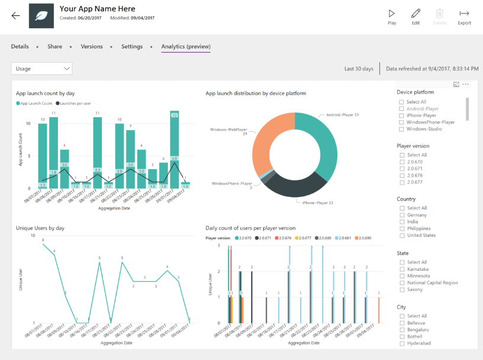
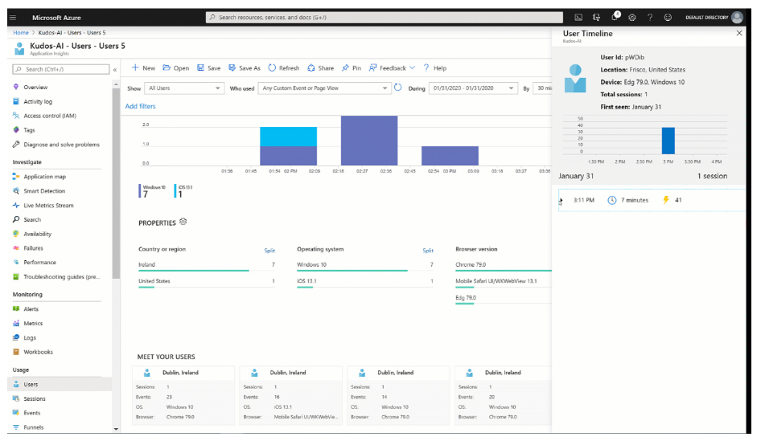

# Collecting feedback and analyzing telemetry

As a way to help you refine and improve your app, collecting feedback and analyzing the
telemetry is an important part of the refining process. Look
back at the goals you set in the planning phase to reflect
on how much the app has contributed.

## Collecting feedback

Providing a place to give feedback ensures your apps will continue to meet user
needs. You can leverage Microsoft Forms and Power Automate to automatically
collect valuable feedback. Forms has Net Promoter Score built in.

## Analyzing telemetry

To ensure healthy app usage, you should leverage the analytics features of the
app. Power Apps analytics provides you information such as:

- Number of active users

- Devices and browsers used

- Locations

- App diagnostics

- Service performance

As an app maker, you can access your analytics by accessing the app usage
report at [https://make.powerapps.com](https://make.powerapps.com). This report is available if you're the owner or co-owner of the canvas
app. Data is available for 30 days for you to view usage information such as app launch
counts, unique users by day, and so on.

If you're an administrator, you can access analytics at the overall tenant level.
More information: [Admin Analytics for Power Apps](/power-platform/admin/analytics-powerapps)

### Adding manual telemetry using Azure Application Insights

You can gain additional insights and telemetry about the app by setting up a
connection to Application Insights, a feature that's part of [Azure Monitor](/azure/azure-monitor/overview).
Some of the telemetry you can gain from setting this up includes:

- Number of active users using the app.

- Location of where the app is used.

- Which screens are used the most.

- User flow from one screen to another.

You can also set up custom telemetry by using the [trace
function](../../maker/canvas-apps/functions/function-trace.md).

[!INCLUDE[footer-include](../../includes/footer-banner.md)]