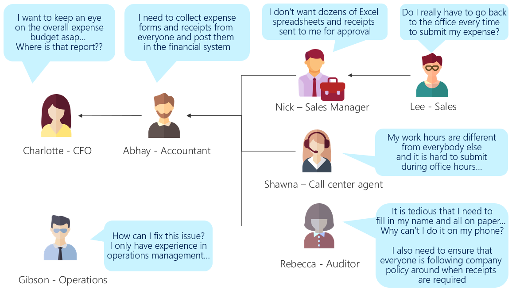

Identifying the business problem to solve (the use case)
========================================================

The first step of using the Power Platform to solve a business problem is
deciding what problem you want to tackle.

In IT terms the ‘Business Problem to Solve’ is commonly referred to as the ‘Use
Case’.

Ask yourself, “what is the business problem I’m trying to solve”? (Be concise on
the name – in many cases this will become the name of the Power Apps app you
build!) When you define the problem, break it down into a problem statement and
the conclusion that you would like to achieve.

For example, “Expense reporting: Create a process that is efficient for
employees and the accounting department, allows faster budget tracking, and
reduces our exposure in audits.”

If you already know exactly what problem you’ve set out to solve, you can skip
on down to the section, *Considering the cost of solving the problem manually*.
If you need some ideas or want to practice on a smaller problem before you
tackle your original inspiration, read on.

What can I do with Power Apps?
------------------------------

If you’re making your first Power Apps app, think about your business and the
work that you and your team do day-to-day and identify a business problem that
you currently have a manual process for.

Potential use cases for automation are gaps, complaints, or inefficiencies that
exist in your current work environment. Processes that still require paper or
email and processes that require manually moving data from one place to another
(from email to a database or from one spreadsheet to another) are likely
candidates for solving with a Power Apps app.

Tip: Don’t pick a problem that is so large that you’ll get stuck. However, even
large processes can be automated in bite-sized portions as you break down the
entire process into manageable elements.

For inspiration, check out these *real-world stories from customers*.

It’s good to know how the app you have in mind may benefit your colleagues and
your boss, especially when you need to ask for cooperation when making or using
the apps. The list below shows the kinds of issues that could be solved by the
platform:

- Availability – Accessing apps at any time, anywhere

- Mobility – Allowing people to work with an app while on the move

- Consolidation – Gathering data in a more automated way to minimize manual
    consolidation

- Training – Getting people up to speed and tracking their training results &
    certifications

- Democratization – Enhancing the ability to self-solve problems within the
    department/section

- Inclusion – Reducing friction for employees who have different work
    environments from other employees (such as remote workers or people with
    disabilities)

- Efficiency – Reducing time required to get the desired outcome, reducing
    unnecessary steps

- Productivity – Increasing throughput of a process

- Timeliness – Increasing the speed of end-to-end collaboration between
    different stakeholders

- Scalability – Allowing more throughput

- Analysis – Gathering required additional information, storing it in such way
    that allows for easier analysis

- Reporting – Enabling faster or more complete reporting to management

- Security – Securely store and work with data

- Compliance – Issues around handling personal information, meeting legal or
    accounting requirements

- Sustainability – Reducing waste (such as paper, electricity) and pollution

Considering the cost of solving the problem manually
----------------------------------------------------

Before you embark on the project, take another moment to reflect on whether the
project is worthwhile.

It may be possible to guesstimate the high-level cost of solving the problem
manually. This can be in *time* to complete the process end-to-end, or if you
know a worker’s “fully loaded cost (salary or hourly rate, benefits, etc.)” then
you can multiply the time spent solving the problem by that rate to get to a
*cost* each time the process is run. From there if you know the number of times
the process is run, you can calculate the annual cost.

Be aware that not all projects result in time-cost-savings. Sometimes automating
a process can provide cleaner or more timely data, or cost avoidance (for
example, capturing the data allows for an audit trail and if there was an audit,
perhaps a fine is avoided). (See the list in the previous section for many types
of benefits your organization can achieve.)

This will be a “back of the napkin” estimate to ensure it’s worth undertaking
your app project. In another article, we’ll go into detail on *analyzing cost vs
business value*.

Assuming you’ve decided this project is worth pursuing, the next step is to
fully understand the current process and look for optimizations you can make to
it.

Example: Expense Reporting
--------------------------

The example below shows how a typical paper-based expense approval within the
organization has inefficiencies for multiple departments and employees.

As you can see from the example, every person has their own issues, but the
common issue here is that the expense approval process is done on paper, which
is tedious and difficult for Lee, Shawna and Rebecca when they create their
reports. Nick is overwhelmed by the incoming paperwork from his team. Abhay then
needs to transcribe and put everything into Excel for the weekly budget report,
in addition to posting to the financial system. It takes time until Charlotte
can find out how much Lee, Shawna and Rebecca have spent.

This is an ideal problem for Power Platform to solve, as the paper forms can be
recreated as Power Apps screens, approval can be set up in Power Automate, and
data analysis can be done in Power BI. We’ll be returning to this example
throughout this set of articles.

The business problem the team has decided to solve is:

> Expense reporting: Create a process that is efficient for employees and the
> accounting department, allows faster budget tracking, and reduces our
> exposure in audits.

We think it’s pretty obvious that it’s worth going digital. As a quick
calculation, the auditing team told us they process about 150 expense reports a
week, and that we use \$90/hour as our standard employee cost. If we can save an
hour over the lifecycle of each report, that’s at least \$500k in savings just
from wasted time. We’ll need to offset that against licensing costs and app
development time, but the CFO did mention that the improvement in budget
visibility and reporting compliance was worth investing in.
