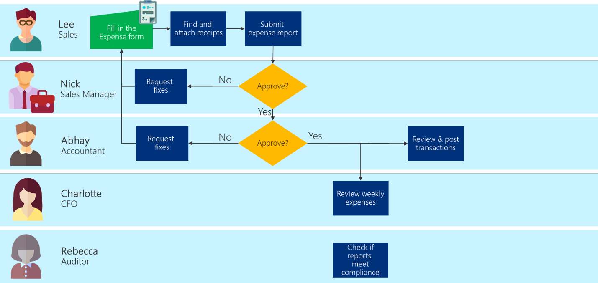

# Optimizing your business process

Now that you've inspected the entire business process, challenge yourself to
optimize it. Streamlining the process avoids having so many steps that employees
are overwhelmed or confused​.

Some helpful ways to approach optimizing the process:

- Start with the goal. Identify the goals you'd like to achieve with your
    business process. These goals should provide a general vision of your hopes for the future
    process.

- Consider whether something can be completed more efficiently, more cheaply,
    or with higher quality.

- Look for key performance indicators to identify what's functioning well and
    what needs improvement.

- Step back and get input by sharing the process document with your team​.

- Share the process document with management to get higher-level perspective and
    provide transparent accountability for each step within the process. ​

- Look at your process from the point of view of the user or customer who might
    benefit from the process, and consider ways you can improve their experience
    and overall satisfaction​.

Some key questions to ask:

- Can any remaining activities be cut from the process to
    increase efficiency or quality, or decrease costs?

- If the cut activity is important to the overall business, can it be
    handled in a separate business process​?

- Can a step be improved to accomplish your objective in a better way?​

- Can the order of steps be rearranged?

- Can steps be combined?

- Can steps in this process be run concurrently?

- Can you reduce the number of people it takes to execute the process?

- Can you change how you notify the next person in the process so that they
    respond more quickly?

- Are there aspects of the process you can automate further? Such as:

  - Capturing data automatically versus manual entry

  - Automating decisions based on data

  - Automating the action taken

  - [Using AI](/ai-builder/overview) to replace
        human attention

## Example: Optimizing the expense report process

We reviewed the current expense process and found some obvious improvements
to make:

- Go paperless for the entire process. (We noted the savings and environmental
    impact as a project benefit as well.)

- Do all possible compliance checks before enabling the report to be submitted
    for approval. (Greatly reduces rework and end-to-end process time.)

- Automatically look up and add accounting codes when the expense report is
    submitted.

- Enable Accounting to move the approved expenses to the financial system
    without re-entering any data.

- Create weekly expense reports automatically from the digital data.

Charlotte is considering further ways to optimize the budget review process. And
Rebecca is researching how the semiannual audit might be optimized by using AI.

Our proposed optimized process looks like the following illustration.

> [!div class="nextstepaction"]
> [Next step: Is it worth automating this process?](worth-automating-process.md)

[!INCLUDE[footer-include](../../includes/footer-banner.md)]