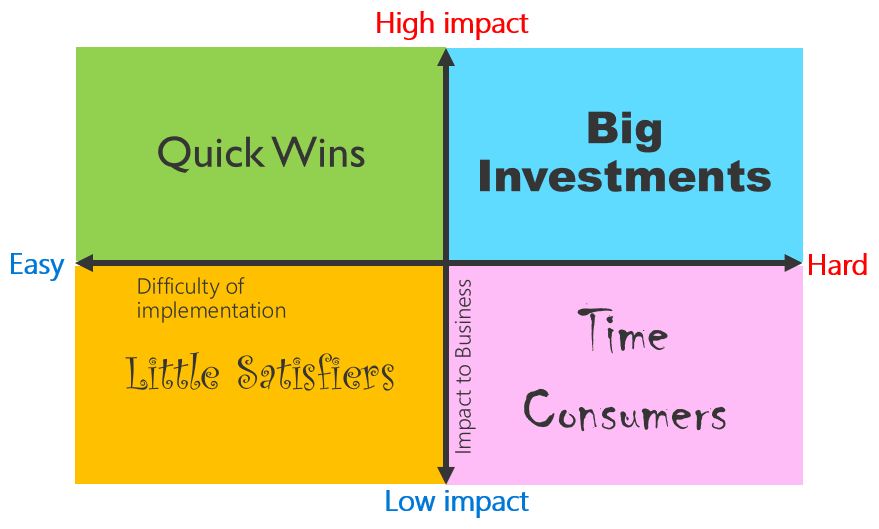

# Prioritizing feature requests

Prioritizing different requests can sometimes be difficult and intimidating.
Following a relatively quantifiable approach will not only help you prioritize
the right features, but also help you explain your decisions to the
people who requested the features.

The first step in prioritizing features is to make sure you record every request,
even requests that you might feel are unimportant. This will help you create
a backlog for improvement when you start working on new versions of your
app after you've finished your first version.

> [!TIP]
> Use your project goals as a guide to which features to prioritize.

The following table shows an example of how you can record each feature.

| Feature requested          | Absolute necessity? | Difficulty of implementation | Impact to business |
|----------------------------|---------------------|------------------------------|------------------------|
| View the list of approval requests    | Yes         |               |                        |
| Real-time push notification to users on their mobile phone when an approval request is received | No                      | Easy                             | High                   |
| Draft save feature for expense reports that haven't been submitted | No        | Hard      | Medium                 |
| Integrate with ERP system     | No               | Hard                     | Very high      |

> [!TIP]
> Avoid mixing up *necessities* with *nice-to-haves.* Ask yourself (or your users): "If this feature takes four weeks to add, will it be worth delaying launch by four weeks?”

## Priority Quadrants chart

After you've listed all your feature requests, you should triage the requests
into the quadrants shown in the following chart.

### Quick Wins

The requests in this quadrant should be prioritized first. Quick Wins are
requests that have high impact to the business, yet are easy to implement.

### Big Investments

These requests provide high impact to the business, but are difficult to
implement due to one or more of the following reasons:

- Requires additional investment (such as a new service)

- Requires development by pro developers or an external business partner

- Takes a long time (more than a week) to create the feature

- Involves multiple stakeholders across different departments

### Little Satisfiers

This type of request can be easy to implement, but only provides limited impact
to the business. You should prioritize Quick Wins and Big Investments first
before you start working on Little Satisfiers. Be careful not to get too heavily
attached to these Little Satisfiers; working on too many at once will turn them into
a Big Investment.

### Time Consumers

Time Consumers take up a lot of time, but provide little impact. They might come
from people in upper management who don't directly use the app. When facing these situations,
you can share the Priority Quadrants chart to explain how decisions were
made. You might help them understand or you might learn that something is more
impactful than you thought.

> [!TIP]
> Ask users who are requesting features to review (or even create!) the Priority
Quadrants, to aid mutual understanding.

> [!div class="nextstepaction"]
> [Next step: Identifying project team members](identifying-project-members.md)

[!INCLUDE[footer-include](../../includes/footer-banner.md)]