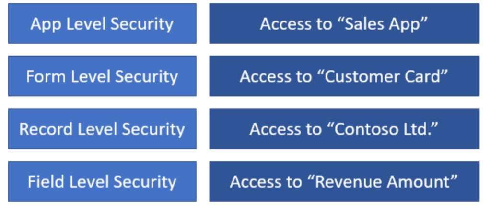

Securing the app and data
=========================

Once you have determined what data structure to use, the next step is to
consider about how to secure your data. You should consider what data will be
accessed by who, and refer back to tasks, business processes and personas that
you have listed in the planning phase.

Layers of security
------------------

When setting up security, there are four different layers of security you could
set up in a Power Apps app.

This article explains about general security concepts for people who are
unfamiliar. You can read more about the technical aspects in [security model for
Common Data
Service](https://docs.microsoft.com/power-platform/admin/security-roles-privileges).

### App-level security

App-level security restricts access to the app.

App-level security doesn't protect your data storage location. How your data is
secured will vary based upon the capabilities of your data source(s). When you
share your app, ensure that your users also have appropriate access to the
underlying data.

### Form-level security

For [Model-driven apps (apps that allow you to quickly create workflows with a
templatized
UI)](../../maker/model-driven-apps/model-driven-app-overview),
form-level security allows you to allow only specific security groups to access
specific forms. This is useful if you want to restrict how people enter or view
data by job role.

For example, an approval process app might have one form for employees to create
and submit the approval request, and a separate form for the approvers to review
what was submitted. Form-level security would be a good fit for this scenario.
For more information on form-level security, see [Control access to
model-driven app
forms.](../../maker/model-driven-apps/control-access-forms)

### Record-level security

Record-level security is a type of security where you can assign access to
certain records. Imagine you currently have an Excel spreadsheet. Record-level
security would allow you to set up security for each individual row.

There are four different types of access known as “CRUD” (meaning create, read,
update and delete) you could set up for record-level security:

-   **Create** Allows the user to create new data (like adding a new row in
    Excel).

-   **Read** Allows the user to view the data.

-   **Update** Update access allows a user to change data that already exists.
    This is different from create, as create is when you want to add **new**
    data.

-   **Delete** Allows the user to delete data (like removing a row in Excel).

For the Common Data Service, there are four more types of access: Append,
Append-To, Assign and Share. [This document explains the security roles and
privileges for Common Data
Service](https://docs.microsoft.com/power-platform/admin/security-roles-privileges).

### Field-level security

Field level security is a finer grain of security within a single record. It is
like setting up security for a single column in Excel. This usually has similar
levels of access as record-level security but at the field level instead of
record level.

### How different levels of security inter-relate to each other

The security levels mentioned above is more like a layer. The design of your app
should consider one or more of these security levels to fit the needs. Example
below shows what each security level would control in the behavior of an app.

The 5 steps for designing security
----------------------------------

Different security levels may seem quite complex and overwhelming but is easier
when considered in the following five steps:

**Step 1** - Identify, who or what groups of people (such as departments,
sections, teams) will have access to the app itself. This should be the same set
of people you had identified in the planning phase.

**Step 2** – Amongst those users you have identified in step 1, divide these
users into groups who will (or won’t) have access to restricted types of
information.

**Step 3** – Identify the requirements for who can see the records.

**Step 4** – If you’re using data sources other than Common Data Service or
services that do not have Office 365/Azure Active Directory logins, you should
consider on how you will allow access to those systems. If you are not in charge
of those systems, seek advice from those service administrators.

**Step 5** – Based on above steps, you should consider how these different
groups will be managed. Microsoft provides “security groups” to manage these
groups.

Example: Expense Report solution security
-----------------------------------------

In an expense approval scenario, all employees can submit expense reports so
they all need to have access to the Expense Report Creation app. Additionally,
Approvers need access to the Approval app.

-   We need an All Employees security group that has access to the expense
    reporting app and the data it uses.

-   We need an Approvers security group that has access to the Approvals app.

The Accounting department might need access to more sensitive data, such as the
employees' bank account for reimbursement.

-   We need an Accounting team security group that is the only security group
    that has access to Employee Bank Routing information.

We are most likely not going to want employees to be able to see each other’s
expense reports, so we need to set up record-level security to allow employees
to access only their own records.

However, we also need to ensure the approvers can see the reports that go to
them for approval. And we need the Auditors team to be able to see all expense
reports (but not change them).

-   We need the Approvers security group and an Auditors security group that
    each has access to all records, and we need to give the All Employees group
    access only to “records I create.”

For details about the security setting and concepts, you should read through the
[Power Apps Administration and Governance
whitepaper](https://aka.ms/powerappsadminwhitepaper).
