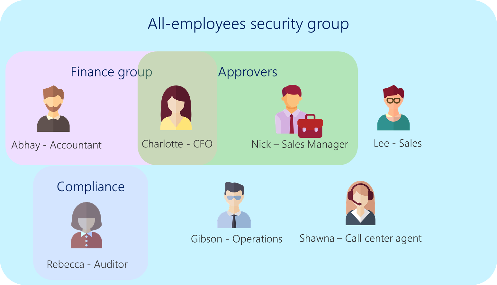

# Securing the app and data

After you've determined what data structure to use, the next step is to
consider how to secure your data. You should consider what data will be
accessed by whom, and refer back to tasks, business processes, and personas that
you listed in the planning phase. This article explains general security concepts for people who are
unfamiliar with them. For more information about the technical aspects of security, see [Security roles and privileges](/power-platform/admin/security-roles-privileges).

## Layers of security

When setting up security, there are four different layers of security you can
set up in an app.

### App-level security

App-level security restricts access to the app.

App-level security doesn't protect your data storage location. How your data is
secured will vary based on the capabilities of your data sources. When you
share your app, ensure that your users also have appropriate access to the
underlying data.

### Form-level security

For model-driven apps, form-level security allows you to allow only specific security groups to access specific forms. This is useful if you want to restrict how people enter or view
data by their job role.

For example, an approval process app might have one form for employees to create
and submit the approval request, and a separate form for the approvers to review
what was submitted. Form-level security would be a good fit for this scenario.
More information: [Control access to model-driven app forms.](../../maker/model-driven-apps/control-access-forms.md)

### Record-level security

Record-level security is a type of security where you can assign access to
certain records. Imagine that you currently have a sheet in an Excel workbook. Record-level
security allows you to set up security for each individual row.

There are four different types of access, known as CRUD (create, read,
update, and delete) that you can set up for record-level security:

- **Create** Allows the user to create new data (like adding a new row in
    Excel).

- **Read** Allows the user to view the data.

- **Update** Allows a user to change data that already exists.
    This is different from creating, because to create is to add *new*
    data.

- **Delete** Allows the user to delete data (like removing a row in Excel).

For Microsoft Dataverse, there are four more types of access: append,
append-to, assign, and share. More information: [Security roles and privileges](/power-platform/admin/security-roles-privileges)

### Field-level security

Field-level security is finer-grained security within a single record. It's
like setting up security for a single column in Excel. This usually has similar
levels of access as record-level security, but at the field level.

### How different levels of security relate to each other

The security levels mentioned above are like layers. The design of your app
should consider one or more of these security levels to fit your needs. The following table shows what each security level controls in the behavior of an app.

|Security Level  |Example |
|---------|---------|
|App-level security     |    Access to "Sales app"     |
|Form-level security    |      Access to "Customer card"   |
|Record-level security     |     Access to "Contoso Ltd."    |
|Field-level security     |     Access to "Revenue amount"    |

## The five steps for designing security

Different security levels might seem quite complex and overwhelming, but you can break it down into the following five steps:

**Step 1**: Identify who or what groups of people (such as departments,
sections, or teams) will have access to the app itself. This should be the same set
of people you identified in the planning phase.

**Step 2**: Among those users you identified in step 1, divide them
into groups who will (or won't) have access to restricted types of
information.

**Step 3**: Identify the requirements for who can see the records.

**Step 4**: If you're using data sources other than Dataverse&mdash;or
services that don't have Office 365 or Azure Active Directory authentication&mdash;you should
consider how you'll allow access to those systems. If you aren't in charge
of those systems, seek advice from those service administrators.

**Step 5**: Based on the above steps, you should consider how these different
groups will be managed. We recommend that you use security groups.

## Example: Expense report solution security

In an expense approval scenario, all employees can submit expense reports, so
they all need to have access to the expense report creation app. Additionally,
approvers need access to the approval app.

> We need an All Employees security group that has access to the expense
    reporting app and the data it uses.
> We need an Approvers security group that has access to the Approvals app.

The Accounting department might need access to more sensitive data, such as the
employees' bank account for reimbursement.

> We need an Accounting team security group that's the only security group
    that has access to employee bank routing information.

We're most likely not going to want employees to be able to see each other's
expense reports, so we need to set up record-level security to allow employees
to access only their own records. However, we also need to ensure that approvers can see the reports they get for approval. And we need the auditors team to be able to see all expense
reports (but not change them).

> We need an Auditors security group. We need to give it and the Approvers security group access to all records, and we need to give the All Employees group access only to "records I create."

More information: [Security in Dataverse](/power-platform/admin/wp-security)

> [!div class="nextstepaction"]
> [Next step: Make the app](making-phase.md)

[!INCLUDE[footer-include](../../includes/footer-banner.md)]