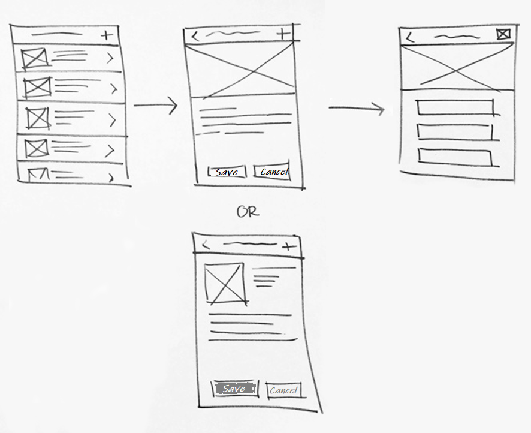

# Sketching the screens

After you've identified the tasks and organized your thoughts, the next
step is to sketch the screens you envision needing within your app. By drawing
out each task and the business process, you already have enough information
about how to get from point A to point B. Sketching the screens will allow you
to visualize the journey.

Don't be intimidated by the sketching. You don't have to be an artist to throw a
few boxes and lines on paper. To avoid getting into too much detail, use
boxes to represent icons and images, and use lines to represent text. You can
use a tool like PowerPoint to efficiently draw the sketch as well.

> [!TIP]
> Focus more on the overall flow of the business rather than the details on-screen.
With Power Apps, you can easily adjust later.

Note that you don't have to restrict yourself to drawing just one version of the
sketch. Try drawing different versions of the screen. Keep sketching until
you run out of ideas.

A good way to get ideas for each screen is to look at the apps you normally use
and "borrow" their ideas. These apps are often created by professional designers.
You can find [customer stories](https://powerapps.microsoft.com/customer-stories)
and samples of apps from the [Power Apps community](https://powerusers.microsoft.com/t5/Power-Apps-Community/ct-p/PowerApps1)
that you might look into. App templates also show a great variety of
different styles of apps.

Check with actual users to see whether your sketches match their
expectations. Showing them the sketches and sharing your
ideas can help eliminate any difference in expectations. Ideally, you can
use the sketches as a "paper prototype" and have your user pretend to actually
use it.

> [!div class="nextstepaction"]
> [Next step: Architectural design](where-is-data.md)

[!INCLUDE[footer-include](../../includes/footer-banner.md)]