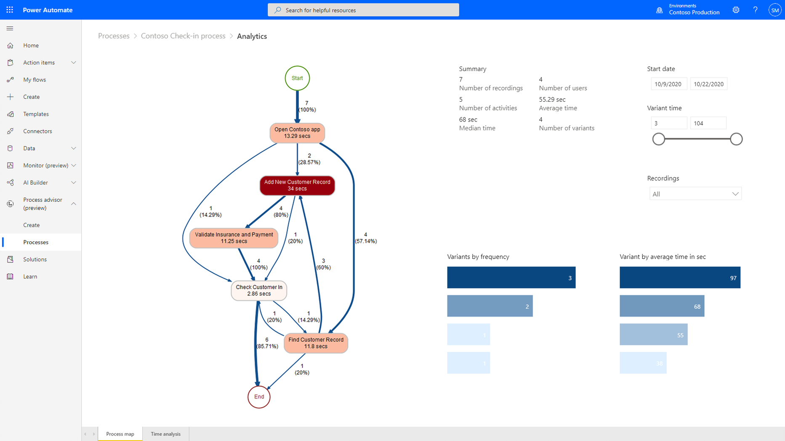

# Understanding the current business process

Now it's time to break down the business process that's currently solving the
business problem, inspecting each step of the process in detail.

In this section, you'll learn about:

- Contributors to solving the business problem

- Documenting the business process

## Identifying key contributors

Think through everyone who contributes to this process. This includes people in
your department and other departments who all work together on this
problem. Understand what they do in the context of the business problem that's
being solved.

When you start documenting the business process in the next section, you'll want
to rely on these people to help you understand each step. You'll most likely
learn along the way, and you might need to add new people to your project team to
provide their perspectives.

> [!TIP]
> Avoid blind spots! If you get to a step in the process where "and then, a
miracle occurs!", you'll need to find someone who can shine a light on that.
Also, consider diverse perspectives in work preferences and constraints.

In our example scenario, we identified these key contributors:

## Discover processes to improve on using Process advisor
If your task is done fully on the desktop, you can discover all the steps 
different people in your organization are performing to complete the task by 
using our process discovery functionality called [process advisor](/power-automate/process-advisor-overview.md). 
Process advisor visualizes your process in a [process map](/power-automate/process-advisor-visualize.md) 
and reveals bottlenecks and metrics for your process through an analytical report.

> [!div class="nextstepaction"]
> [Next step: Documenting the business process](what-is-task.md)

[!INCLUDE[footer-include](../../includes/footer-banner.md)]