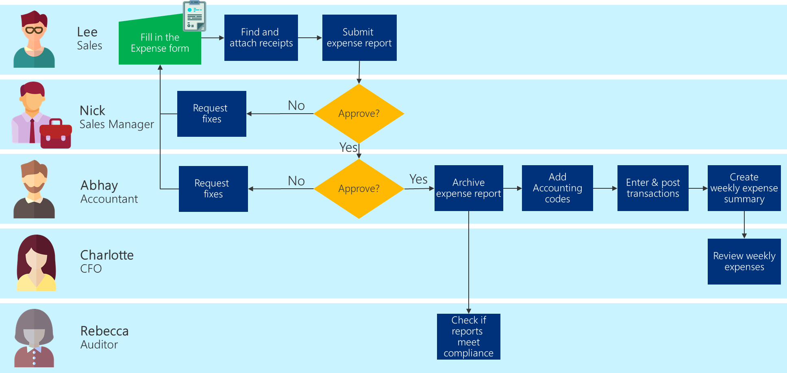

# Visually map the process

The next step is to draw the business process of the use case you're trying to
solve.

> [!TIP]
> You can draw your map on paper or by using a tool such as Visio or PowerPoint.

This business process should include not only the steps that directly relate to
the app you're trying to create, but also the steps before and after, so you can
see how the app fits into the overall business process.

Use your map to confirm with your team that you've captured the business
process accurately.

Here's an example business process map:

List each activity in order, and link it to the next part of the process​:

1. Start with the first event leading to your goal.

2. Draw a line to a box. Fill this box with the first activity required to
    work from this event to your goal​.

3. When you reach a point that requires a decision, draw a diamond around the
    decision that must be made. Usually this is written as a true/false
    question. Two lines should proceed from the diamond, each leading to the activity
    that will occur depending on the decision&mdash;one line for "true" and the other for
    "false."

4. Link each activity sequentially. Some might run simultaneously through
    different departments within your business​.

5. Culminate in the activity that reaches your goal. ​

You can also add data to your map, such as time taken or the cost of the task. Then
you'll be able to compare and gain insights about which areas need improvement. You
can also use this for comparing the money or time saved by the new process.

> [!div class="nextstepaction"]
> [Next step: Optimize the process](optimizing-business-process.md)

[!INCLUDE[footer-include](../../includes/footer-banner.md)]