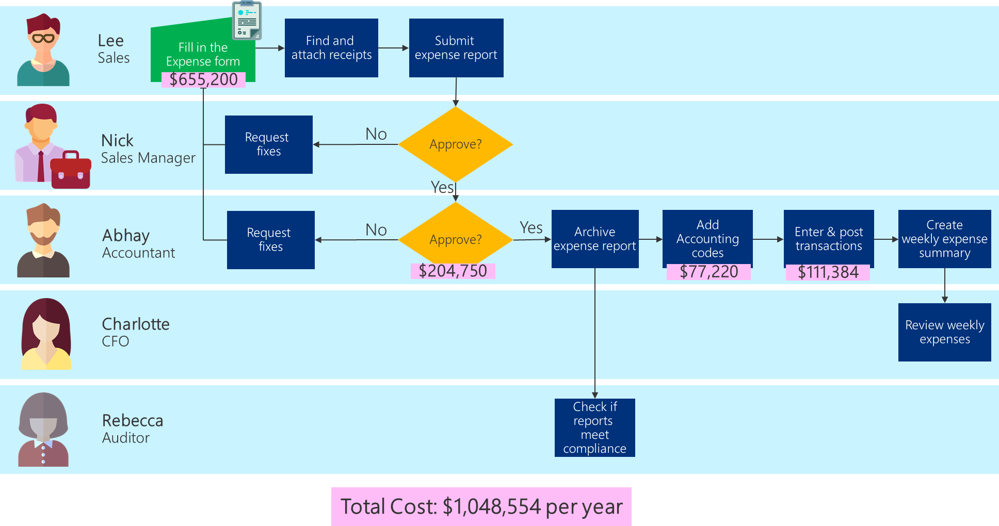

# Is it worth automating this process?

Now it is time to consider the effort it will take to build the solution and
whether it is justified.

Business Value is the ongoing benefit that the business receives from the
project.

## The cost of doing nothing
-------------------------

To figure out if it is worth automating the process, you first must understand
the cost of **NOT solving the problem**.

As a byproduct of defining the business value that you hope to achieve from the
Power Platform solution, you should have a better understanding of what it is
costing your organization to solve the problem in the current manner. In other
words, the cost of Doing Nothing.

If the Business Value you will receive by automating the process is less than
the cost of Doing Nothing, then you must ask yourself if this is the right
business problem to focus on?

Now, if the business value you receive by solving the business problem is
greater than the cost of doing nothing plus your development time and the
monthly cost of any [software license](https://docs.microsoft.com/en-us/power-platform/admin/pricing-billing-skus), then it makes sense to automate the
process.

Before we decide to automate this business process, we can answer the question
of ‘what does it cost me to NOT automate the process’. You should consider this
before deciding to build an automated solution. (And can also be helpful to know
when celebrating the impact of your achievement when you are done!)

## Example: The cost of the current expense process

The first thing we need to understand is what is it costing the organization to
continue to do the expense report process manually? Here is what we discovered
when we talked to our colleagues:

-   When we spoke to our colleagues, we found that it takes them roughly an hour
    each week to pull together all their receipts and fill out the manual
    expense report. Abhay indicated that there are roughly 140 expense reports
    per week. We also learned that the fully loaded cost of each team member is
    roughly \$90/hr.

    >   (140 expense reports \* 1 hour a week) \* \$90 = \$12,600 a week
    >   
    >   52 weeks \* \$12,600 = \$655,200 a year

-   Nick isn’t reviewing or approving the expense reports – that is all falling
    to Abhay and his team to complete. Because he’s not regularly monitoring the
    team’s expenses, he’s missing an important opportunity to sanity-check the
    expenses, watch for fraud, and optimize his team’s spending habits.

-   Abhay shared with us that his team spends roughly 15 minutes per expense
    report, receives on average 140 reports a week, and sends back 25% of those
    due to missing information.

    >   Initial Review: 140 expense reports \* 15-minute review = 35 hours
    >   
    >   Initial Review: 35 hours \* \$90 = \$3,150 a week = \$163,800 /year
    >   
    >   Rework Review: 35 expense reports \* 15-minute review = 8.75 hours
    >   
    >   Rework Review: 8.75 hours \* \$90/hr = \$787.50/week = \$40,950 /year
    >   
    >   Total Weekly Cost: \$3,937.50
    >   
    >   Total Annual Cost: \$204,750

-   Once the expense report is identified as accurate, it takes roughly 7
    minutes per expense report to look up the general ledger codes for each
    expense category and write them on each expense line of the report.

    >   140 expense reports \* 7-minute coding = 16.5 hours a week =
        \$1,485/week = \$77,220/year

-   It takes roughly 10 minutes per expense report to create a payment journal
    in the financial system to process for payment and appear on the financial
    report for Charlotte:

    >   140 expense reports \* 10 minutes = 23.8 hours a week = \$2,142/week =
        \$111,384/year

-   Charlotte would like to review the budget each week but is not able to get
    her report until Thursday each week after Abhay has completed his review and
    received back the reports where there was missing information. (While this
    is not a monetary cost, it does have an impact on the business.)

For the entire process it's costing the company:

>   \$655,200 + \$204,750 + \$77,220 +\$111,384 = \$1,048,554

