| Schlumberger – Prolific app maker ignites low code revolution |
|---------------------------------------------------------------|

Power Platform Customer Success Story
=====================================

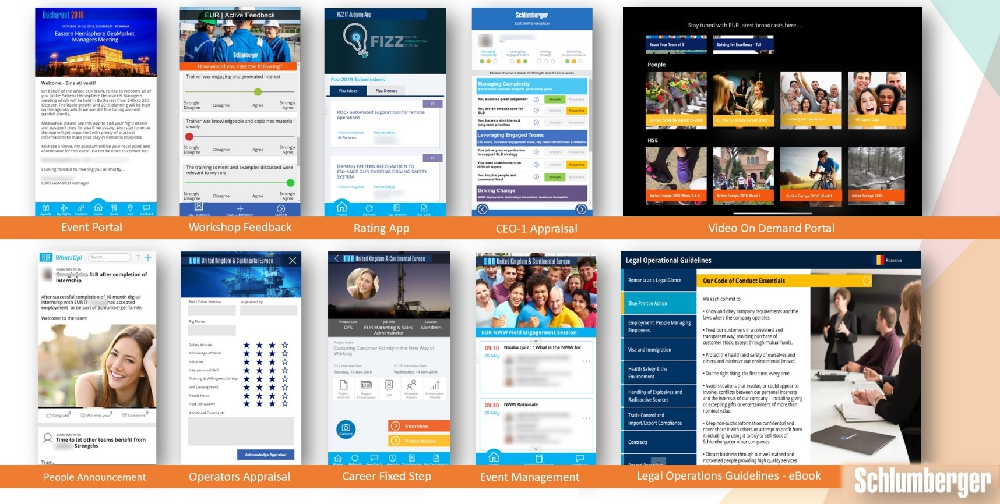

“Power Platform provides a low code no code environment to drive innovation at
the edge of our business, enabling us to drive digital transformation at an
enterprise level” – Alan Chai, Digital Transformation Leader, Schlumberger

[Schlumberger](https://slb.com) is the world’s largest oil service company.
Operating in over 85 countries with 100k+ employees, they describe themselves as
a “mini United Nations” of 140 nationalities. With a strong culture of
engineering and innovation, Schlumberger firmly believes that technology drives
exploration and production performance. For over 90 years, they’ve used
innovative technology and reservoir domain expertise to deliver solutions that
help improve the performance of customers in the oil and gas industry, and been
early adopters of big data and AI technologies to transform day-to-day
operations.

Over the past eighteen months, Schlumberger has seen rapid viral adoption of the
Power Platform, reaching over 10k monthly active users, 650+ production apps and
120+ citizen developers building solutions on the platform across 32 countries.
This past summer they ran a Power Platform hackathon, which, in a single week
saw 1000+ participants sign up across 47 countries and build \~100 solutions in
a week.

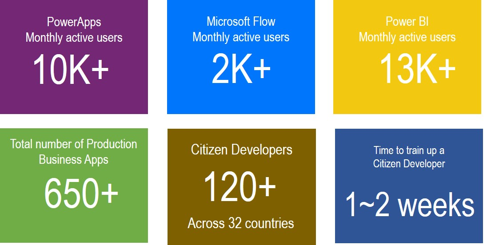

    Given the scale of adoption and breadth of solutions, we will cover the
    Schlumberger story in multiple parts. In this post we’ll focus on the
    solutions built by Alan Chai, who spearheaded the citizen development
    efforts in a “Digital Cell” at Schlumberger Europe. The Digital Cells are
    part of a decentralized IT effort, in contrast to “Digital Studios” that
    reside within a Central IT function. We will highlight how it all got
    started with a health campaign and an app to motivate Schlumberger employees
    to live healthier lives. We’ll also describe an Employee Career Progression
    app which has been used to promote over hundreds of engineers and save over
    2000 hours by eliminating paper-based processes, and a Digital Value
    Calculator solution that is integrated in Microsoft Teams. In a follow up
    post, we will highlight the progression of the Power Platform into the
    pro-dev led “Digital Studios”, and the successful efforts within Central IT
    to create a Center of Excellence around the platform with robust governance,
    monitor, alerting and security practices.

| Watch Schlumberger present their story at the Microsoft Business Applications Summit:                                                                                                                                                                                                                            |
| [presentation video](https://youtu.be/q6WQkLMknqA?t=38) \| [slides](https://medius.studios.ms/video/asset/PPT/MBAS19-BRK2065) \| [PDF](https://pahandsonlab.blob.core.windows.net/content/Champions/PowerApps_AlanChai.pdf)                                                                                      |
|------------------------------------------------------------------------------------------------------------------------------------------------------------------------------------------------------------------------------------------------------------------------------------------------------------------|

MEET ALAN
---------

Alan Chai managed a business app development team called “Digital Cell” at
Schlumberger Europe. Alan is a self-taught PowerApps maker who places a strong
emphasis on user experience and creating PowerApps that look and feel like
native apps. You can see this reflected in his stunning portfolio of apps. In a
recent [\#PowerAddicts community hangout](https://youtu.be/rBE6CbvMFcg?t=1499),
Alan shared his thinking on “User Experience (UX) first” and the difference you
can achieve within PowerApps by simply applying a few best practices before
putting a solution together. He regularly shares updates on his Power Platform
journey on Twitter at [\@AlanChai](https://twitter.com/alanchai).

Alan’s team consisted of interns from local universities who underwent two weeks
of training on PowerApps, Microsoft Flow and Power BI under the guidance of
Alan. They then worked with internal stakeholders and functional heads to enable
them on their journey to digital transformation. His team is now using the Power
Platform to support the larger corporate transformation program. Alan’s career
has evolved as well – he is now Head of Digital Transformation and Innovation,
driving transformation in “Digital Cells” at an enterprise level.

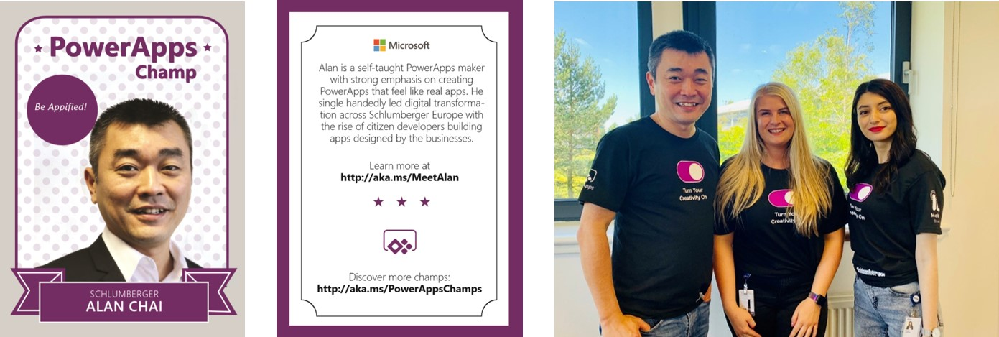

    Alan's PowerApps Champ card (left); Alan with a few interns on his team who
    are now fellow PowerApps makers

ACTIVE EUROPE APP
-----------------

The Schlumberger journey with PowerApps started when Alan saw a need to start a
health campaign to encourage work-life balance. Being a first-time user to
PowerApps, Alan spent a weekend learning from the PowerApps community and was
able to put together a working fitness tracking app by Monday morning – within 2
days! The app was called *ActiveEurope*. Together with their Europe Health and
Safety Director, they launched a campaign to solicit co-workers to log a run
around all Schlumberger Europe locations in a circle, which was about 22,000 km
in 3 months. The ActiveEurope PowerApp, working together with Yammer, had such a
great adoption rate that they achieved the initial target within 2 weeks. The
success of this campaign led to the health campaign app being replicated in more
than 10 additional business units spanning 60+ countries across all continents.

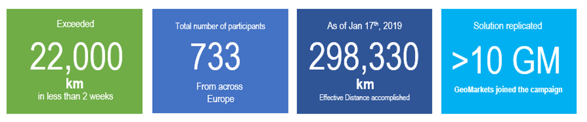

In addition to tracking fitness related activities, the app includes a
leaderboard with badges to incentivize engagement via friendly competition.
Employees take photos of their activities and share with their colleagues. They
can also post updates on Yammer through the app to further encourage sharing and
viral interest in the health campaign.

[./media/image6.jpg](./media/image6.jpg)
----------------------------------------

~   A screen shot of a computer Description automatically generated

    A **Power BI** dashboard is used to display cumulative stats for the
    ActiveEurope campaign, such as – hours logged, breakdown of activity types,
    spread of participants across different locations, and more.

[./media/image7.png](./media/image7.png)
----------------------------------------

CAREER PROMOTION EVALUATION APP (“G11 Mobile”)
----------------------------------------------

Moving on from a social app, the next step was to build something that was
closer to the business. Schlumberger has a very structured way in developing
their people. One of the most mature HR processes is called GFE Control (General
Field Engineer) – employees deliver a project outside their day-to-day work, and
demonstrate through a presentation the value the project brings to the company
or customers. This process helps employees grow and develop to take on bigger
challenges and promotions in their career. They needed a way to digitize the
cumbersome paper-based process that was used to evaluate employee projects and
presentations.

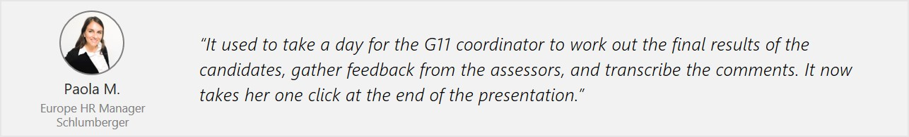

    **Before Power Platform – business process, challenges, and opportunities**

    Prior to the Power Platform solution, each of the \~15 managers in a
    presentation session used a paper form to provide their assessment of the
    employee’s performance. The various VPs from different units, e.g. HR,
    Finance, Legal, etc. interviewed the candidates and provide their summary
    evaluation in individual blocks on a single paper form. This process led to
    multiple challenges:

    -   A single paper form had to be manually transferred from one VP to
        another.

        -   As all the data was buried in paper, when there was an opening to
            fill a Sales Engineering position, there was no convenient way to
            determine the best candidate across the GFE candidates based on the
            cumulative feedback. They had to reaching to the filing cabinet and
            start tabulating results manually.

            In addition to needing to streamline the business process, Alan
            considered this a personal challenge to help the environment by
            reducing or eliminating the need for paper printing as part of this
            process.

            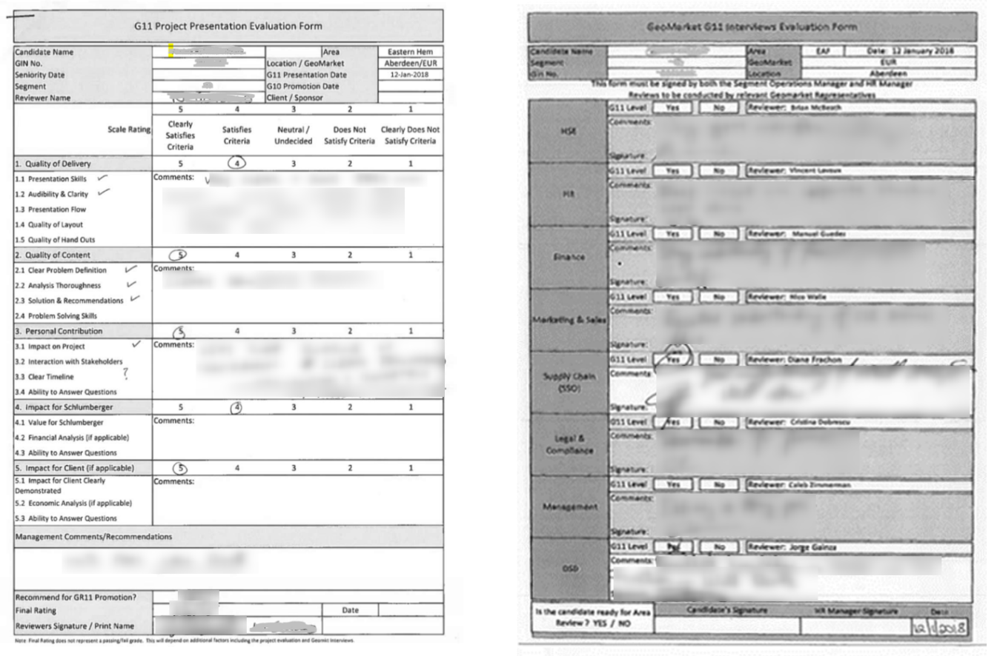

            **Left**: presentation evaluation form filled out by each manager;
            **Right**: single feedback form used by multiple VPs

            **Power Platform solution**

            The team put together a PowerApps canvas app called “G11 Mobile”
            with Alan as the primary app maker. The app was built in under a
            week and has replaced the need for paper printing as all project
            evaluations and documents are available in a digital app. The app
            was such a success that it has being reused or replicated over 18
            times across multiple business units. After a year in production, it
            was estimated to give back 2000 hours to the business from
            efficiency gain and help save 120 trees based on the number of
            sheets of paper that were no longer printed.

            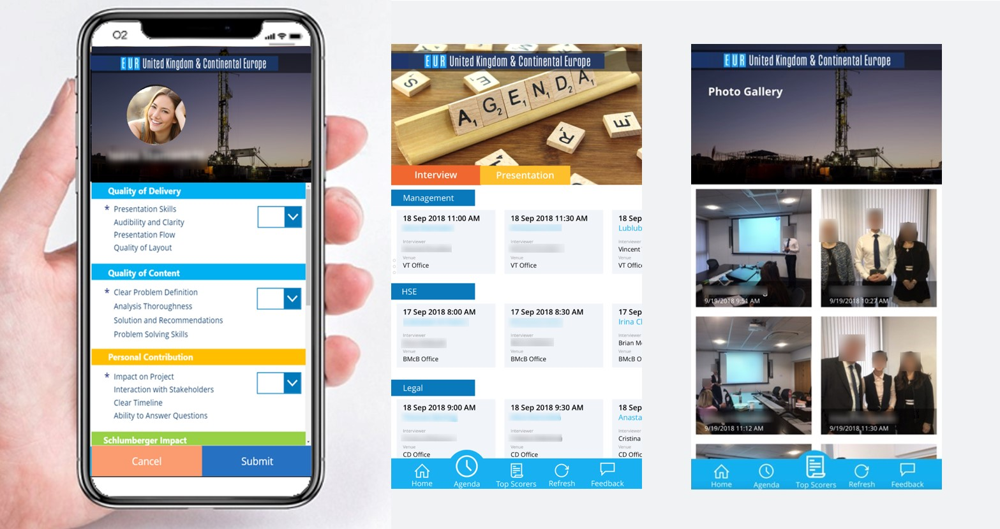

            G11 application - used for career promotion evaluations

            Let’s look at how the process works. When an engineer is ready to
            present their project, an HR Training Coordinator registers the
            candidate in a SharePoint Online list and adds relevant metadata
            about the candidate and the project. As the various Function Heads
            interview the candidate, they use the PowerApps on their mobile
            device to score the candidate and add their notes. On the
            presentation day, all managers use the “Presentation” option to
            score each candidate using a form in PowerApps that matches the
            layout of the paper form. Some of the key features of the
            application include:

            -   Integrated camera functionality to capture photos during
                presentation events

            -   Access control based on user type – candidate / manager /
                function head / app owner

            -   Agenda/scheduling for showing the sequence of interviews and
                presentation for each candidate

            -   Photo gallery to display all photos for a candidate

            **Benefits and Impact**

            The app was deployed in July 2018 and has been running in production
            for fourteen months. A few key benefits include:

            -   Been used to promote over 450 engineers across the world

            -   Saved over 2,000 hours of time that was previously spent in
                manual paper processes

            -   The HR Training Coordinator used to spend at least 3 to 4 days
                post-event to find the overall scores for all candidates through
                an Excel file. This is now computed instantly based on criteria
                set by the G11 process.

            -   The app has elevated employee engagement based on the visible
                recognition of their contributions in their G11 project.

            This app marked the beginning of the digital journey with the Power
            Platform and subsequently led to evolving many other internal
            processes to achieve efficiency gains, cost avoidance and ultimately
            generate business impact which aligned with corporate objectives.

            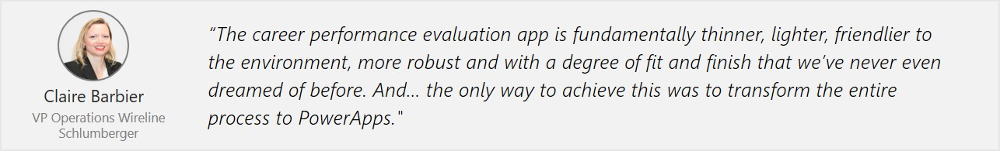

DIGITAL VALUE CALCULATOR – USED WITHIN MICROSOFT TEAMS
------------------------------------------------------

Schlumberger has a high focus on ensuring that resources are being prioritized
based on value creation, and correspondingly, solutions that do not generate
direct business value get deprioritized. They created a Digital Value Calculator
to measure and track the value of their Power Platform solutions. This app has
been used by managers of “Digital Cells” to measure the impact of over 60
solutions across twenty global regions.

Some of the key dimensions used to measure impact are:

-   Efficiency gained – how many hours have been given back to the business
    after the solution was deployed.

    -   Business impact – how much free cash flow or ‘income before tax’ was
        generated from a given solution.

        -   Savings in implementation costs – how much have they saved by
            building a solution in-house with rapid development approaches
            compared to purchasing a 3rd party solution.

            Managers access the PowerApp and the Power BI dashboards primarily
            from within Microsoft Teams.

            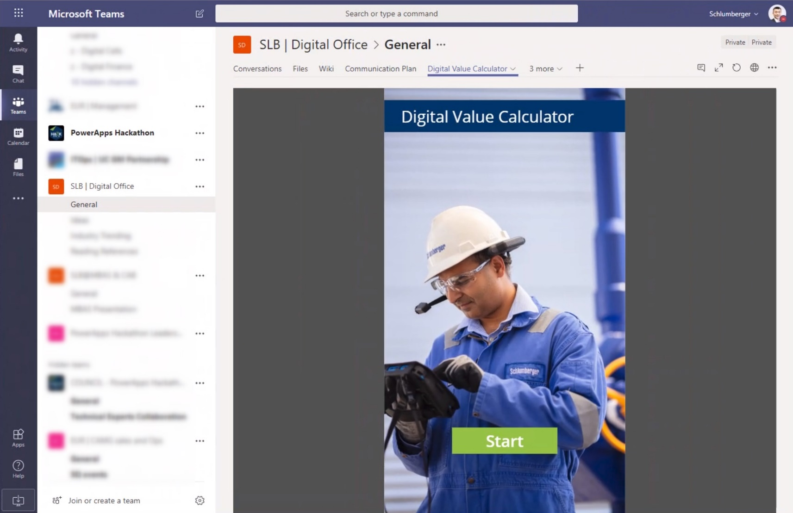

            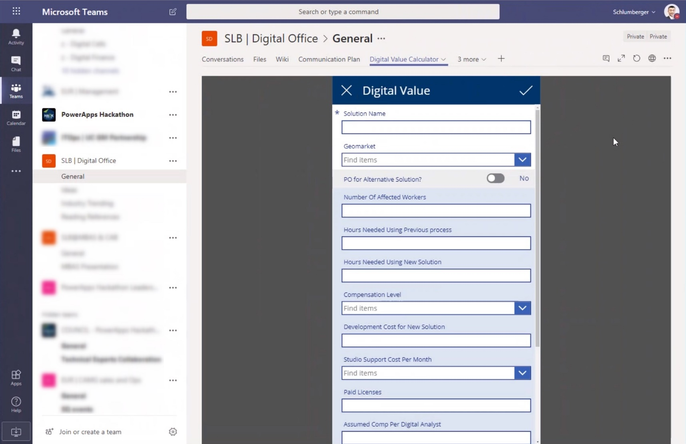

[./media/image14.jpg](./media/image14.jpg)
------------------------------------------

SOLUTION ARCHITECTURE
---------------------

A consistent architecture pattern across Alan’s app includes PowerApps canvas
apps that connect to data stored in SharePoint Online lists, with Microsoft Flow
and Power BI used by some of them for automation and reporting, respectively. In
addition, some apps connect to services such as Yammer or run embedded within
Microsoft Teams. Alan has created a library of template apps with branding and
basic design patterns in place, which allows him to create and publish new apps
rapidly, sometimes within a couple hours.

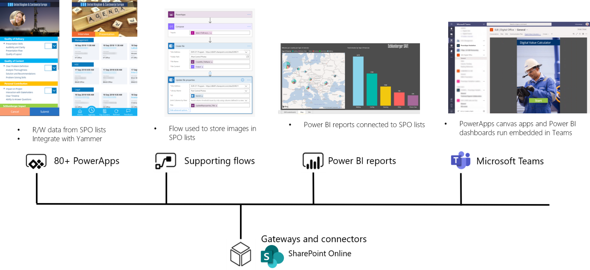

ADDITIONAL APPS
---------------

Here are a few additional examples from the 80+ apps built by Alan and his team
at Schlumberger:

**WHATSUP**

A PowerApp solution that crowd sources input from Operations Managers to track
employees moving within different roles in the field. It allows employees to
send congratulatory notes and say goodbye in a casual way. It also serves as a
single point to view the history of organizational changes without having to go
through a list of Yammer posts. The employee data is managed and validated by HR
prior to going public using a built-in approval process within the app.

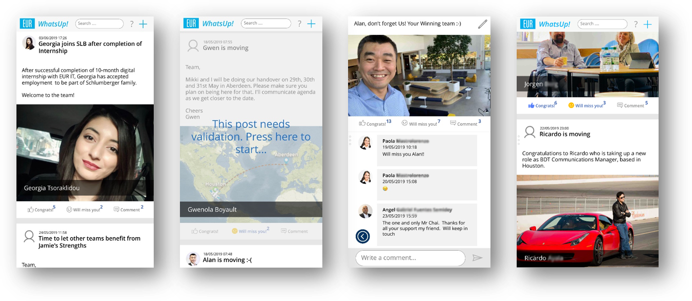

    **APPRAISAL APP**

    A performance management app that is used by the executive team at
    Schlumberger to perform performance evaluations while on the road.

    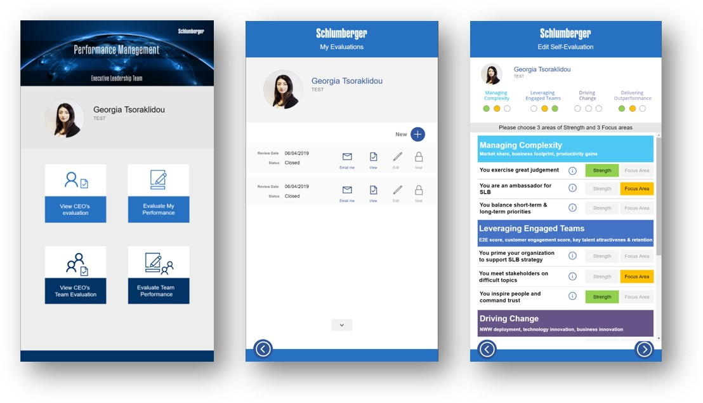

        **ON DEMAND VIDEO PORTAL**

        A portal to push video content to field employees who are often hard to
        reach. The content is structured and targeted based on roles in the
        organization. This is also used as self-service digital signage around
        the campus.

        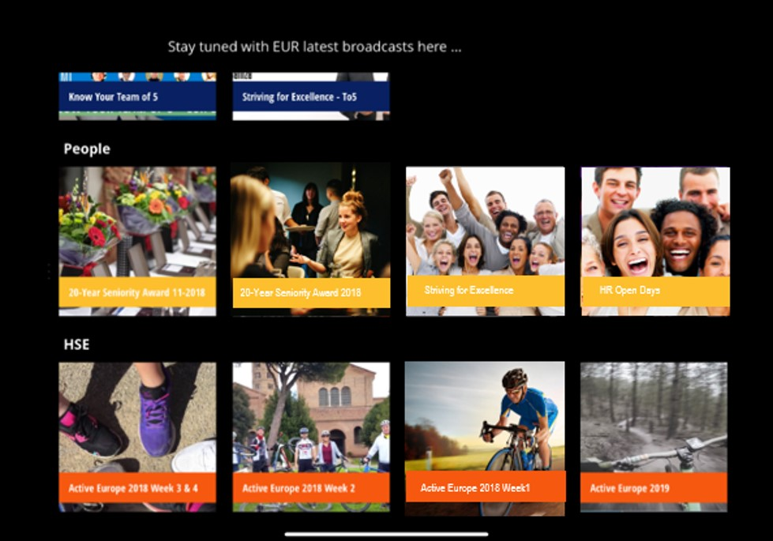

LOOKING AHEAD
-------------

Alan has played a transformational role in igniting the low code revolution at
Schlumberger. Along with Alan, there are several citizen developers in Digital
Cells globally across Schlumberger rapidly creating cross platform solutions to
digitize business processes. As the adoption, visibility and business value of
the Power Platform grew, it caught the attention of the centralized Digital
Studios IT team consisting of .NET and Xamarin developers. Ladd Laird, Director
of Mobility Studio, who leads a team of full stack developers described it as
“IT waking up” – his team woke up to the pace at which the decentralized Digital
Cells were able to deliver on solutions using a low code platform.

Meanwhile, with hundreds of apps and thousands of monthly users across
Schlumberger, Ken Auguillard who is the tenant administrator for Schlumberger
realized he needed to establish robust governance processes without stifling
innovation. In a future post we’ll dive into further details on the adoption of
the Power Platform by Ladd’s team along with the work by Ken Auguillard and his
central IT team to establish a Power Platform Center of Excellence (COE) with
the necessary security, monitoring and alerting processes, while continuing to
empower the engineers at Schlumberger to rapidly innovate with the Power
Platform. To hear this story directly from Alan and Ladd, watch their [customer
story presentation at the Microsoft Business Application
Summit](https://youtu.be/q6WQkLMknqA?t=38) held in June 2019.

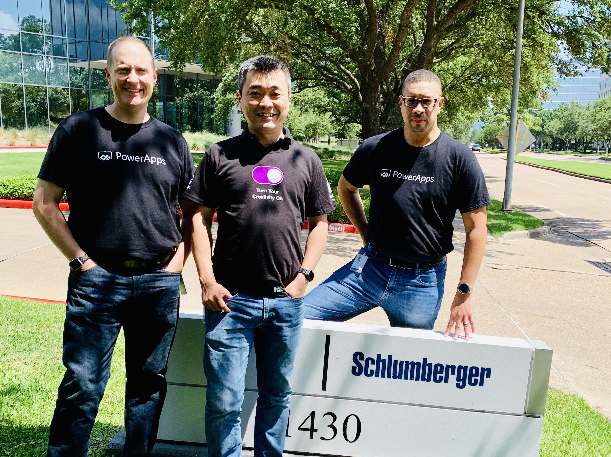

    Picture taken at the start of the global hackathon - three key personas
    leading the Power Platform adoption at Schlumberger:

    From left: Ladd Laird (**pro-dev**), Alan Chai (**citizen dev**), Kenric
    Auguillard (**IT Admin**)

|   |   |   |   |   |   |   |   |   |   |   |   |   |   |   |   |   |   |   |   |   |   |   |   |   |   |   |   |   |   |   |   |   |   |   |   |   |   |   |   |   |   |   |   |   |   |   |   |   |   |   |   |   |   |   |   |   |   |   |   |   |   |   |   |   |   |   |   |   |   |   |   |   |   |   |   |   |   |   |   |   |   |   |   |   |   |   |   |   |
|---|---|---|---|---|---|---|---|---|---|---|---|---|---|---|---|---|---|---|---|---|---|---|---|---|---|---|---|---|---|---|---|---|---|---|---|---|---|---|---|---|---|---|---|---|---|---|---|---|---|---|---|---|---|---|---|---|---|---|---|---|---|---|---|---|---|---|---|---|---|---|---|---|---|---|---|---|---|---|---|---|---|---|---|---|---|---|---|---|

