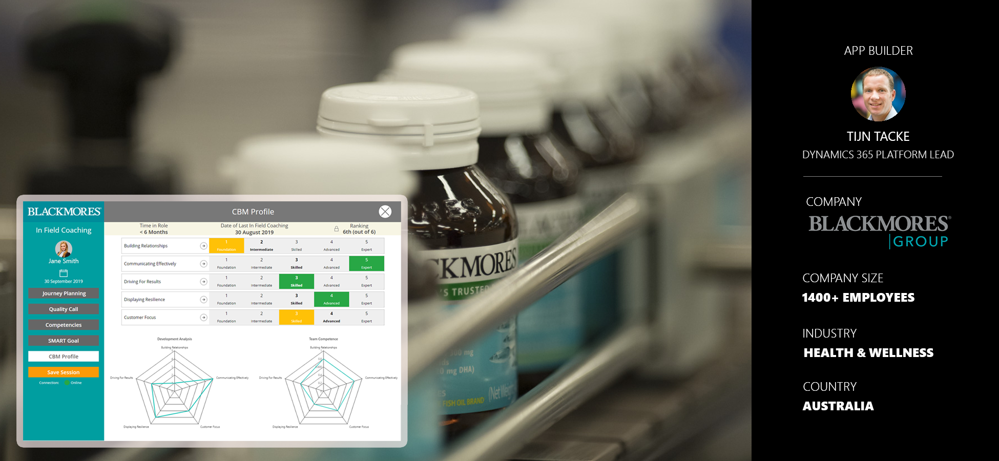
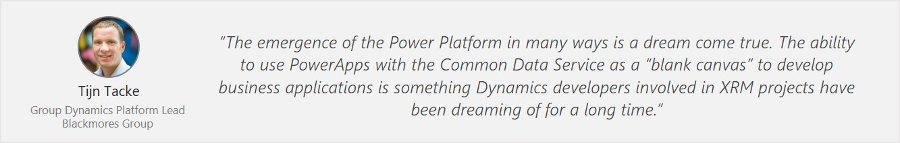
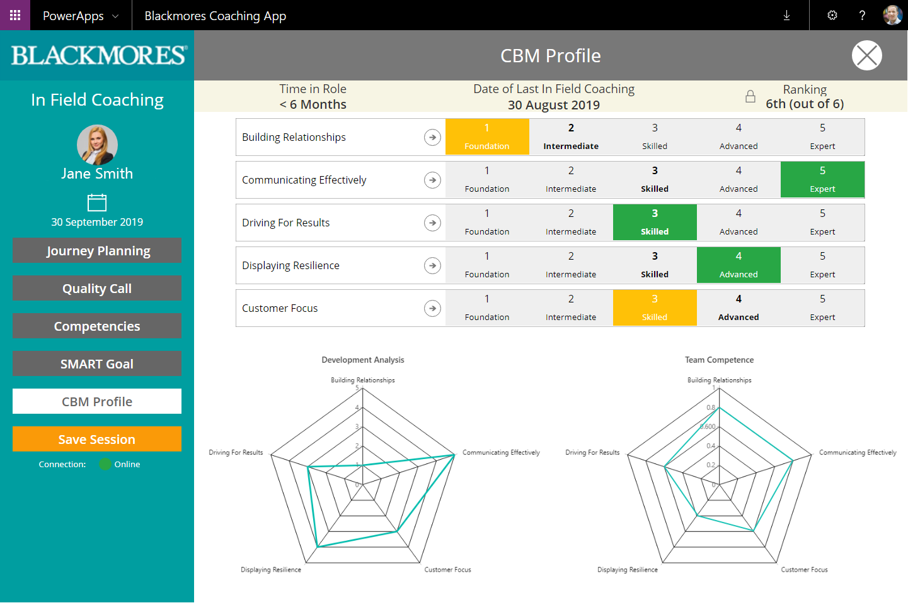
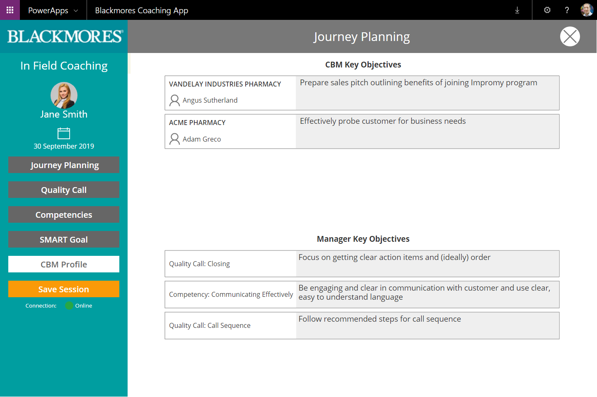
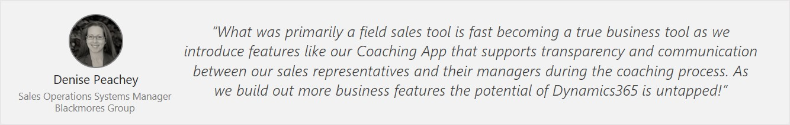
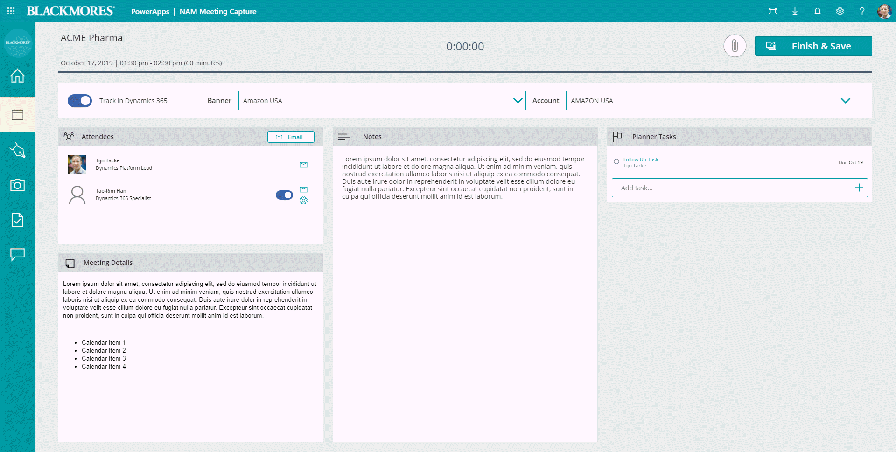
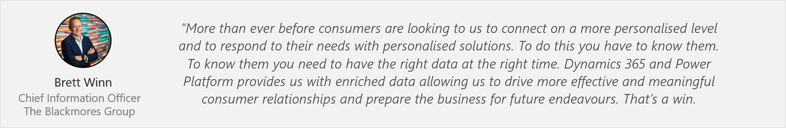
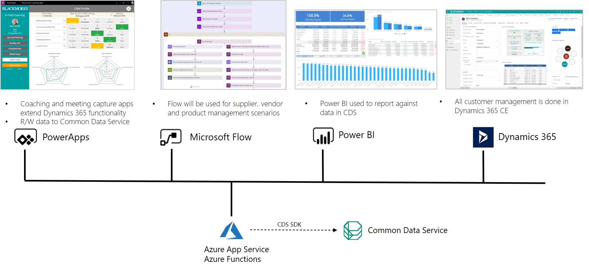
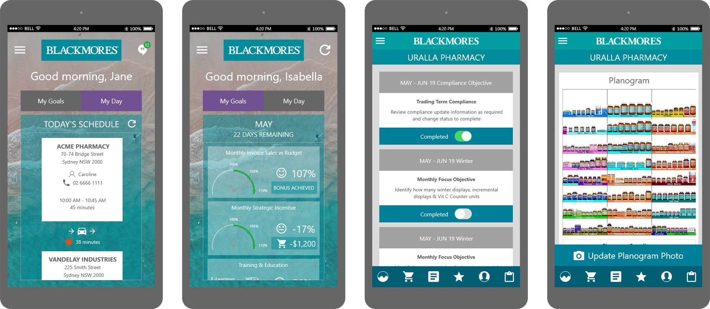

| Microsoft Confidential – Internal Use Only                                                                                                                                         |                                                                                                                                                                                                                                                                                                                                                                                  |
|------------------------------------------------------------------------------------------------------------------------------------------------------------------------------------|----------------------------------------------------------------------------------------------------------------------------------------------------------------------------------------------------------------------------------------------------------------------------------------------------------------------------------------------------------------------------------|
| **Power Platform CAT – Episode 55**                                                                                                                                                |                                                                                                                                                                                                                                                                                                                                                                                  |
| [./media/image1.png](./media/image1.png)                                                                                                                                           | Blackmores Group – Mobile solutions for sales managers                                                                                                                                                                                                                                                                                                                           |
| **Read the public story on news.microsoft.com**: [case study](https://news.microsoft.com/en-au/features/blackmores-prescribes-data-as-a-healthy-foundation-for-sustained-success/) |                                                                                                                                                                                                                                                                                                                                                                                  |
| [./media/image14.jpeg](./media/image14.jpeg)                                                                                                                                       | Foo Shen Wu, Power Platform Global Black Belt, APAC A big thank you to Foo Shen for inspiring and educating the team at Blackmores Group on the possibilities the Power Platform has to offer, and for providing deep technical guidance on building PowerApps canvas apps. Thank you as well for bringing this story to our attention and connecting us with Tijn and his team. |

### Power Platform Customer Success Story

“The combination of Microsoft Power Platform, Dynamics 365 and Azure will help
us streamline the entire product development cycle within Blackmores Group into
one cohesive platform.” – Kris Ellis, Group Technology Director, Blackmores
Group

The [Blackmores Group](https://www.blackmores.com.au/) is Australia’s leading
natural health company, supplying a quality range of vitamin, mineral, herbal
and nutritional supplements across Asia Pacific. They are an ASX 200 publicly
listed company employing 1400+ people. In 2019, Blackmores was awarded
“Australia’s Most Trusted Brand” for vitamins and supplements for the 11th year
running.

Over the past two years, they’ve migrated from their legacy CRM system to
Dynamics 365, which is now used by \~150 people across the business. The initial
focus was on the sales team, but the efforts have broadened to customer service,
customer training and supporting Blackmores’ naturopaths – the consumer advisory
team.

In this episode we will look at how the Blackmores Group extended its usage of
Dynamics 365 Sales and Customer Service apps with the Power Platform. The Power
Platform enabled the business to tap into the existing data stored in the Common
Data Service and create bespoke experiences for its sales staff. This includes
solutions for coaching staff members, capturing customer meeting notes while on
the go, and improving the planning process for setting and tracking monthly
sales goals. As a result, the sales staff, known as Customer Business Managers
(CBMs) are more productive – they spend more time engaging with clients and less
time on paperwork.

The Blackmores group continues to have several apps and long-term Power Platform
projects in motion. Recognizing that insight is the key to success, a key
priority is to unlock the information in their data warehouse by integrating
Dynamics 365 and the Power Platform to increase user productivity.

### MEET TIJN AND THE TEAM AT BLACKMORES

Tijn Tacke is the Dynamics Platform Lead at Blackmores Group. He and his awesome
team (below) is responsible for the strategy, development and support of
solutions across the full range of Dynamics 365 applications, and now Power
Platform. Tijn is passionate about “translating real world business problems and
finding the perfect IT solution”. He is a professional developer well-versed in
C\#, web and client development, and has a deep technical background with
Dynamics, SharePoint and Azure. He’s worked with Dynamics since version 1.2 and
been part of several large implementations where Dynamics was used as an “XRM”
system to manage insurance claims, manage constituents such as teachers and
students in school systems, and more.

The Dynamics 365 and Power Platform team at Blackmores Group

**Introduction to the Power Platform**

As Platform lead, Tijn is always on the lookout for the best solution to solve a
business problem and be an evangelist for the adoption of new technology within
Blackmores. In late 2018 the team started working on a Dynamics 365 module to
facilitate coaching of sales staff. Tijn conceptualized a tablet application to
optimize the user experience for managers in the field. Creating a PowerApps
canvas app seemed to fit the requirement, but the team had no experience with
this new technology. They participated in a local “App-in-a-Day” event run by
Microsoft which provided a quick start with the technology. While canvas apps
seemed to have potential, Tijn was skeptical of how PowerApps would perform in a
more complex use case.

They conceptualized wireframes and reached out to Microsoft, who organized a
workshop led by local Power Platform Global Black Belt (GBB) Foo Shen Wu, whom
the Blackmores team have since nicknamed Master Shifu. In this high intensity
session, they dived deeper into the platform capabilities and got several of
their questions answered, along with useful tips and tricks that led them to
feel confident on embarking on their first PowerApp.

**Tijn’s perspective as a full stack developer**

*“Canvas PowerApps more than delivered on proving to be an extremely powerful
platform to quickly deliver a high-quality product. While often positioned as a
“Citizen developer” tool, in the hands of a “pro developer” the platform can be
used to develop enterprise apps in a much shorter time, while still creating an
easy to maintain product. It is now very much front of mind, we see it as a
perfect tool to provide targeted UI for end users and have already identified
many more use cases where PowerApps can be used.*

*The new tools really take what is possible to the next level, and make it
possible to address complex business problems as well as continuously improve
and innovate to meet changing business demands. Also, having Dynamics 365 and
the Power Platform hosted in the cloud really allows the team to focus on high
value tasks instead of the daily drudgery of keeping systems up and running.”*

### POWER PLATFORM SOLUTION – COACHING APP

The Blackmores Group has a group of managers called State Managers that manage a
team of sales staff, called Customer Business Managers (CBM), that are out on
the field, selling Blackmores products. The State Managers accompany CBMs on
customer visits, observe them in the store and assesses them on pre-agreed
areas, such as their effectiveness in building relationships, their
communication skills, how focussed they are on driving results, and more. They
needed an effective solution for capturing and visualizing this data.

**Before Power Platform:**

Prior to using PowerApps, State Managers used an inefficient Excel
spreadsheet-based process to coach CBMs, which had several challenges:

-   The spreadsheet had to be printed and taken to the store.

-   There was no easy way to see the store visits, schedule coaching sessions or
    collaborate with CBMs on their goals for the day.

-   All the data was “trapped” in individual spreadsheets. There was no way to
    report on development of CBMs.

-   The lack of data transparency made the process open to interpretation and
    was hard to bring in consistency in how results were measured.

Old spreadsheet-based solution

**Power Platform solution:**

Tijn and his team created a user-friendly PowerApps solution for Managers to
coach CBM’s. State Managers use the app on their tablet to view the information
they need and provide feedback that can be used to coach the Customer Business
Manager (CBM) and help them improve their skills. The app includes pre-agreed
areas under which the feedback is provided. Managers and CBMs use the app to
capture and track their key objectives for each sales visit. This data is
captured in a customized fashion that mirrors the internal HR processes at
Blackmores.

All the data is stored centrally in the Common Data Service as part of their
Dynamics 365 Sales subscription. Power BI dashboards are used to report on the
data.

Managers capture feedback under several pre-agreed categories

Notes and objectives captured and tracked using the same app

**Impact and benefits**

-   Easy to use on a mobile device – can be used on a touch screen while at a
    store.

-   Centralized access – all data is stored centrally in the Common Data Service
    and accessible via Dynamics 365 apps or PowerApps.

-   Transparency – all objectives and feedback along with historical data is
    readily available

-   Enables two-way communication and process simplification - managers and CBMs
    can collaborate on coaching sessions, review the ‘journey planner’, and plan
    appointments through a purpose-built custom tablet app

-   Enabled the ability to benchmark and CBMs and centrally report on data via
    Power BI.

### POWER PLATFORM SOLUTION – MEETING CAPTURE

National Account Managers (NAMs) at Blackmores deal with large accounts such as
Coles, Woolworths and Chemist Warehouse. They needed a simple way to capture
meeting notes and follow-up actions while visiting their customers. The NAM’s
are not necessarily natural users of Dynamics 365. They needed an interface that
was customized for the purpose of capturing meeting notes, and at the same time
integrated the data directly into the Dynamics 365 Sales system along with the
rest of the customer data.

**Before Power Platform**

Prior to the PowerApps solution, the main challenge was that interactions
between National Account Managers and customers were not being captured in any
meaningful fashion. Some managers may have recorded it in email or private notes
on their machine. Most managers did not end up capturing this information in the
CRM system that was available to them and as a result there was no central
repository of information or visibility to senior leaders. Moreover, there was a
risk to the business when people left the organization as they “took the
knowledge” with them.

**Power Platform solution**

Tijn and his team built a PowerApps solution using the Meeting Capture template
available in the template gallery within the PowerApps maker experience.
Approximately 60% of the functionality in the final production version is what
was available out of box in the template. They further extended the template by
connecting it to the Common Data Service that was part of their Dynamics 365
subscription.

NAMs use the app to capture meeting notes during sales visits and automatically
send via email. Information about the meeting, such as the list of attendees and
meeting agenda is made available in the app via the Office Outlook connector.
Once the NAM has met with the customer and captured notes and action items, they
can select the “Track in Dynamics 365” option to record the information against
a particular customer account. The appointment information, notes and action
items are then stored against that customer record, and available centrally for
sales staff and other managers to view and report on. The app also allows the
NAMs to automatically broadcast actions or alerts to the field.

**Impact and benefits**

Some of the key benefits from the solution include:

-   Transparency and visibility – notes and actions from all meetings are
    available to all sales users to view via Dynamics 365. NAMs can get full
    visibility of their accounts through centralized reports, which historically
    did not have access to this information in one place. Senior leaders have
    direct visibility on account actions, eliminating the need for email
    requests.

-   Streamlined communication – NAMs can quickly easily create actions and
    objectives that gets broadcasted out to the field teams. There is a tighter
    loop between collecting information and turning it into action.

-   Risk mitigation – intellectual property is captured in a central location.

-   “Dynamics by stealth” – managers who were not previously comfortable using
    the CRM system can now interact with an app and have all the data directly
    stored back in Dynamics 365.

Meeting Capture App - modified version of the Meeting Capture template

Meeting information with one-click toggles to add contacts and track items in
Dynamics 365

### IMPACT AND BENEFITS

In addition to the specific benefits gained from the individual solutions
described above, Power Platform and Dynamics 365 have provided a holistic
solution allowing for easy integration with other systems through Microsoft Flow
and Power BI. The move to Dynamics 365 took away the pain points experienced
with the previous system and provided a consolidated view of the customer. On
top of this the Power Platform has provided task-focused experiences for users
that did not traditionally interact with the CRM system. As a result, the
solution is used by a much broader user base including Advisory and Customer
Management, trainers and dietitians. By extending the system using PowerApps
canvas apps, users get an optimized UI for specific use cases, thereby improving
the user experience and adoption of the platform.

### SOLUTION ARCHITECTURE

The solution extends Dynamics 365 Sales and Customer Service functionality. It
consists of PowerApps canvas apps and Power BI connected to Common Data Service.
All access to CDS is via the CDS SDK, with Azure App Service used to host the
middle-tier APIs.

### LOOKING AHEAD

There are several new Power Platform solutions in development. One example is
the journey planner app. The sales teams out on the road will have a PowerApps
solution designed to support journey planning and tracking monthly goals. The
app will be used to capture the sites that the Customer Business Manager plans
to visit that week, the frequency of visits and assessment of travel times. This
allows them to be more strategic in planning ahead. It also monitors and tracks
time in the field.

Adding to the Journey app, Blackmores is in the process of building an app which
will provide Customer Business Managers on the road with the unique information
for a site visit and the data they need to collect during the site visit. The
app will also connect to Microsoft Teams as a source of data that can be fed
back into Dynamics 365.

Blackmores Group is already achieving clear wins from its more focused and
comprehensive use of data across the business. They have now embarked on an
ambitious project to consolidate ten independent siloed systems into a single
IT-managed platform with all data in the Common Data Service and heavy usage of
the Microsoft stack across Office 365, Microsoft Teams, Power Platform, Dynamics
365 and Azure. The Azure usage will include App Services, Azure Functions, Azure
Data Lake, Application Insights, Event Hub, and Azure Search along with AI and
ML capabilities. The centralized system will be used for vendor relationship
management, product data management, project management and more, with the first
module being Supplier Management slated to go live in December 2019.

### Special acknowledgment

### About these customer stories

These stories from the Power CAT Team showcase the ingenuity of customers and
partners who have leveraged the Power Platform (often in tandem with Azure,
Office 365, and Dynamics 365) to digitally transform a core business process.
These stories are shared with the technical community at Microsoft to spur ideas
that may benefit other customers.

### Previous episodes

For a recap of the previous weekly episodes, see
<http://aka.ms/PowerPlatformEpisodes>. Links to corresponding public case
studies, videos, and customer presentations are included in the episode recap.

### Sharing these stories with your customers

For these write-ups, we do not have explicit permission from the customer to
share them publicly; as such, they are all marked Microsoft Confidential –
Internal Use Only. Please contact the [Power CAT
team](mailto:pacustsuccess@microsoft.com) if you’d like to use this story as a
reference with a potential customer.

### Questions?

Do you have questions about the above customer success story or have a PowerApps
success story of your own that you would like to see highlighted? Email
<pacustsuccess@microsoft.com>.

To share your feedback on these episodes, use this [feedback
form](http://aka.ms/PowerApps/EpisodeFeedback).

To subscribe to these episodes, [join the PowerApps Customer Story Announcements
DL](http://aka.ms/powerapps/SubscribeToEpisodes).
