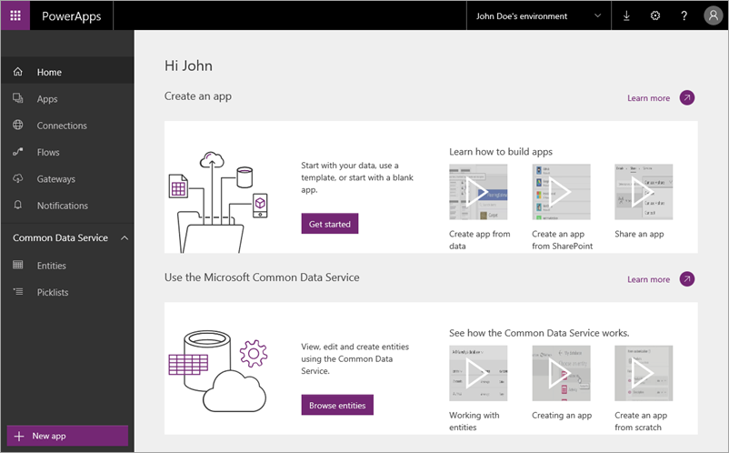
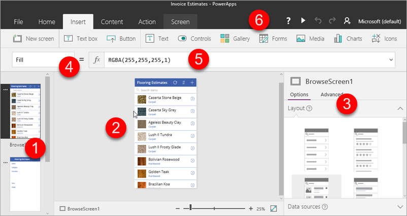

In the first Guided Learning topic you read about the main parts of PowerApps. Now we're going to provide a little more detail on each of the parts. PowerApps is a set of software services and apps that work together, and there are related technologies that help make this a powerful ecosystem. The PowerApps components are:

* **web.powerapps.com** - manage and share the apps you build
* **PowerApps Studio** - build powerful apps with easy to use visual tools
* **PowerApps Mobile** - run apps on Windows, iOS, and Android devices
* **PowerApps admin center** - administer PowerApps environments and other components
* **The Common Data Service for Apps** - integrate business data using the common data model

We don't expect you to take a ton of time just to learn what PowerApps *is*, but we think it's helpful to flesh things out a bit more.

## web.powerapps.com
If you build apps, this is where you spend most of your time. You learn from the **sample apps and templates** that are available here, and see all the apps you have created. You create apps in **PowerApps Studio for web** or **PowerApps Studio for Windows**, and share those apps with individuals and organizations. You manage data: **connections**, **gateways**, and **entities** (all of which we'll cover shortly.) And you see all the **flows** created in **flows.microsoft.com**, which you can integrate with your apps.

## PowerApps Studio
**PowerApps Studio** is available as a web application that you can use in any modern browser, and as a Windows application. PowerApps Studio has three panes and a ribbon that make app creation feel **similar to building a slide deck in PowerPoint**:

1. **Left navigation bar**, in which you can show a thumbnail for each screen in your app or a hierarchical view of all the controls on each screen
2. **Middle pane**, which shows the screen that you're working on
3. **Right-hand pane**, where you set options such as layout and data sources
4. **Property** drop-down list, where you select the properties that formulas apply to
5. **Formula bar**, where you add formulas (as in Excel) that define app behavior
6. **Ribbon**, where you add controls and customize design elements

## PowerApps Mobile
**PowerApps Mobile for Windows, iOS, and Android** provides an environment where you can find and use apps. Instead of going to separate app stores, you stay in PowerApps and have access to all the apps that you've created and that others have shared with you. When you use apps in PowerApps Mobile, you get the most out of your device's capabilities like camera controls, GPS location, and more.

## Admin center
The **PowerApps admin center** is the centralized place to administer PowerApps for an organization. This is where you define different **environments**, which house apps, data connections, and other elements. The admin center is also where you create Common Data Service databases, and manage permissions and data policies.

### Microsoft Common Data Service for Apps
The **Common Data Service for Apps** makes it easy to integrate business data from multiple sources. The service features a **common data model** that includes many **entities** common to apps and business processes. The service stores the data in a scalable and reliable way, and makes the data available so that multiple applications can use it. The applications can be apps that you build in PowerApps, Dynamics 365, other Microsoft applications, or third party applications. The image below shows a portion of an entity in web.powerapps.com.

In the next topic we'll learn about the set of related technologies that PowerApps works with to make a powerful ecosystem for app development.

