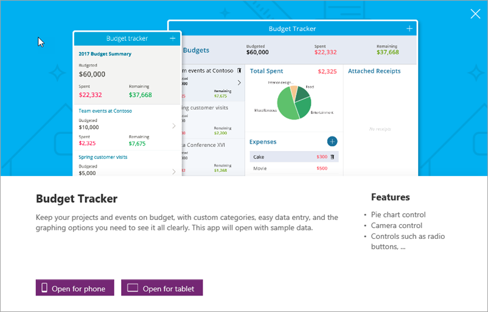

Now that you know the basics of PowerApps, let's jump into **a quick tour of how to get started with apps**. We'll look at sample apps, creating apps from a template, using shared apps, and creating apps from a data source. In the next topic, we will get more hands-on with app creation.

## Check out some sample apps
In web.powerapps.com, you'll be greeted with several sample apps that you can use in your web browser. Explore these apps to **get a quick sense of what's possible** and how PowerApps can help your business.

Each sample app is designed for a specific purpose, such as managing a budget, inspecting a site, or tracking service tickets. These apps contain sample data to **inspire your thinking**. This app illustrates how a flooring company could help service representatives deliver accurate and immediate cost estimates when visiting customer locations.

## Create an app from a template
Another good way to start is by **building an app from a template**. Templates are basically sample apps that you can open to understand how they are put together. They use sample data to help you get a sense of what's possible, and opening them in PowerApps Studio will help you **see hands-on how an app is built**.

For example, with the **Budget Tracker** template, you can create an app that helps you track the budget for projects and events, with custom categories, easy data entry, and visuals that clearly show expenditures.

## Use shared apps
If your team has started using PowerApps, people might have **shared apps with you** already. When people share apps with you, they show up in AppSource and also in Dynamics 365 if you choose to include them there. If you're a contributor to those apps, they also show up in web.powerapps.com.

## Create an app from a data source
Create apps in **PowerApps Studio**. You'll be able to connect to data sources and start composing apps in a visual designer.

A great way to get started is to **generate an app from your own data**. Just point PowerApps at the data source of your choice (for example, a SharePoint list) and watch as PowerApps **automatically builds a three-screen app** for browsing the list, viewing detailed records, and editing data. You can **then start customizing this app** to look and behave exactly how you want. We will see how the following app is created in the next topic.

You can also build applications from scratch and add all the pieces as you go, but **the easiest way to learn about PowerApps is to start with a sample or a template**, or connect to your data source and have PowerApps generate the app for you. Then you can branch out and let your imagination run wild—there will be plenty of that later in the course! In the next topic, you will learn how to generate an app from data.

