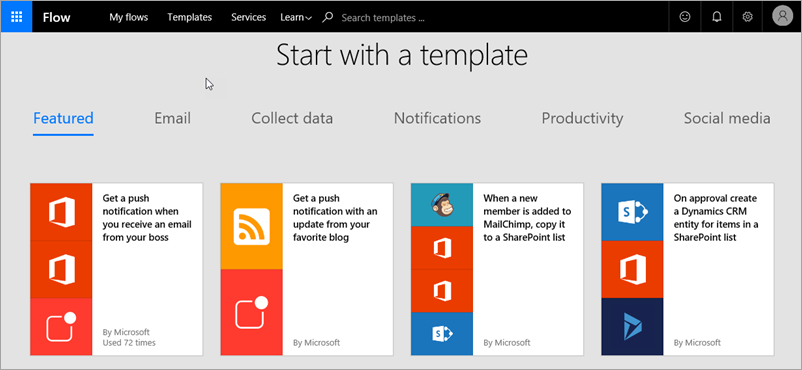

The following technologies are often used with PowerApps to build and share robust apps across your organization. Your apps can integrate data from multiple sources and include workflows that automate tasks. 

* **Microsoft Flow** - create automated workflows between your favorite apps and services
* **Data sources, connections and connectors, and gateways** - bring cloud and on-premises data into your apps
* **Microsoft Dynamics 365** - run all your business apps in the web
* **Microsoft AppSource** - share your apps into this centralized place for Microsoft and our many partners

### Microsoft Flow
**Microsoft Flow** is a service for automating workflow across the growing number of apps and services that business users rely on. Microsoft Flow can accelerate your business so you spend less time on mundane, repetitive tasks, and more time on what you want to do. Use Microsoft Flow in conjunction with PowerApps to **build apps that trigger and respond to workflows**.

### Data sources, connections and connectors, and gateways
There are many **data sources** that you might care about, and PowerApps uses **connectors** to make **connections** to these data sources. Some of the most popular data sources are shown below—many of them are cloud services, like Salesforce. Connectors might not feel like the coolest part of app development, but they are essential to working with data that you, your colleagues, and your customers care about. For data that is stored on-premises rather than in the cloud, you use a **gateway** to provide a reliable connection between PowerApps and your data source. The gateway sits on an on-premises computer and communicates with PowerApps.

### Microsoft Dynamics 365
**Dynamics 365** is a cloud service with purpose-built apps that enable you to address specific business needs like sales automation, operations, or customer service. In PowerApps, you share apps into AppSource, then users you share with view and run those apps in Dynamics 365, as well as on mobile devices. The advantage of having the apps in Dynamics 365 is that you have **one place to run all your business apps** - from creators in your organization, from Microsoft, and from third parties.

### Microsoft AppSource
**AppSource** is the place to **easily find and evaluate apps from your colleagues, and from Microsoft and our partners**. When you share an app from PowerApps, you make it available in AppSource. You can choose to make it available just for people in your organization, or you can make it available publicly.

Now you have a little more information about all the parts of PowerApps, and related technologies. Don't feel like you have to memorize the list, because we will continue to deepen your knowledge on each of the parts throughout this course. Next up is an introduction to the options you have for creating apps.

