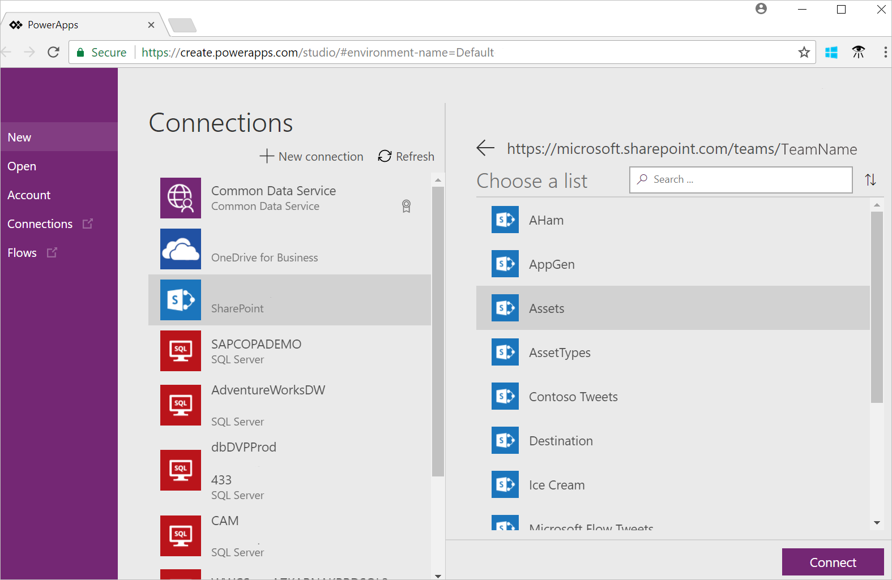

# Quickstart: Create an app using SharePoint

This quickstart shows how to automatically create your first app using a SharePoint Online list within PowerApps. In this article, you create a new app, select an existing SharePoint Online list, and then see what you created. Every generated app automatically includes screens to browse records, show record details, and create or update records. This is a quick way to get a working app using your SharePoint data. You can also customize the app.

To follow this quickstart, you need a SharePoint Online URL that also has a SharePoint list.

If you're not signed up for PowerApps, you can [sign up for free](https://web.powerapps.com/signup?redirect=marketing&email=). 

## Sign in to PowerApps 

Open a web browser, and go to [https://web.powerapps.com]([https://web.powerapps.com). Sign in with your account. 

## Choose a site and list

1. In the left menu, select **Apps**, and then select **Create an app**. 

2. In **Start with your data**, select **SharePoint**. You may have to select **Connect directly (cloud services)**, and **Create** the connection. 

3. Enter the URL to your SharePoint site,and select **Go**. For example, enter  something like `https://microsoft.sharepoint.com/teams/TeamName`.  

4. **Choose a list**, and **Connect**. It may take a few minutes to create your app.

    

## View your app    
In PowerApps Studio, select **See a preview of this app**. Play the app. Select the different options, and use the arrows to navigate within your app. You can also sort the list, and add new items to the list. 

## Clean up your resources
Apps aren't saved until you save them. If you want to keep this app, then save it (Ctrl + S). If you don't want to save this app, then close it using `Ctrl + F4`, or go to the **File** menu, and select **Close**. 

To remove the SharePoint connection, go to the **File** menu, and select **Connections**. In the list, select your connection, and then **Delete**.

## Next steps
In this quick start, you created an app using existing data in a SharePoint list. To get more hands-on experience creating apps, use one of our templates.

> [!div class="nextstepaction"]
> [Create and run an app from a template](../get-started-test-drive.md)