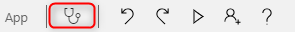
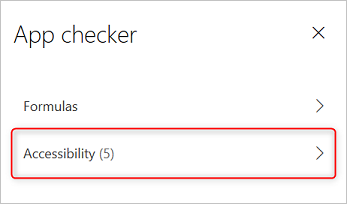
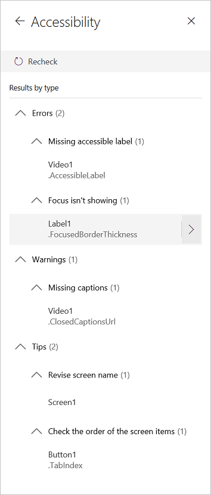

# Review a canvas app for accessibility in PowerApps

Users who have vision, hearing, or other impairments can use your canvas app more easily and successfully if you consider accessibility as you design how the app looks and behaves. If you're not sure how to make your app more accessible, you can run the Accessibility checker in PowerApps Studio. This tool not only finds potential accessibility issues but also explains why each might be a potential problem for users who have a specific disability and offers suggestions on how to resolve each issue.
The Accessibility checker detects screen-reader and keyboard issues for you, and you can find information about how to fix color-contrast issues  by using [accessible colors](accessible-apps-color.md).

The Accessibility checker helps you identify settings that you might want to change, but you should always consider the suggestions in the context of what your app needs to do. Many suggestions may be worthwhile, but you can ignore any that might do more harm than good.

## Find accessibility issues

1. In the upper-right corner of PowerApps Studio, select the icon for the App checker.

    

2. In the menu that appears, select **Accessibility**.

    

    A list of issues appears, sorted first by severity and then by screen.

    

3. Select the arrow next to an item to show details about it.

    

4. Select the back arrow to return to the list of items.

5. If you decide to address an issue, select it to open the affected property.

6. After you change one or more properties, select **Re-check** to update the list of issues.

    Resolved items disappear from the list, and new items may appear.

## Severity of issues

The Accessibility checker classifies each issue as an error, a warning, or a tip based the issue's severity.

- **Errors** identify issues that make the app difficult or impossible to use and understand for users who have a disability.
- **Warnings** identify issues that make the app difficult to use or understand for most but not all users who have a disability.
- **Tips** help you improve the experience of users who have a disability.

## Types of issues

| Issue Title                            | Severity | Issue Description  | How to fix | Why fix|
| ------------------------------         |:---------| -----| ------|------ |
| **Missing accessible label**           | Error    | When the accessible-label property of an interactive control contains no text. An interactive control can be inherently interactive, as a button is, or it has interactive properties. For example, you might have set the **OnSelect** property of an image or set its **TabIndex** property to 0 or higher.  | Edit the accessible-label property to describe the item. | If the accessible-label property contains no text, people who can’t see the screen won't understand what’s in images and controls. |
| **Focus isn't showing**                | Error    | When the **FocusBorderThickness** of a control is set to 0. It is good practice to ensure a proper color-contrast ratio between the focus border and the control itself so it's clearly visible. | Change the **FocusedBorderThickness** property to a value that's higher than 0.  | If the focus isn't visible, people who don't use a mouse can't see it when they interact with the app.   |
| **Missing captions**                   | Warning  | When the **ClosedCaptionsURL** property of an **Audio** or **Video** control is empty. | Set the **ClosedCaptionsURL** property to the URL for captions. | Without captions, people who have disabilities might not get any information from a video or audio segment. |
| **Missing helpful control settings**   | Warning  | When any of several settings (such as showing labels and markers for charts and showing default controls for **Audio**, **Video**, and **Pen input** controls) are turned off. | Select the warning, and then set the property to **true**. | By changing this property setting, you give the user better information about how the controls in your app function. |
| **HTML won't be accessible**           | Warning  | When a control other than an HTML text control contains HTML. In that case, PowerApps doesn't support accessibility of custom HTML elements. | Use a method other than HTML, or remove the HTML from this element. | Your app won't work correctly or be accessible if you add interactive HTML elements. |
| **Turn off autostart**                 | Warning  | When an **Audio** or **Video** control's **Autostart** property is set to **true**. | Set the control's **Autostart** property to **false**. | Video and audio files that play automatically can distract users. Let them choose whether to play a clip. |
| **Revise screen name**                 | Tip      | When a screen has a default name, which will be read out by screen readers when users navigate the app. | Give the screen a name that describes what's on the screen or what it's used for.| People who are blind, have low vision, or a reading disability rely on screen names to navigate using the screen reader. |
| **Add State indication text**          | Tip      |  When a control that has a state, such as a toggle, but the value labels are turned off. | Set the **ShowValue** property of the control to **true** to show its current state. | Users won't get confirmation of their actions if the state of the control doesn't appear. |
| **Check the order of the screen items**| Tip      | When the **TabIndex** property is greater than 1. App creators can set custom tab orders by setting the **TabIndex** property to a numerical value such as 1, 2, 3, and 4. This tip reminds you to review the interactive order for this screen. As a best practice, follow a design in which the **TabIndex** property is 0.  | Make sure that your screen elements match the order in which you'd want to tab through them. | When a screen reader reads the elements of an app, they should appear in the order in which a user would see them, instead of an order that's less intuitive.  |
| **Add another input method**           | Tip      | When an app contains a **Pen** control. This tip reminds you to include a separate method of input. | Add a **Text input** control in addition to the **Pen** control for an accessible experience. | Some users can't use a pen and require another way to provide information (for example, by typing a signature). |

## Next steps

- [Create accessible apps](accessible-apps.md)
- [Accessible colors](accessible-apps-color.md)
- [Accessibility properties](controls/properties-accessibility.md)
