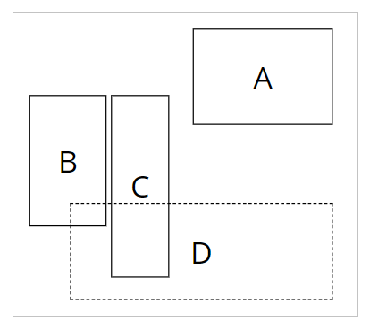
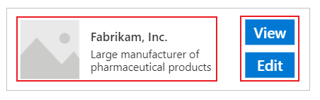

# Organize controls in accessible canvas apps

Controls in an app should be organized to help screen reader users navigate sequentially. A logical order also reduces confusion for keyboard users and helps them be more productive.

## Meaningful screen name

When a screen is loaded, screen readers will say its name. Pick a meaningful name to orientate users.

You can change the screen name in the controls tree or properties panel in Power Apps Studio. Select the screen, and then select  to rename the screen.

The first element on a screen is its name. It's visually hidden and accessible only to screen reader users.

When a new screen loads, Power Apps focuses the screen name. If you use **[SetFocus](functions/function-setfocus.md)** immediately when the screen loads, the screen name will not be read. Consider creating a visible title and making it a [live region](accessible-apps-live-regions.md) to announce the change in context.

## Logical control order

Screen reader users can navigate content sequentially. The order is determined by the position of controls, starting from top to bottom, then left to right. The size of the control doesn't matter, only its **[X](controls/properties-size-location.md)** and **[Y](controls/properties-size-location.md)** properties matter.

In this example, A appears first in the sequence since it's closest to the top. B and C have the same vertical position, but since B is closer to the left, and hence, it appears before C. D appears last since it's furthest from the top.

> [!NOTE]
> - In **Preview** mode when editing an app, the control order is not updated for performance reasons. The order will be correct when the app is published and run.
> - Control order is not the same as that shown in the [tree view of controls](add-configure-controls.md#add-and-select-a-control) in Power Apps Studio. The tree view sorts controls according to when they were added to the app. It does not affect the order of controls when the app is run.

### Grouped controls

The default order is suitable for isolated content but not for grouped content. Consider two tiles side by side, drawn with **[Rectangle](controls/control-shapes-icons.md)** controls. Each tile has a heading. Below the heading are two buttons stacked vertically: A and B for the first tile and C and D for the other.

The default order goes from top to bottom, then left to right. Hence, the order of controls is:

1. Left **Rectangle**
1. Right **Rectangle**
1. Left heading
1. Right heading
1. A
1. C
1. B
1. D

This structure doesn't convey that A and B are together, and similarly, C and D are together.

Use **[Containers](controls/control-container.md)** to group related content. All controls in a **Container** will appear together in sequence. Within a container, controls are ordered with the same rule: top to bottom, then left to right.

Replacing the **Rectangles** of the previous example with **Containers**, the control order is now logical for screen reader users:

1. Left **Container**
1. Left heading
1. A
1. B
1. Right **Container**
1. Right heading
1. C
1. D

All controls in a **[Form Card](controls/control-card.md)** and **[Gallery](controls/control-gallery.md)** are automatically grouped, so you don't have to use a **Container**. However, if there are subgroups, you should still use **Containers** for them.

In this example, a **Gallery** row has a thumbnail and two pieces of text on the left. On the right are two buttons. Visually and logically, the two sets of controls should be grouped. This ensures that screen reader users will encounter the left group first before the right.

## Logical keyboard navigation order

**[TabIndex](controls/properties-accessibility.md)** specifies how controls can be reached by keyboard users. **TabIndex** should either be 0 or -1. With a logical control order as described above, there is little reason to have **TabIndex** greater than 0.

Keyboard navigation order should follow visual flow of controls. If the navigation order is unexpected, you should first check if the app structure is logical.

> [!NOTE]
> Keyboard navigation order is not the same as control order. **TabIndex** only affects Tab key navigation. It does not change how screen reader users navigate an app linearly. Some screen reader users don't even use keyboards.

For rare scenarios where the keyboard navigation order should be different from control order, you can customize **[TabIndex](controls/properties-accessibility.md)**.

## Next steps

[Accessible colors in Power Apps](accessible-apps-color.md)

### See also

- [Create accessible apps](accessible-apps.md)
- [Show or hide content from assistive technologies for canvas apps](accessible-apps-content-visibility.md)
- [Announce dynamic changes with live regions for canvas apps](accessible-apps-live-regions.md)
- [Use the Accessibility checker](accessibility-checker.md)
- [Accessibility limitations in canvas apps](accessible-apps-limitations.md)
- [Accessibility properties](controls/properties-accessibility.md)
