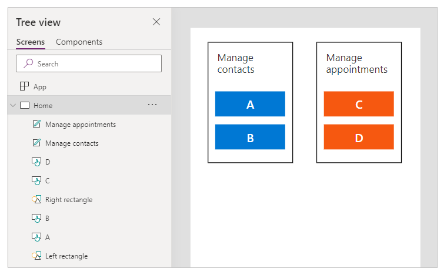
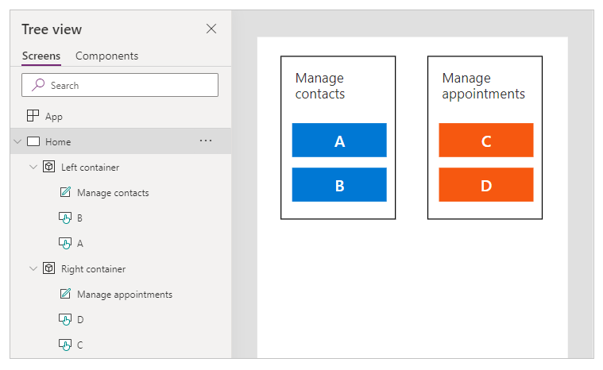

# Organize controls in accessible canvas apps

Controls in an app should be organized to help screen reader users navigate sequentially. A logical order also reduces confusion for keyboard users and helps them be more productive.

## Meaningful screen name

When a screen is loaded, screen readers will say its name. Pick a meaningful name to orientate users.

You can change the screen name in the controls tree or properties panel in Power Apps Studio. Select the screen, and then select  to rename the screen.

The first element on a screen is its name. It's visually hidden and accessible only to screen reader users.

When a new screen loads, Power Apps focuses the screen name. If you use **[SetFocus](functions/function-setfocus.md)** immediately when the screen loads, the screen name won't be read. Consider creating a visible title and making it a [live region](accessible-apps-live-regions.md) to announce the change in context.

## Logical control order

Screen reader users can navigate content sequentially. The order is determined by the position of controls, starting from top to bottom, then left to right. The size of the control doesn't matter, only its **[X](controls/properties-size-location.md)** and **[Y](controls/properties-size-location.md)** properties matter.

In this example, A appears first in the sequence since it's closest to the top. B and C have the same vertical position, but since B is closer to the left, and hence, it appears before C. D appears last since it's furthest from the top.

> [!NOTE]
> - In **Preview** mode when editing an app, the control order is not updated for performance reasons. The order will be correct when the app is published and run.
> - Control order is not the same as that shown in the [tree view of controls](add-configure-controls.md#add-and-select-a-control) in Power Apps Studio. The tree view sorts controls according to when they were added to the app. It does not affect the order of controls when the app is run.
> - When a control's **X** or **Y** value is set to an expression, the control order is not updated when the result of the expression changes. The order is computed and fixed when the app is saved, using the initial state of the app to evaluate expressions.
>     - If you're changing its position because other controls are being hidden or shown, you can use [auto-layout containers](./build-responsive-apps.md#auto-layout-containers) to manage **X** and **Y** for you.
>     - You can also position all controls in a logical way regardless of expression values. For example, if control A should always be below control B and B may be hidden sometimes, set A's **Y** to be `If(B.Visible, B.Y + B.Height, B.Y + 1)`. The addition of 1 ensures that A is always below B, even if B is hidden.

### Grouped controls

The default order is suitable for isolated content but not for grouped content. Consider two tiles side by side, drawn with **[Rectangle](controls/control-shapes-icons.md)** controls. Each tile has a heading. Below the heading are two buttons stacked vertically: A and B for the first tile and C and D for the other.

The default order goes from top to bottom, then left to right. Hence, the order of controls is:

1. Left **Rectangle**
1. Right **Rectangle**
1. Left heading
1. Right heading
1. A
1. C
1. B
1. D

This structure doesn't convey that A and B are together, and similarly, C and D are together.

Use **[Containers](controls/control-container.md)** to group related content. All controls in a **Container** will appear together in sequence. Within a container, controls are ordered with the same rule: top to bottom, then left to right.

Replacing the **Rectangles** of the previous example with **Containers**, the control order is now logical for screen reader users:

1. Left **Container**
1. Left heading
1. A
1. B
1. Right **Container**
1. Right heading
1. C
1. D

All controls in a **[Form Card](controls/control-card.md)** and **[Gallery](controls/control-gallery.md)** are automatically grouped, so you don't have to use a **Container**. However, if there are subgroups, you should still use **Containers** for them.

In this example, a **Gallery** row has a thumbnail and two pieces of text on the left. On the right are two buttons. Visually and logically, the two sets of controls should be grouped. This ensures that screen reader users will encounter the left group first before the right.

## Logical keyboard navigation order

Keyboard navigation is an important aspect of any app. For many, the keyboard is more efficient than using touch or a mouse. The navigation order should:
- Follow the visual flow of controls.
- Follow either an intuitive across and then down "Z" order or a down and then across "reverse-N" order.
- Only have a tab stop at controls that are interactive.

**[AcceptsFocus](controls/properties-accessibility.md)** specifies whether controls can be reached by keyboard. For classic controls, the equivalent property is **[TabIndex](controls/properties-accessibility.md)**.

Navigation order follows [control order](#logical-control-order): from left-to-right, then top-to-bottom, in a "Z" pattern. You can customize it the same way as with control order. For example, controls in **[Containers](controls/control-container.md)**, **[Form Cards](controls/control-card.md)** and **[Galleries](controls/control-gallery.md)** are automatically grouped. The Tab key will navigate through all elements inside the container before proceeding to the next control outside of the container.

If the navigation order is unexpected, you should first check if the app structure is logical.

> [!NOTE]
> When controls are dynamically moved on the screen, for example, by having its **X** or **Y** value change according to a Power Fx expression, the navigation order will not be updated.

### Workaround for custom tab sequence

For rare scenarios where the keyboard navigation order should be different from visual order, you can position container controls carefully to have the same effect.

In the example below, button A is above button B. The natural tab navigation order is A, then B.

:::image type="content" source="media/accessible-apps-structure/simplified-tab-index-workaround-normal.png" alt-text="Two buttons with the same TabIndex, stacked vertically.":::

To reverse the tab navigation order, put B in a Container control. Set the Y value of the Container to be above A. The app structure now has the Container (and B) before A. Hence, the tab navigation order is B, then A.

:::image type="content" source="media/accessible-apps-structure/simplified-tab-index-workaround-container.png" alt-text="B is put in a container that appears before A.":::

With this technique, screen reader users will also encounter B before A when navigating without the **Tab** key.

### Custom tab indexes (retired feature)

Custom tab indexes are those that are greater than zero. They are no longer supported. All **TabIndex** values greater than zero will be treated as zero.

Custom tab indexes are almost always a sign of bad design. There are better alternatives like creating an appropriate app structure or using **[SetFocus](/power-platform/power-fx/reference/function-setfocus)** to change focus.

Some problems with custom tab indexes:

#### Accessibility
It's a serious accessibility issue to have custom tab indexes. Screen reader users navigate an app using its logical structure. Custom tab indexes ignore that structure. Since screen reader users can also navigate using **Tab** key, they'll be confused when they get a different order from other methods of navigation.

#### Usability
Users can be confused when some items appear to be skipped. They can be disoriented when focus moves in an unpredictable order. This is even more problematic for users with cognitive disabilities.

#### Maintenance
App makers have to manually update the **TabIndex** of multiple controls whenever a new one is inserted. It's easy to miss an update or get the order wrong.

#### Performance
To support custom tab indexes, the Power Apps system has to examine all controls on the page and compute the appropriate order. This computation is an intensive process. Container controls like **Gallery** have complicated rules on how **TabIndex** works for child controls. The system maps the app maker's desired **TabIndex** to a different value to obey these rules. This is why even if TabIndex is set to zero for all controls, the actual HTML `tabindex` will be some positive number.

#### Integration with other components
Custom tab indexes only work with built-in controls. Controls that aren't integrated into Power Apps' tab index system will have an unexpected navigation order. This can be a problem for [code components](/power-apps/developer/component-framework/component-framework-for-canvas-apps). Developers of these components have to keep track of interactive elements and set tab index on them. They might use third-party libraries, which may not even provide a way to customize tab indexes. On the other hand, when all tab indexes are either 0 or -1, there's no need to involve Power Apps' tab index system. Any third-party component embedded in the app will automatically get the correct tab sequence.

In the other direction, when canvas apps are embedded in another web page, custom tab indexes don't work. For example, in [custom pages](../model-driven-apps/model-app-page-overview.md). Power Apps can't control the elements outside the canvas app, so the overall tab navigation order will be illogical.

## Next steps

[Accessible colors in Power Apps](accessible-apps-color.md)

### See also

- [Create accessible apps](accessible-apps.md)
- [Show or hide content from assistive technologies for canvas apps](accessible-apps-content-visibility.md)
- [Announce dynamic changes with live regions for canvas apps](accessible-apps-live-regions.md)
- [Use the Accessibility checker](accessibility-checker.md)
- [Accessibility limitations in canvas apps](accessible-apps-limitations.md)
- [Accessibility properties](controls/properties-accessibility.md)
