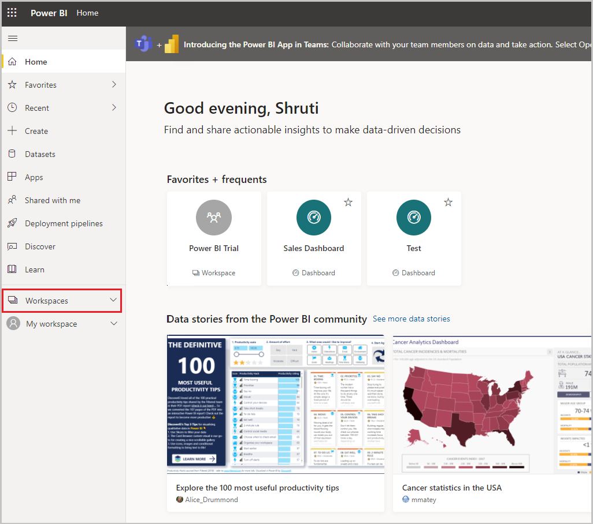
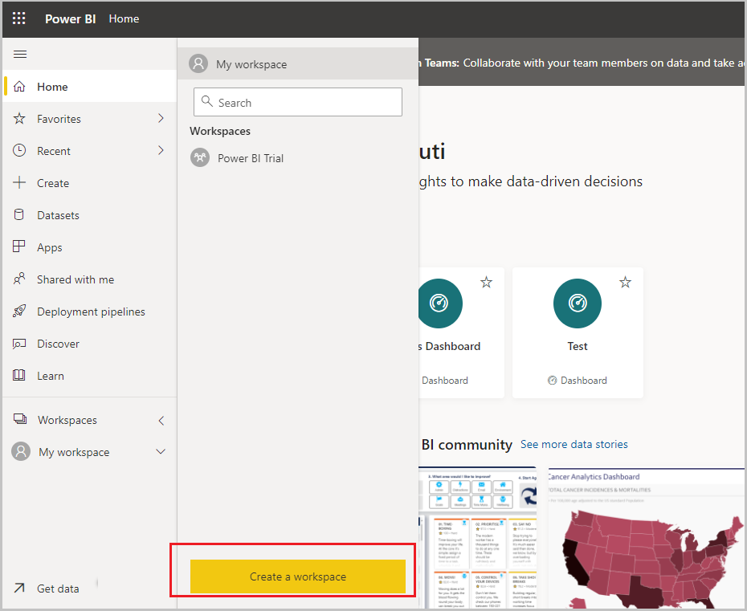
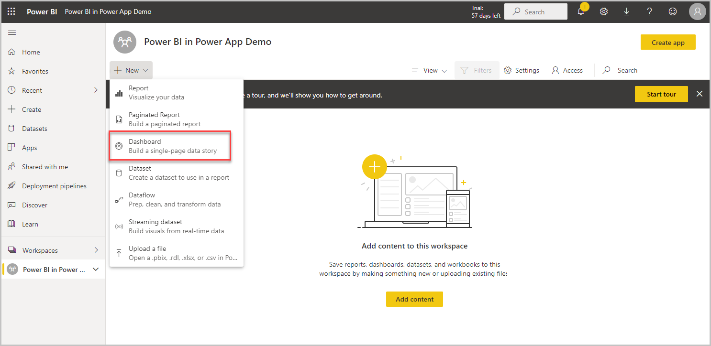
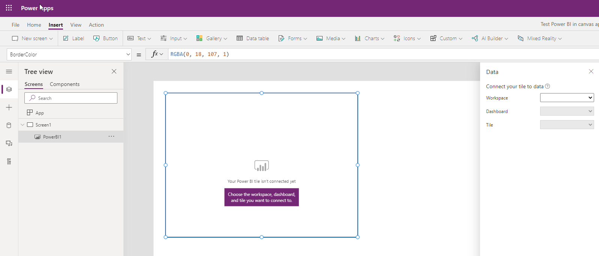

title: Add a Power BI visual into a canvas app
description: Example exercie showing how to add Power BI visual into a canvas app.
author: joel-lindstrom
ms.service: powerapps
ms.topic: article
ms.custom: canvas
ms.reviewer:
ms.date: 06/25/2021
ms.author: v-ljoel
search.audienceType: 

  - maker
search.app: 
  - PowerApps

# Example: Add a Power BI visual into a Canvas App

Power BI is a powerful analysis and visualization tool. Power Apps is great at enabling people to take action on the web and mobile. A Power App can be embedded in a Power BI report. Similarly, a Power BI Report tile can be added to a Power App. The best of both worlds can be achieved at the same place and same time.

In this example, we will create a quick Power BI report and a Power App and then see how we can add the report as a tile in the app.

## Prerequisites

To complete this lesson, we would need the ability to create Power BI dashboards and reports

## Login into Microsoft Power BI

Login into Power BI with the same Office license as the one used for creating the Power App

## Create a new Workspace

1.  Select the Workspaces link in the left navigation menu

2.  Select the Create a workspace button

3.  Enter a name for the workspace and select Save

4.  The workspace gets created

5.  Select the +New button and add a Dashboard

6.  Add a name for the dashboard then select Create

7.  The Power BI Dashboard gets created within the workspace we created

8.  Open the workspace and select the +New button on top and select Dataset to
    create a new dataset

9.  Select the Samples hyperlink under “More ways to create your own content
    to use sample data”

10.  Select the Sales and Marketing sample (or any sample of your choice)

11.  Select the Connect button to connect to the data sample

12.  A dataset with the Sales and Marketing sample and a report gets added to the Workspace

13.  From the left menu, select the report that was created from the dataset, select the 3 dots on the top and select the Pin to dashboard option

14.  Select Existing dashboard option and then select the dashboard and select Pin live

15.  Thus, the report gets added to the dashboard and is ready for use in a power app

## Create a new canvas app

1.  Go to make.powerapps.com and select +Create

2.  Give the app a name and select Create

3.  The canvas app gets created

4.  Select Insert -\> Charts and select Power BI Tile

5.  The Power BI Tile gets added to the screen

6.  Select the right Workspace, Dashboard and Tile that were just created - and the Power BI Tile is added to the canvas app

