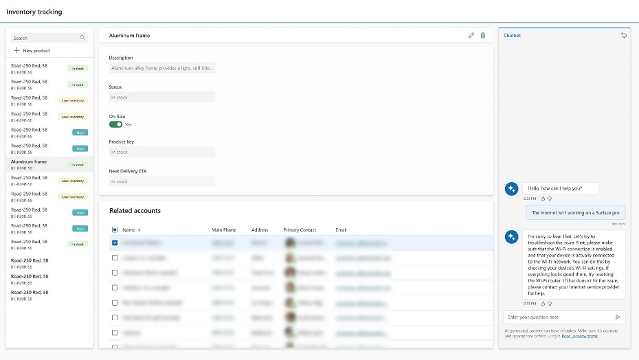
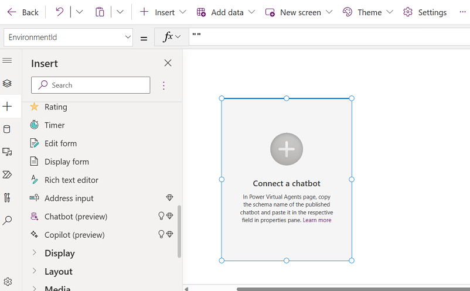
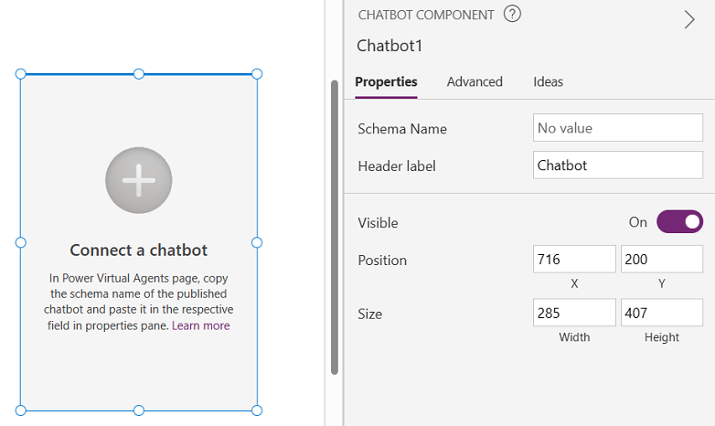

# Add Chatbot control to a canvas app (preview)

[This article is prerelease documentation and is subject to change.]

Add Chatbot control to your canvas apps and embed a published [Power Virtual Agents](/power-virtual-agents/fundamentals-what-is-power-virtual-agents) chatbot to assist your end-users with a variety of requests&mdash;from providing simple answers to common questions to resolving issues requiring complex conversations. 

The Chabot control is also available in [custom pages for model-driven apps](../model-driven-apps/model-app-page-overview.md). The control also supports authenticated Power Virtual Agents bots. A bot picker lists all bots that are in the same environment as your app.

You can use an AI bot or AI boosted conversations bot:

- With AI chatbots, you can create an extended tree of answers to support your users. More information: [Power Virtual Agents quickstart](/power-virtual-agents/quickstart-preview)

- With AI boosted conversations Power Virtual Agents bot your bot can have a higher ability to respond to the user by using a number of prompts or generating a response based on provided "fallback" website, which you set. The "fallback" website can include internal documents or publicly available websites. More information: [AI-based boosted conversations overview (preview)](/power-virtual-agents/nlu-gpt-overview)

You can design the Chabot control by giving it a name, change the size of the control window, and position it anywhere on the screen.

> [!div class="mx-imgBorder"]
> 

> [!IMPORTANT]
> - Preview features aren’t meant for production use and may have restricted functionality. These features are available before an official release so that customers can get early access and provide feedback.
> - For more information, go to our [preview terms](https://go.microsoft.com/fwlink/?linkid=2189520).
> - This capability is powered by [ Azure OpenAI Service](/azure/cognitive-services/openai/overview).
> - This capability  may be subject to usage limits or capacity throttling.

## Prerequisites 

Follow the prerequisites for AI features: [AI Copilot overview (preview)](ai-overview.md)
- To add the Chatbot control, you need to create and publish a bot on the [Power Virtual Agents web app](/power-virtual-agents/fundamentals-what-is-power-virtual-agents-portal). You can create any bot such as an AI bot or a new generative AI enriched Power Virtual Agents bot.
- You can see all your Power Virtual Agents bots (published and unpublished) in the list of Chatbot control when you pick the bot to connect to. However, you can only add a published bot to the control. Unpublished bots are grayed out.

## Add a control with a bot

With your [canvas app open for editing](edit-app.md):

1. On the app authoring menu, select **Insert**.
2. Expand the **Input** menu and then select **Chatbot (preview)**). Place the Chatbot control where you want to add it on the screen. 

   > [!div class="mx-imgBorder"]
   > 

3. Choose the bot you want to connect from one of your published Power Virtual Agents bots, or select **New chatbot** to create a new one.

    You can change the name, the position, and size of the control.

### Key properties 

The following are the main properties for Chatbot control: 

- **Header label**: This is the name of the bot that your end-user sees. If you don't enter a header label, then the name is **Chatbot**.

- **Schema name**: This property refers to the Power Virtual Agents bot that you connect to. The property automatically populates once a bot is selected. To choose a bot, for **Schema name** property select, **Select bot**.

- **Visible**: Choose if you want the bot be visible or not.
  
- **Position** and **Size**: Determines how your bot looks on the screen. Use the other properties or move the control on the screen to set position and size of the control on the screen.

  Once you select the bot and set the properties, the properties pane looks like this:

  > [!div class="mx-imgBorder"]
  > 

## Limitations

1. Chatbot control isn't supported on the Power Apps mobile app.
2. Chatbot control isn't available in [Power Apps US Government](/power-platform/admin/powerapps-us-government) or Mooncake.

## See also

[AI Copilot overview (preview)](ai-overview.md)

[Power Virtual Agents preview quickstart (preview)](/power-virtual-agents/preview/quickstart)

[AI-based boosted conversations overview (preview)](/power-virtual-agents/nlu-gpt-overview)

[Use the Copilot control](add-ai-copilot.md)

[Build apps through conversation (preview)](ai-conversations-create-app.md)

 

[!INCLUDE[footer-include](../../includes/footer-banner.md)]
