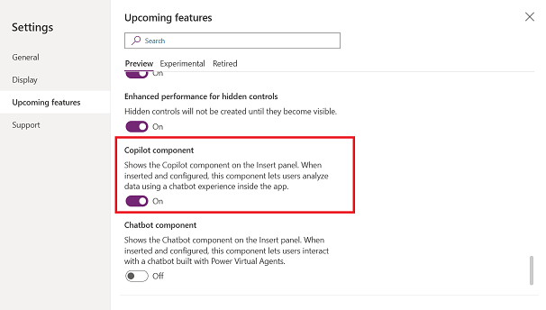
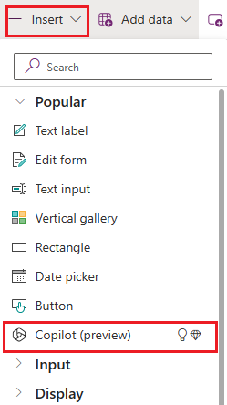
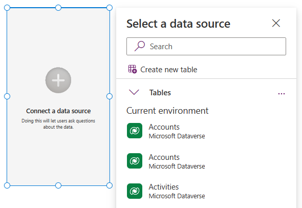
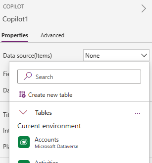
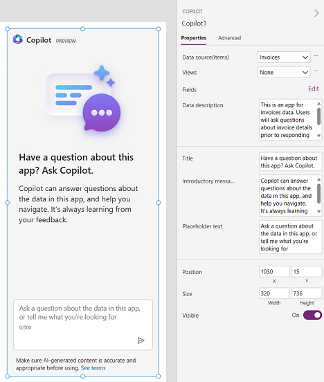

# Add Copilot control to a canvas app (preview)

[This article is prerelease documentation and is subject to change.]

The Copilot control is a next-generation AI assistant that makers can add to their apps for end-users. This is an AI-powered experience for app users to get insights about the data in their apps through conversation in natural language. Makers can add this control to any app and choose what data it can answer questions about.

> [!IMPORTANT]
> - To use this capability your environment must be in the US region.
> - Preview features aren’t meant for production use and may have restricted functionality. These features are available before an official release so that customers can get early access and provide feedback.
> - For more information, go to our [preview terms](https://go.microsoft.com/fwlink/?linkid=2189520).
> - This capability is powered by [ Azure OpenAI Service](/azure/cognitive-services/openai/overview).
> - This capability  may be subject to usage limits or capacity throttling.
> - Copilot control isn't supported and won't work for environments that have customer-managed key (CMK) or have lockbox.

## Prerequisites

- Follow the prerequisites for AI features: [AI Copilot overview (preview)](ai-overview.md).

## Enable Copilot control for your app

With your [canvas app open for editing](edit-app.md):

1. On the command bar, select **Settings** > **Upcoming features**.
2. From the **Preview** tab, set the toggle for **Copilot component** to **On**.

   > [!div class="mx-imgBorder"]
   > 

## Add the Copilot control

With your [canvas app open for editing](edit-app.md):

1. On the app authoring menu, select **Insert**.
2. Expand the **Input** menu and select **Copilot (preview)** to add this control.

   > [!div class="mx-imgBorder"]
   > 

## Choose data

1. When the Copilot control is added, select a data source from the pane.

  > [!NOTE]
  > Currently, the Copilot control can only answer questions for smaller datasets. The only exception to the dataset limit is when Dataverse is selected as the data source. To configure the table and its columns for use in Copilot, see [Configure tables to use Copilot](../data-platform/table-settings-for-copilot.md).

   > [!div class="mx-imgBorder"]
   > 

   Or, from the control **Properties** tab, select **Data source (Items)** and choose a Dataverse table for your data source.
   > [!div class="mx-imgBorder"]
   > 
   

3. Select the specific **Fields** and/or **View** that the Copilot control will answer questions for.

## Configure the control (optional)

In addition to choosing the data source, you can also configure the following properties:

- **Title**: Replaces the control's default title of **Have a question about this app? Ask Copilot**, and can be replaced with a more appropriate title that reflects the assistance that the Copilot control can provide to app users.

- **Introductory message**: Replaces the control's default introductory message of **Copilot can answer questions about the data in this app, and help you navigate. It's always learning from your feedback**. The current description of the Copilot control can be enhanced to provide a more specific explanation of how it benefits app users.

- **Data summary**: Helps Copilot control give better responses to questions from app users. We recommend a brief 2-3 lines describing what the app is and what sort of questions this Copilot control will answer. This property doesn't impact the control's UI.

- **Placeholder text**: Replaces the control's default placeholder text in the text input box **Ask a question about the data in this app, or tell me what you're looking for**. We recommend for you to provide a concise message to app users, explaining what types of questions can be addressed by the Copilot control.

   > [!div class="mx-imgBorder"]
   > 

## Provide feedback

- To improve Copilot control, makers can submit feedback using the **Like** (thumbs up) or **Dislike** (thumbs down) button on the Copilot control properties pane. Once you select a response, enter your feedback and then select **Submit**.

- App users can provide feedback by selecting **Like** (thumbs up) or **Dislike** (thumbs down) button for each response that Copilot provides. Optionally, can also enter additional feedback in the text box and then select **Submit**.

### Disable feedback

Admins can disable the option to provide feedback to Microsoft.

1. Sign in to [Power Apps](https://make.powerapps.com).
2. On the [left navigation pane](intro-maker-portal.md#1--left-navigation-pane), select **Tables** > **Organization**.
3. In the **Organization columns and data** section, select the list of columns and search for **Allow users to provide feedback for App Copilot**.
4. Set the toggle to **No**.

## See also

[Build apps through conversation (preview)](ai-conversations-create-app.md)

[Add Chatbot control to a canvas app (preview)](add-ai-chatbot.md)

[Leverage Azure OpenAI Service in AI Builder (preview)](/ai-builder/prebuilt-azure-openai) 

[!INCLUDE[footer-include](../../includes/footer-banner.md)]
