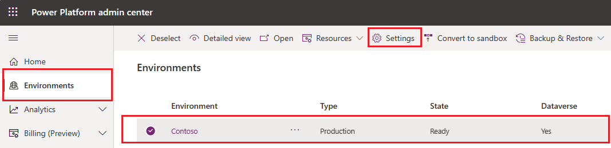
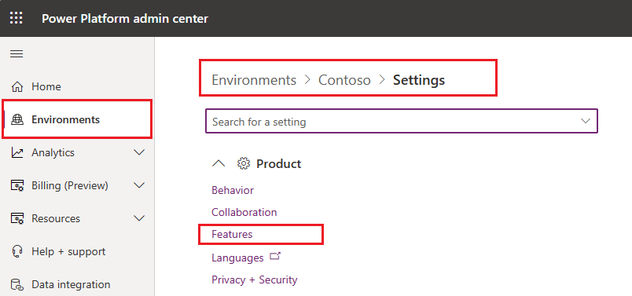
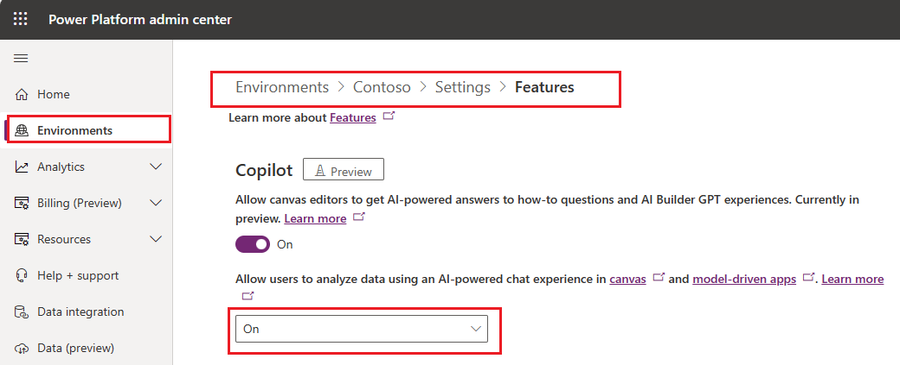

# Add Copilot for app users in a canvas app (preview)

[This article is prerelease documentation and is subject to change.]

The Copilot control is a next-generation AI assistant that makers can add to their canvas apps for end-users. This is an AI-powered experience for app users to get insights about the data in their apps through conversation in natural language. Makers can add this control to any canvas app and choose what data it can answer questions about.

> [!IMPORTANT]
> - To use this capability your environment must be in the US region.
> - Preview features aren’t meant for production use and may have restricted functionality. These features are available before an official release so that customers can get early access and provide feedback.
> - For more information, go to our [preview terms](https://go.microsoft.com/fwlink/?linkid=2189520).
> - This capability is powered by [Azure OpenAI Service](/azure/cognitive-services/openai/overview).
> - This capability  may be subject to usage limits or capacity throttling.
> - Copilot control isn't supported and won't work for environments that have customer-managed key (CMK) or have lockbox.

## Enable Copilot for canvas app users feature for your enviornment

Environment administrators can enable access to Copilot control (preview) for app makers in their environments in [Power Platform admin center](https://admin.powerplatform.microsoft.com). Once Copilot fetaure is enabled for the environment, makers will be able to add Copilot chat control for end  users in their canvas apps in App Studio.

  > [!IMPORTANT]
  > Copilot for app users cpontrol fetaure for canvas apps is not enabled by default. Administrators must manually enable this feature for their environments in [Power Platform admin center](https://admin.powerplatform.microsoft.com).

1. Sign in to the Power Platform admin center at https://admin.powerplatform.microsoft.com.

2. In the navigation pane, go to **Environments** and select the enviornment where you want to enable Copilot for app users in model-driven apps in. Click on **Settings** for this environment in the top menu.

  > [!div class="mx-imgBorder"]
  > 
 
3. In **Settings** for the seleceted environment, navigate to **Product** section and select **Features** option.

  > [!div class="mx-imgBorder"]
  > 

4. In **Features** section, set the value for **Allow users to analyze data using an AI-powered chat experience in canvas and model-driven apps** to **On** in the dropdown control and **Save** your changes.
   
  > [!div class="mx-imgBorder"]
  > 

## Enable Copilot control for your canvas app in App Studio

With your [canvas app open for editing](edit-app.md):

1. On the command bar, select **Settings** > **Upcoming features**.
2. From the **Preview** tab, set the toggle for **Copilot component** to **On**.

   > [!div class="mx-imgBorder"]
   > 

## Add the Copilot control for app users to a canvas app

With your [canvas app open for editing](edit-app.md):

1. On the app authoring menu, select **Insert** and select **Copilot (preview)** to add this control.

   > [!div class="mx-imgBorder"]
   > 

## Choose data for Copilot

1. When the Copilot control is added to the canvas app, select a data source from the pane. Currenly, Copilot for app users in canvas apps is able to provide data inisghts on a single Dataverse table only.

   > [!div class="mx-imgBorder"]
   > 

   Or, from the control **Properties** tab, select **Data source (Items)** and choose a Dataverse table for your data source.
   > [!div class="mx-imgBorder"]
   > 
   
 > [!TIP]
  >Any Dataverse tabeles in your environment that are not added to you canvas app can be selected as a datasource for Copilot control.

2. Select the specific **Fields** and/or **View** that the Copilot control will answer questions for.
   
3. To configure the selected table and its columns for use in Copilot, see [Configure tables to use Copilot](../data-platform/table-settings-for-copilot.md).

  > [!NOTE]
  > Currently, the Copilot for apps can only answer questions for smaller datasets in a canvas app. The only exception to the dataset limit is when a Dataverse table is selected as the data source. 

## Configure the Copilot control (optional)

In addition to choosing the data source for Copilot, you can also configure the following Copilot properties in a canvas app:

- **Title**: Replaces the control's default title of **Have a question about this app? Ask Copilot**, and can be replaced with a more appropriate title that reflects the assistance that the Copilot control can provide to app users.

- **Introductory message**: Replaces the control's default introductory message of **Copilot can answer questions about the data in this app, and help you navigate. It's always learning from your feedback**. The current description of the Copilot control can be enhanced to provide a more specific explanation of how it benefits app users.

- **Data summary**: Helps Copilot control give better responses to questions from app users. We recommend a brief 2-3 lines describing what the app is and what sort of questions this Copilot control will answer. This property doesn't impact the control's UI.

- **Placeholder text**: Replaces the control's default placeholder text in the text input box **Ask a question about the data in this app, or tell me what you're looking for**. We recommend for you to provide a concise message to app users, explaining what types of questions can be addressed by the Copilot control.

   > [!div class="mx-imgBorder"]
   > 

## Provide feedback

- App users and makers can provide feedback by selecting **Like** (thumbs up) or **Dislike** (thumbs down) button for each response that Copilot provides. Optionally, app users can also enter additional feedback in the text box and then select **Submit**.

### Disable feedback option for app users

Admins can disable the option for apps users to provide feedback to Microsoft in Copilot in canvas apps.

1. Sign in to [Power Apps](https://make.powerapps.com).
2. On the [left navigation pane](intro-maker-portal.md#1--left-navigation-pane), select **Tables** > **Organization**.
3. In the **Organization columns and data** section, select the list of columns and search for **Allow users to provide feedback for App Copilot**.
4. Set the toggle to **No**.

## See also

[Build apps through conversation (preview)](ai-conversations-create-app.md)

[Add Chatbot control to a canvas app (preview)](add-ai-chatbot.md)

[Leverage Azure OpenAI Service in AI Builder (preview)](/ai-builder/prebuilt-azure-openai) 

[!INCLUDE[footer-include](../../includes/footer-banner.md)]
