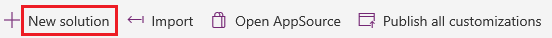
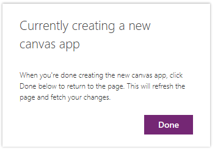
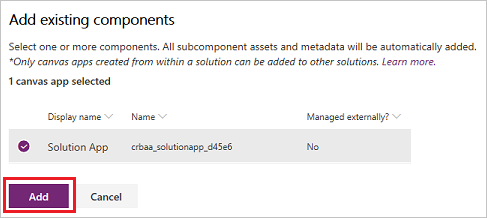

# Create a canvas app from within a solution

Create an app from within a solution if you want to deploy the app, for example, to a different environment. Solutions can contain not only apps but also customized entities, option sets, and other components. You can quickly customize an environment in a variety of ways by creating apps and other components from within a solution, exporting the solution, and then importing it into another environment.

Solutions are built on the same platform as Dynamics 365 for Customer Engagement. For more information, see [Solutions overview](../common-data-service/solutions-overview.md).

## Prerequisites

- You can create an app from within a solution only in an environment that contains a CDS for Apps database.
- You can link an existing app to a solution only if the app was created from within a solution.

## Create a solution

You can skip this procedure if you already have a solution in which you want to create an app or to which you want to link an app.

1. [Sign in](https://web.powerapps.com?utm_source=padocs&utm_medium=linkinadoc&utm_campaign=referralsfromdoc) to PowerApps, and then (if necessary) switch to the appropriate environment:

    - If you want to create an app from within a solution, switch to any environment that contains a CDS for Apps database.
    - If you want to link an existing app to a solution, switch to the environment that contains that app.

1. In the left navigation bar, select **Solutions**.

    

1. In the banner under the title bar, select **New solution**.

    

1. In the window that appears, specify a display name, a publisher, and a version for your solution.

    

    A name (with no spaces) will be automatically generated based on the display name that you specify, but you can customize the generated name if you want. You can specify the default publisher for your environment and **1.0** for the version if you don't have specific needs in those areas.

1. Near the upper-left corner, select **Save and close**.

    

## Create a canvas app in a solution

You can create a blank canvas app from within a solution. You can't automatically generate a three-screen app or customize a template or sample app from within a solution.

1. [Sign in](https://web.powerapps.com?utm_source=padocs&utm_medium=linkinadoc&utm_campaign=referralsfromdoc) to PowerApps.

1. If necessary, switch to the environment that contains the solution in which you want to create a canvas app.

1. In the left navigation bar, select **Solutions**.

    

1. In the list of solutions, select the solution in which you want to create a canvas app.

1. In the banner under the title bar, select **New** > **App** > **Canvas app**, and then select the form factor (phone or tablet) of the app that you want to create.

    

    PowerApps Studio opens with a blank canvas in another browser tab.

1. Create your app (or make at least one change), and then save your changes.

1. On the browser tab where you selected your solution, select **Done** to refresh the list of components in your solution.

    

    Your new app appears in the list of components for that solution. If you save any changes to your app, they will be reflected in the version that's in the solution.

## Link an existing canvas app to a solution

1. [Sign in](https://web.powerapps.com?utm_source=padocs&utm_medium=linkinadoc&utm_campaign=referralsfromdoc) to PowerApps.

1. If necessary, switch to the environment that contains the solution to which you want to link an app.

1. In the left navigation bar, select **Solutions**.

    

1. In the list of solutions, select the solution to which you want to link an app.

1. In the banner under the title bar, select **Add existing** > **App** > **Canvas app**.

    

    A list of canvas apps that were created within a solution in this environment appears.

1. In the list of apps, select the app that you want to link to the solution, and then select **Add**.

    

## Next steps

- Create or link more apps and [other components](../common-data-service/use-solution-explorer.md#create-component-in-a-solution), such as entities, flows, and dashboards, to your solution.
- [Export your solution](../common-data-service/import-update-export-solutions.md#export-solutions) so that you can deploy it to another environment, on AppSource, and so forth.