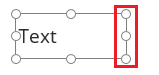
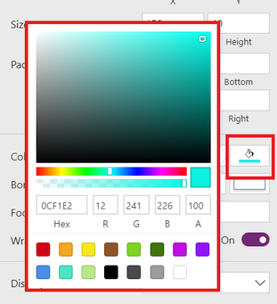
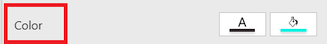
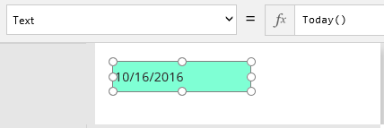
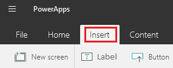
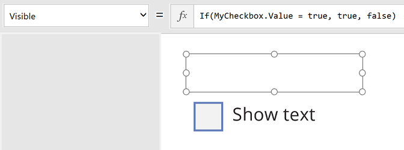

# Add and configure a control in PowerApps
Add a variety of UI elements to your app, and configure aspects of their appearance and behavior directly, from the toolbar, in the **Properties** tab, or in the formula bar. These UI elements are called controls, and the aspects that you configure are called properties.

## Prerequisites
1. [Sign up](../signup-for-powerapps.md) for PowerApps, and then [sign in](https://web.powerapps.com) by providing the same credentials that you used to sign up.

2. In PowerApps Studio, click or tap **New** on the **File** menu (near the left edge).

    

3. On the **Blank app** tile, click or tap **Phone layout**.

    

4. If you're prompted to take the intro tour, click or tap **Next** to get familiar with key areas of the PowerApps interface (or click or tap **Skip**).

    

    You can always take the tour later by clicking or tapping the question-mark icon near the upper-right corner and then clicking or tapping **Take the intro tour**.

## Add a control
You can add any control in a variety of categories by clicking or tapping the **Insert** tab of the toolbar, clicking or tapping a category, and then clicking or tapping the control that you want. In this section, review the controls in each category to get familiar with the types of controls that you can add and where you might find each type.

On the **Insert** tab, click or tap any of these categories, and then click or tap the control that you want to add:

**Text**: Label, Text input, HTML Text, Pen input 
**Controls**: Button, Drop down, Date picker, List box, Check box, Radio, Toggle, Slider, Rating, Timer 
**Gallery**: Vertical, Horizontal, Flexible height, Blank vertical, Blank horizontal, Blank flexible height 
**Data table** 
**Forms**: Edit, Display, Entity form 
**Media**: Image, Camera, Barcode, Video, Audio, Microphone, Add picture 
**Charts**: Column chart, Line chart, Pie chart 
**Icons**

> [!TIP]
> If you need more space for controls, [add another screen](add-screen-context-variables.md).

## Configure a control directly
In this procedure, you'll add and configure a **Label** control, but you can apply many of the same principles to other controls.

1. Click or tap the **Insert** tab, and then click or tap **Label**.

    

    When you add a control, it's selected by default. You can also select an existing control by clicking or tapping it. When a control is selected, a selection box surrounds it, and other areas of the UI change so that you can configure the selected control. For example, a selected **Label** control resembles this graphic.

    

    > [!IMPORTANT]
   > If a control is selected when you select another control or a blank area of the screen, the first element is no longer selected.
2. Make the **Label** control narrower by dragging a handle on the right edge of the selection box to the left. (The middle handle appears only if you zoom in.)

    

     You can also resize a control by modifying its **[Height](controls/properties-size-location.md)**, **[Width](controls/properties-size-location.md)**, or both properties, as this topic describes later.

3. Move the **Label** control by dragging the selection box itself (or by modifying the **[X](controls/properties-size-location.md)**, **[Y](controls/properties-size-location.md)**, or both properties, as this topic describes later).

4. Triple-click the text that appears in the **Label** control, and then type **Hello, world**.

    

     You can also modify this text by setting the **[Text](controls/properties-core.md)** property of this control, as this topic describes later.

## Configure a control from the toolbar
By configuring a control from the toolbar, you can specify a wider variety of options than you can by configuring a control directly.

1. With the **Label** control selected, click or tap the **Home** tab of the toolbar.

    

2. Click or tap **Fill**, and then click or tap a color such as aquamarine.

    

    The **Label** control reflects your selection.

    

3. Change the font family and the size of the text (for example, to 18 pt. Georgia).

    

    The **Label** control reflects your selection.

    

4. Click or tap the **Label** tab, click or tap **VerticalAlign**, and then click or tap **Top**.

    

    The **Label** control reflects your selection.

    

## Configure a control from the Properties tab
By using the **Properties** tab, you can configure a control without writing a formula. In this procedure, you'll add and configure another **Label** control, but you can apply many of the same principles to other controls.

1. Add another **Label** control as described earlier in this topic.

2. With the new control selected, click or tap the **Properties** tab in the right-hand pane.

    

3. In the **Text** box, type **Properties tab**.

    

    The **Label** control shows the entered text.

    

4. Click or tap the **Fill** icon in the **Properties** panel, and then click or tap a color.

    

    The **Label** control reflects your selection.

    

5. Click or tap the **Color** property in the properties panel.

    

    The value of the **Color** property is highlighted in the formula bar.

    

6. Delete the second **Label** control by clicking or tapping it and then pressing Delete.

## Configure a control in the formula bar
By using the formula bar, you can set properties that you can't set directly, in the **Properties** tab, or from the toolbar. For example, you can set a tooltip that appears when a user points to the control but doesn't click or tap it. You can also specify complicated formulas that increase the power of your app.

Each change that you made earlier in this topic updated the value of a [property](reference-properties.md) for the control that you configured.

* When you resized the control, you changed its **[Width](controls/properties-size-location.md)** property.
* When you moved the control, you changed its **[X](controls/properties-size-location.md)** and **[Y](controls/properties-size-location.md)** properties.
* When you changed the text that the control displays, you changed its **[Text](controls/properties-core.md)** property.

Instead of configuring a control directly, in the **Properties** tab, or from the toolbar, you can also update the value of a property by selecting it in the property list and then specifying a value in the formula bar. By taking this approach, you can search for a property alphabetically, and you can specify more types of values.

1. With the remaining **Label** control selected, click or tap **[Text](controls/properties-core.md)** in the property list, and then type **"My Company Name"** (including the quotation marks) in the formula bar.

    

    When you surround a string of text with quotation marks, you specify that it should be treated exactly as you typed it. As an alternative, you can set the value of a property to a formula.

2. With the **Label** control selected, click or tap **[Text](controls/properties-core.md)** in the property list, and then type **Today()** (without quotation marks) in the formula bar.

    The control shows the current date.

    

    > [!TIP]
   > You can [format dates and times](show-text-dates-times.md) in various ways, in addition to performing calculations on them.

## Configure two controls to interact with each other
In this procedure, you'll add a check box and then configure the label that you already have to appear only when the check box is selected.

1. Click or tap the **Insert** tab.

    

2. Click or tap **Controls**, and then click or tap **Check box**.

    

3. Move the **Check box** control so that it appears below the **Label** control, and set the **[Text](controls/properties-core.md)** property of the **Check box** control so that **Show text** appears.

    

4. With the **Check box** control still selected, click or tap its name just above the **Properties** tab, and then type **MyCheckbox**

    

5. Click or tap the **Label** control to select it.

6. On the **Properties** tab, click or tap the **Visible** property.

    

7. In the formula bar, delete **true**, and then type or paste this formula:

    **If(MyCheckbox.Value = true, true, false)**

    This **[If function](functions/function-if.md)** states that the label should appear only when the check box is selected. Because the check box is cleared, the **Label** control disappears (except for the selection box).

    

8. Click or tap the **Check box** control to add the selection box to it, and then click or tap it again to add a check mark.

    The **Label** reappears:

    

9. Clear the **Check box** control to hide the **Label** control.

    

This example is basic, but you can configure the behavior and appearance of your app by building one or more [formulas](formula-reference.md) from simple to complex.

## Rename a screen or a control
By renaming a screen or control, you can build formulas that are easier to read and maintain.

1. Click or tap the screen or the control that you want to rename.

2. In the right-hand pane, click or tap the name of the control (just above the **Properties** tab), and then type the name that you want.

    

## Find and select a screen or a control
You can find and select a screen or a control, even if it's hidden or overlaps with another control, by searching for it in the left-hand pane. This pane shows either a thumbnail of each screen in the app or a hierarchical view of each screen and the controls that it contains.

* **To switch between the thumbnails and the hierarchical view**, click or tap an icon in the upper-right corner of the pane.

    

* **To find a control**, type one or more characters to highlight the control names that contain the text that you typed.

    If you click or tap a search result, you select that control in the app.

    

* **To move a screen up or down, duplicate it, delete it, or rename it**, right-click it (or click or tap the ellipsis next to it), and then click or tap the option that you want.

    

* **To copy/paste a control, delete it, or rename it**, right-click it (or click or tap the ellipsis next to it), and then click or tap the option that you want.
