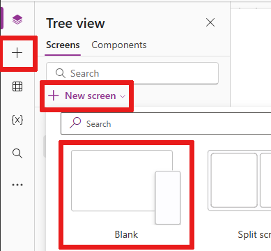
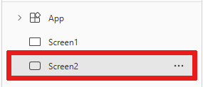

# Add and configure a canvas-app control in PowerApps

Add a variety of UI elements to your canvas app, and configure aspects of their appearance and behavior directly, from the toolbar, in the **Properties** tab, or in the formula bar. These UI elements are called controls, and the aspects that you configure are called properties.

## Prerequisites

1. If you don't already have a PowerApps license, [sign up](../signup-for-powerapps.md), and then [sign in](https://web.powerapps.com?utm_source=padocs&utm_medium=linkinadoc&utm_campaign=referralsfromdoc).
1. Under **Make your own app**, hover over **Canvas app from blank**, and then select **Make this app**.
1. If you're prompted to take the intro tour, select **Next** to get familiar with key areas of the PowerApps interface (or select **Skip**).

    You can always take the tour later by clicking or tapping the question-mark icon near the upper-right corner and then clicking or tapping **Take the intro tour**.

## Add and select a control

On the **Insert** tab, perform either of these steps:

- Select **Label** or **Button** to add one of those types of controls.
- Select a category of controls, and then select the type of control that you want to add.

For example, select **New screen**, and then select **Blank** to add a blank screen to your app. (Screens are a type of control that can contain other types of controls.)

The new screen is named **Screen2** and appears in the left navigation pane. This pane shows a hierarchical list of controls in your app so that you can easily find and select each control.

To demonstrate how this list works, select **Label** on the **Insert** tab. The new control appears under **Screen2** in the hierarchical list.

In the screen, a box with six handles surrounds the label by default. That type of box surrounds whichever control is selected. If you select the screen by clicking or tapping in it (but outside the label), the box disappears from the label. To select the label again, you can click or tap in it, or you can click or tap **Label2** in the hierarchical list of controls.

> [!IMPORTANT]
> You must always select a control before you can configure it.

## Rename a control

In the hierarchical list of controls, hover over the control that you want to rename, select the ellipsis that appears, and then select **Rename**. You can then type a unique, memorable name to make building your app easier.

## Delete a control

In the hierarchical list of controls, hover over the control that you want to delete, select the ellipsis that appears, and then select **Delete**. To delete a control that isn't a screen, you can also select the control on the canvas, and then press the Delete key.

## Reorder screens

In the hierarchical list of controls, hover over a screen that you want to move up or down, select the ellipsis that appears, and then select **Move up** or **Move down**.

> [!NOTE]
> When the app is opened, the screen at the top of the hierarchical list of controls usually appears first. But you can specify a different screen by setting the **OnStart** property to a formula that includes the **Navigate** function.

## Move and resize a control

To move a control, select it, hover over its center so that the four-headed arrow appears, and then drag the control to a different location. To resize a control, select it, hover over any handle in the selection box so that the two-headed arrow appears, and then drag the handle.

> [!NOTE]
> As this topic describes later, you can also move and resize a control by modifying its **[X](controls/properties-size-location.md)**, **[Y](controls/properties-size-location.md)**, **[Height](controls/properties-size-location.md)**, **[Width](controls/properties-size-location.md)**, or all of these properties.

## Change the text of a label or a button

Select the label or button, double-click the text that appears in the control, and then type the text that you want.

> [!NOTE]
> As this topic describes later, you can also modify this text by setting the **[Text](controls/properties-core.md)** property of this control.

## Configure a control from the toolbar

By configuring a control from the toolbar, you can specify a wider variety of options than you can by configuring a control directly.

For example, you can select a label, select the **Home** tab, and then change the font of the text in the label.

## Configure a control from the Properties tab
By using the **Properties** tab, you can specify a wider variety of options than you can by configuring a control from the toolbar.

For example, you can show or hide a control by changing its **Visible** property.

## Configure a control in the formula bar
Instead of configuring a control directly, from the toolbar, or in the **Properties** tab, you can also configure a control by selecting a property in property list and then specifying a value in the formula bar. By taking this approach, you can search for a property alphabetically, and you can specify more types of values.

For example, you can configure a selected label in these ways:

- Move it by selecting **X** or **Y** in the properties list and then specifying a different number in the formula bar.
- Resize it by selecting **Height** or **Width** in the properties list and then specifying a different number in the formula bar.
- Change its text by selecting **Text** in the properties list and then specifying a literal string, an expression, or a formula in the formula bar.
    - A literal string is surrounded by quotation marks and appears exactly as you type it. **"Hello, world"** is a literal string.
    - An expression doesn't include a function and is often based on a property of another control. **Screen1.Height** is an expression that shows the height of **Screen1**.
    - A formula includes one or more functions. The **Now** function returns the current date and time in your local time zone, and the **Text** function formats values such as dates, times, and currency. 

        Formulas are usually much more complex than that example so that they can manage data by filtering it, sorting it, updating it, and performing other operations. For more information, see the [formula reference](formula-reference.md).

## Next steps

- Find step-by-step procedures for configuring common controls such as [screens](add-screen-context-variables.md), [lists](add-list-box-drop-down-list-radio-button.md), [galleries](add-gallery.md), [forms](add-form.md), and [charts](use-line-pie-bar-chart.md).
- Find reference information about each type of control in the [control reference](reference-properties.md).