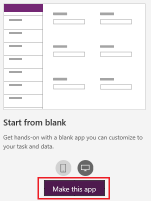
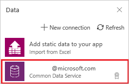
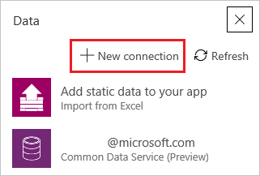
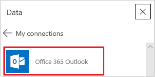
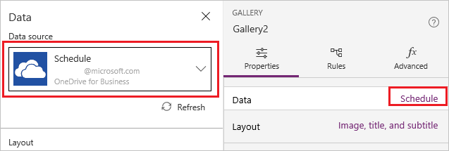
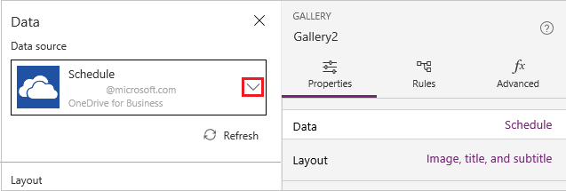

# Add a data connection to a canvas app in PowerApps

In PowerApps, add a data connection to an existing canvas app or to an app that you're building from scratch. Your app can connect to SharePoint, Salesforce, OneDrive, or [many other data sources](connections-list.md).

Your [next step](#next-steps) after this article is to display and manage data from that data source in your app, as in these examples:

* Connect to OneDrive, and manage data in an Excel workbook in your app.
* Connect to Twilio, and send an SMS message from your app.
* Connect to SQL Server, and update a table from your app.

## Prerequisites

[Sign up](../signup-for-powerapps.md) for PowerApps, and then [sign in](http://web.powerapps.com?utm_source=padocs&utm_medium=linkinadoc&utm_campaign=referralsfromdoc) by providing the same credentials that you used to sign up.

## Add a data source
1. On the **Home** tab, hover over the **Start from blank** tile, and then select **Make this app.**

    

1. If the **Welcome to PowerApps Studio** dialog box appears, select **Skip**.

3. In the center pane, click or tap **connect to data**.

4. If the list of connections in the **Data** pane includes the one that you want, select it to add it to the app. Otherwise, skip to the next step.

    

5. Select **New connection** to display a list of connectors.

    

6. Scroll through the list of connectors until the type of connection that you want to create appears (for example, **Office 365 Outlook**), and then select it.

    

7. Select **Create** to both create the connection and add it to your app.

    Some connectors, such as **Office 365 Outlook**, require no additional steps, and you can show data from them immediately. Other connectors prompt you to provide credentials, specify a particular set of data, or perform other steps. For example, [SharePoint](connections/connection-sharepoint-online.md) and [SQL Server](connections/connection-azure-sqldatabase.md) require additional information before you can use them.

## Add another data source
1. Add a control to which you want to add a data source.

    The control must have an **Items** property, as galleries and listboxes do, or an **Item** property, as a form does.

1. In the **Data** pane (which opens automatically), open the list under **Data source**, and then select **Add a data source**.

1. Follow the previous procedure, starting with step 4.

## Identify or change a data source
If you're updating an app, you might need to identify or change the source of data that appears in a gallery, a form, or another control. For example, you might need to identify a data source as you update an app that someone else created or you that you created long ago.

1. Select the control for which you want to identify or change the data source.

    For example, select a gallery (not a control within the gallery) by clicking or tapping it in the hierarchical list of screens and controls near the left edge.

    The name of the data source appears on the **Properties** tab of the right-hand pane.

2. Select the data source to change it or to show more information about it.

    

3. To change the data source, open the list of data sources, and then select or create another source.

     

## Next steps
* To show and update data in a source such as Excel, SharePoint, or SQL Server, [add a gallery](add-gallery.md), and [add a form](add-form.md).
* For data in other sources, use connector-specific functions such as those for [Office 365 Outlook](connections/connection-office365-outlook.md), [Twitter](connections/connection-twitter.md), and [Microsoft Translator](connections/connection-microsoft-translator.md).
