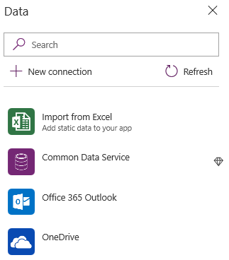
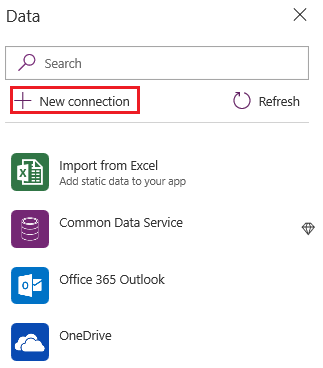
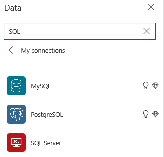
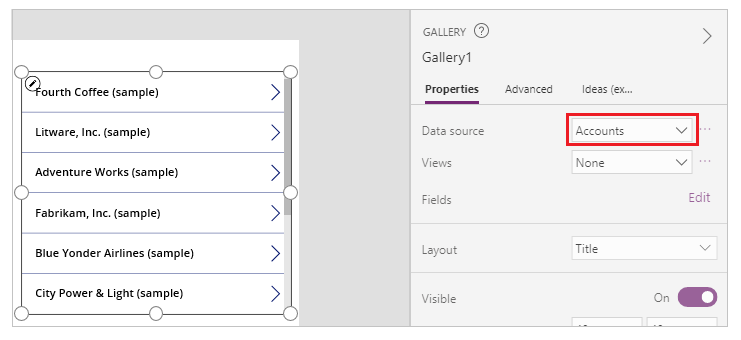
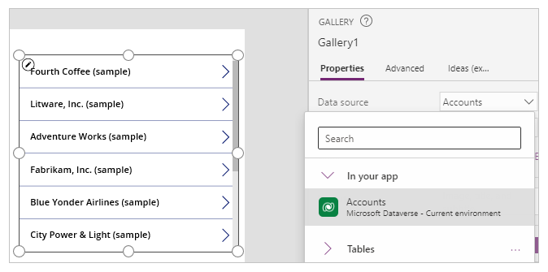

# Add a data connection to a canvas app in PowerApps

In Power Apps, add a data connection to an existing canvas app or to an app that you're building from scratch. Your app can connect to SharePoint, Common Data Service, Salesforce, OneDrive, or [many other data sources](connections-list.md).

Your [next step](#next-steps) after this article is to display and manage data from that data source in your app, as in these examples:

* Connect to OneDrive, and manage data in an Excel workbook in your app.
* Connect to Twilio, and send an SMS message from your app.
* Connect to Common Data Service, and update an entity from your app.
* Connect to SQL Server, and update a table from your app.

## Prerequisites

[Sign up](../signup-for-powerapps.md) for Power Apps, and then [sign in](https://make.powerapps.com?utm_source=padocs&utm_medium=linkinadoc&utm_campaign=referralsfromdoc) by providing the same credentials that you used to sign up.

## Open a blank app

1. On the **Home** tab, select **Canvas app from blank**.

1. Specify a name for your app, and then select **Create**.

1. If the **Welcome to Power Apps Studio** dialog box appears, select **Skip**.

## Add data source

1. In the center pane, select **connect to data** to open the **Data** pane.

    If this were an existing app and the screen already contained a control, select **View** > **Data sources** to open the same pane.

1. Select **Add data source**.

1. If the list of connections includes the one that you want, select it to add it to the app. Otherwise, skip to the next step.

    

1. Select **New connection** to display a list of connections.

    

1. In the search bar, type or paste the first few letters of the connection you want, and then select the connection when it appears.

    

1. Select **Create** to both create the connection and add it to your app.

    Some connectors, such as **Office 365 Outlook**, require no additional steps, and you can show data from them immediately. Other connectors prompt you to provide credentials, specify a particular set of data, or perform other steps. For example, [SharePoint](connections/connection-sharepoint-online.md) and [SQL Server](connections/connection-azure-sqldatabase.md) require additional information before you can use them. With [Common Data Service](connections/connection-common-data-service.md), you can change the environment before you select an entity.

## Identify or change a data source
If you're updating an app, you might need to identify or change the source of data that appears in a gallery, a form, or another control. For example, you might need to identify a data source as you update an app that someone else created or that you created long ago.

1. Select the control, such as a gallery, for which you want to identify or change the data source.

    The name of the data source appears on the **Properties** tab of the right-hand pane.

    

1. To show more information about the data source or to change it, select the down arrow next to its name.

    More information about the current data source appears, and you can select or create another source.

    

## Next steps

* To show and update data in a source such as Excel, SharePoint, Common Data Service, or SQL Server, [add a gallery](add-gallery.md), and [add a form](add-form.md).
* For data in other sources, use connector-specific functions such as those for [Office 365 Outlook](connections/connection-office365-outlook.md), [Twitter](connections/connection-twitter.md), and [Microsoft Translator](connections/connection-microsoft-translator.md).
