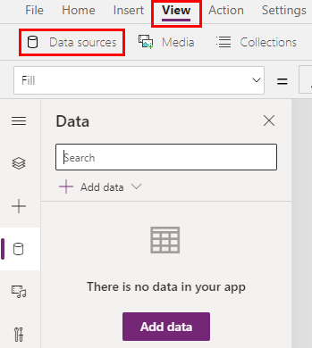

# Add editable tables in Power Apps canvas apps

Designing a productivity application to have related data and functions in one place is good practice. This is because more can be done without having to switch back and fourth between screens. That's why many people like Excel&mdash;they're able to edit data real-time in a fast and efficient way.

In Microsoft Power Apps, you can apply the same concept by providing it as a front end to any data source. You're also able to customize it even more.

## Components needed for implementation

If you want to use this method for hosting everything in the same place, you'll need the following components:

- A data source (Microsoft Dataverse or other)
- Form&mdash;For new items
- Gallery&mdash;To display existing items and
- Text input controls&mdash;To update existing items

The example in the following screenshots show a catalog of product information that is updated with each shipment. The steps will walk you through building an app in Power App to log new items and change item data in line on the same screen, directly to the data source.

## Step 1: Add a data source

1. Select **View** > **Data sources**.

1. Add an existing connection or create a new one to the desired data source.

   

    To learn how add a connection, see [Add data source](add-data-connection.md#add-data-source).

## Step 2: Set up a form control

This step adds a form control to add new items.

1. Insert a new Form control by clicking Insert > Forms > Edit Form

1. In the flyout, connect the data source to the one you just connected to, or manually update the DataSource property in the formula bar.

1. Change the Form.DisplayMode property to New (or FormMode.New)

1. Make sure to add a button to submit the form – Button.OnSelect = NewForm(Form)

   

See additional documentation on the form control here

## See also

- [Control reference](reference-properties.md)
- [Working with formulas](working-with-formulas.md)

[!INCLUDE[footer-include](../../includes/footer-banner.md)]