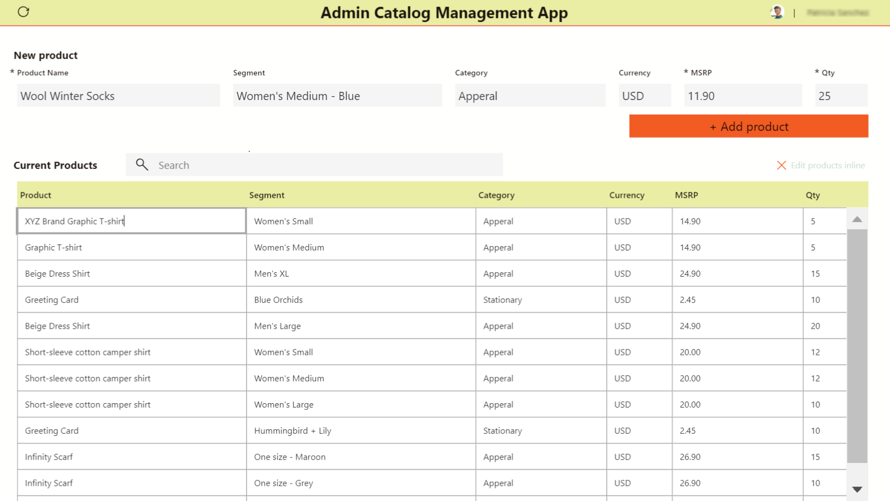
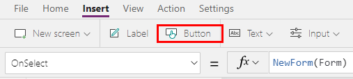

# Add editable tables in canvas apps

Designing a productivity application to have related data and functions in one place enables you to achieve more without having to switch back and fourth between the screens. Microsoft Excel is one such example that allows editing data real-time in fast and efficient way.

Using Power Apps, you can apply the same concept by providing it as a front end to any data source. You're also able to customize it even more.



This tutorial uses the following components to make a sample app:

- A data source (Microsoft Dataverse, you can also use Excel instead)
- Form&mdash;For new items
- Gallery&mdash;To display existing items and
- Text input controls&mdash;To update existing items

## Prerequisites

To follow this tutorial, you'll need access to a [Power Platform environment](/power-platform/admin/environments-overview#types-of-environments), and the ability to create tables in Microsoft Dataverse.

The tutorial uses the following structure to create the sample app:


To learn about how to add columns, see [Work with table columns](/powerapps/teams/table-columns).

A new main form has been created to add sample data:


To learn about how to create a main form with the required columns, see [Create a form](/powerapps/maker/model-driven-apps/create-and-edit-forms#create-a-form). Be sure to use the correct [form order](/powerapps/maker/model-driven-apps/control-access-forms#set-the-form-order) for adding records using the new form.

## Step 1: Create blank app

1. Sign in to [Power Apps](https://make.powerapps.com).
1. Select **Canvas app from blank** under **Make your own app** in Power Apps Home.
1. Enter a name for the app, such as "Catalog Management App".
1. Choose **Tablet** format.
1. Select **Create**.

## Step 2: Add a data source

This section shows how to add a Dataverse table as the data source for the sample app. You can also use an Excel file from a SharePoint site, or OneDrive as the data source; or any other data source type of your choice.

1. From the left-pane, select **Data** > **Add data**.
1. Select **See all tables**.
1. Select **Editable tables**, or the table that you created earlier.

    

For more information about adding a connection to a canvas app, see [Add data source](add-data-connection.md#add-data-source).

## Step 3: Set up a form control

This step adds a form control to add new items.

1. Select **+** (Insert) > **Edit form**.

    

1. On the right-pane, choose the table as the data source for the edit form control.

    

1. Use the **Edit fields** properties option to select the columns to show on the edit form control. You can also change the column order as appropriate.

    

1. Choose the **Default mode** for the form to **New**.

    

1. Adjust the **Width**, **Height** properties for size of the data cards to fill the canvas as appropriate.

1. On the left-pane, select **+** (Insert) > **Button**.

1. Update the button text to **Add product**.

1. Select **OnSelect** property for the button control from the top-left side of the screen.

1. In the formula bar, enter the following formula.

    ```powerapps-dot
    SubmitForm(Form1);
    NewForm(Form1);
    ```

    - [SubmitForm](functions/function-form.md) function submits the new product details to the Dataverse table.
    - [NewForm](functions/function-form.md) changes the mode of the form back to new form to add new products after submitting new product details.
    - **Form1** in this formula is the name of the edit form control added earlier. Update the form name in this formula if your form name is different.

    

1. On the left-pane, select **+** (Insert) > **Layout** > **Blank vertical gallery**.

1. Select the table from Dataverse as the data source.

1. Resize the gallery to take over remaining half of the entire canvas since this gallery will contain all editable columns from the data source.

1. Select **Edit gallery**.

    

1. On the left-pane, select **+** (Insert) > **Input** > **Text input**.

1. Align gallery with the following actions:

    

    1. Move the top-most row for text input control to the top-left corner within the gallery. Moving this top-most row automatically moves remaining rows for same column.
    1. Resize the first row height within the gallery to occupy the size of the first row you just moved to top-left.

    At the end, you should see all rows stacked on left-side of the gallery.

1. Update the **Default** property formula for the first text input row within the gallery:

    ```powerapps-dot
    ThisItem.Product
    ```

    - [ThisItem](functions/operators.md#thisitem-thisrecord-and-as-operators) in this formula relates to the item within the selected data source; which in this example is the Dataverse table.
    - "Product" is the name of the column within the table.
    - When this formula is updated for the first row in gallery, it automatically updates the entire column with product names. If you see an error, check if you've connected the gallery to the Dataverse table.

    

1. Repeat previous steps to add a text input control for each column that you want to show up inside the app as editable field. Ensure you choose the correct columns in the formula replacing "Product" with the appropriate column names.

    > [!TIP]
    > To resize width, use **Width** property, or the drag using the buttons around the first row in each column.

1. Select the first row from the first column inside the gallery, and add the following formula to the **OnChange** property:

    ```powerapps-dot
    Patch('Editable tables',ThisItem,{Product:TextInput8.Text})
    ```

    - [Patch](functions/function-patch.md) function in this formula updates the table selected as the data source with the values when changed.
    - "Editable tables" is the sample data source name.
    - [ThisItem](functions/operators.md#thisitem-thisrecord-and-as-operators) relates to the item within the selected data source for this column.
    - "Product" is the name of the column within the selected data source.
    - "TextInput8" is the name of the text input control added to the gallery attached to the "Product" column for the selected data source.
    - "Text" for "TextInput8" is the text entered in the selected cell within the editable table on the canvas. 

    

<!--- || -->
1. Insert a new Form control by clicking Insert > Forms > Edit Form

1. In the flyout, connect the data source to the one you just connected to, or manually update the DataSource property in the formula bar.

1. Change the Form.DisplayMode property to New (or FormMode.New)

1. Make sure to add a button to submit the form – Button.OnSelect = NewForm(Form)

   


See additional documentation on the form control here

## See also

- [Control reference](reference-properties.md)
- [Working with formulas](working-with-formulas.md)

[!INCLUDE[footer-include](../../includes/footer-banner.md)]