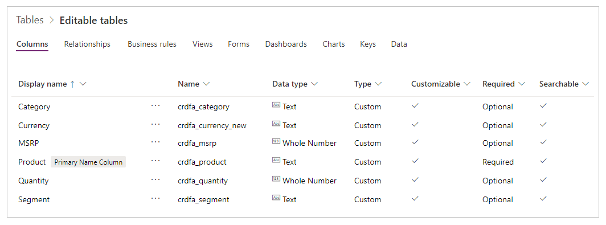
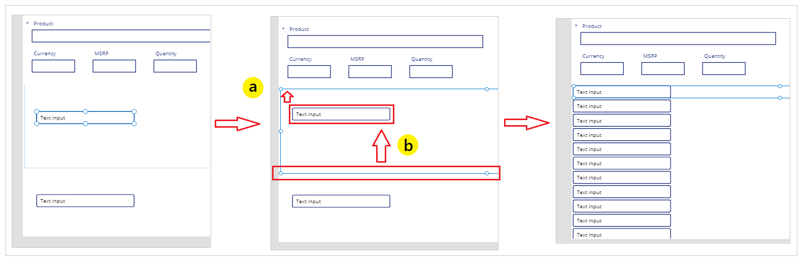
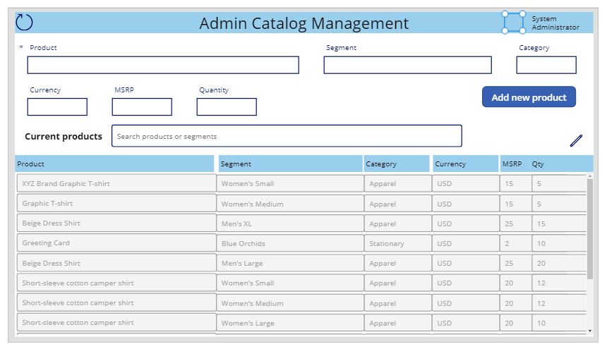

# Create an app to edit tables in canvas apps

Bringing related data and actions together on one screen lets users get more done without switching between views. Microsoft Excel is a familiar example—you can read and edit data inline in the same grid.

With Power Apps, you can build the same kind of experience on top of any data source, and customize it further to fit your business.

This tutorial builds a sample catalog-management app that combines:

- A **data source** (Microsoft Dataverse in this example; you can use Excel or another connector instead).
- A **form** control to add new records.
- A **gallery** with **text input** controls to display and edit existing records inline.
- A **search** box to filter the gallery.

## Prerequisites

- Access to a [Power Platform environment](/power-platform/admin/environments-overview#types-of-environments).
- Permission to create tables in Microsoft Dataverse.

The tutorial uses a Dataverse table named **Editable tables** with the columns shown below. You can use your own table—just substitute your table and column names in the formulas.



To learn more, see:

- [Work with table columns](/powerapps/teams/table-columns)
- [Create a form](/powerapps/maker/model-driven-apps/create-and-edit-forms#create-a-form) and [set the form order](/powerapps/maker/model-driven-apps/control-access-forms#set-the-form-order) for adding new records.

## Step 1: Create a blank canvas app

Create a [blank canvas app](create-blank-app.md) named **Catalog Management app** with the **Tablet** layout.

## Step 2: Add a data source

This tutorial uses a Dataverse table, but the same pattern works with Excel on SharePoint or OneDrive, or any other tabular connector.

1. On the left pane, select **Data** > **Add data**.
1. Select **See all tables**, and then select **Editable tables** (or your own table).

For more information, see [Add a data source](add-data-connection.md#add-a-data-source).

## Step 3: Add a form to create new records

In this step, you add an **Edit form** so users can create new records.

1. On the left pane, select **+ Insert** > **Edit form**.
1. On the **Properties** pane, set **Data source** to your table.
1. Select **Edit fields** to choose the columns to show on the form. Reorder them as needed.
1. Set **Default mode** to **New**.
1. Adjust **Width** and **Height** so the form fills the left half of the canvas.
1. Rename the form to **NewProductForm** so the formulas in this tutorial match what you see on screen.
1. On the left pane, select **+ Insert** > **Button**.
1. Set the button's **Text** property to `"Add product"`.
1. Set the button's **OnSelect** property to:

   ```powerapps-dot
   SubmitForm(NewProductForm);
   NewForm(NewProductForm)
   ```

   - [SubmitForm](functions/function-form.md) saves the new record to your data source.
   - [NewForm](functions/function-form.md) resets the form so users can add another record right away.

## Step 4: Add a gallery as an editable table

Now add a blank vertical gallery on the right half of the canvas. Each row holds one text-input control per column you want to edit.

1. On the left pane, select **+ Insert** > **Layout** > **Blank vertical gallery**.
1. On the **Properties** pane, set the gallery's **Items** property to your table (for example, `'Editable tables'`).
1. Rename the gallery to **ProductGallery**.
1. Resize the gallery to fill the right half of the canvas.
1. Select **Edit** (the pencil icon in the upper-left of the gallery) to enter template-editing mode.
1. On the left pane, select **+ Insert** > **Input** > **Text input**. A new text input appears in the first cell of the gallery template—repeat this for each editable column.
1. Arrange the text inputs side by side across the top of the template so they form a single editable row:

    

    Resize the template height so it matches the input height. The gallery now renders one editable row per record.

1. Rename each text input to match its column (for example, **ProductInput**, **SegmentInput**). Named controls make the formulas in the rest of the tutorial easier to follow.
1. For each text input, set its **Default** property to the matching column on `ThisItem`. For example:

   ```powerapps-dot
   ThisItem.Product
   ```

   - [ThisItem](functions/operators.md#thisitem-thisrecord-and-as-operators) refers to the current record being rendered in the gallery.
   - Replace `Product` with each column name as you configure the other inputs.

1. For each text input, set its **OnChange** property to write the user's edit back to the data source. For example, on `ProductInput`:

   ```powerapps-dot
   Patch('Editable tables', ThisItem, { Product: ProductInput.Text })
   ```

   - [Patch](functions/function-patch.md) updates the current record with the new value.
   - Replace `'Editable tables'`, `Product`, and `ProductInput` with your table, column, and control names.

> [!TIP]
> Adjust column widths by dragging the edges of the first row in each column, or by setting the **Width** property directly.

## Step 5: Add edit and cancel controls

By default, the gallery is editable, which can lead to accidental changes. Add an explicit edit toggle so users only edit when they intend to.

1. On the left pane, select **+ Insert** > **Icons**, and add an **Edit** icon and a **Cancel (badge)** icon. Place them where they're easy to find—for example, near the top of the gallery.
1. On the left pane, select **Tree view**, and then select **App**.
1. Set the **App.OnStart** property to:

   ```powerapps-dot
   Set(galleryDisplayMode, DisplayMode.Disabled)
   ```

   This creates a `galleryDisplayMode` variable and sets the gallery to read-only when the app starts. [Set](functions/function-set.md) creates or updates a global variable.

   > [!NOTE]
   > To run **OnStart** immediately so you can test, right-click **App** in the Tree view and select **Run OnStart**.

1. Select **ProductGallery** and set its **DisplayMode** property to:

   ```powerapps-dot
   galleryDisplayMode
   ```

1. Configure the **Edit** and **Cancel** icons:

    | Icon | Property | Formula |
    | --- | --- | --- |
    | Edit | **OnSelect** | `Set(galleryDisplayMode, DisplayMode.Edit)` |
    | Edit | **Visible** | `galleryDisplayMode = DisplayMode.Disabled` |
    | Cancel | **OnSelect** | `Set(galleryDisplayMode, DisplayMode.Disabled)` |
    | Cancel | **Visible** | `galleryDisplayMode = DisplayMode.Edit` |

    Only one icon is visible at a time—**Edit** when the gallery is locked, **Cancel** when it's editable.

1. Place the two icons in the same position. Because their **Visible** properties are mutually exclusive, users see a single toggle.

> [!TIP]
> Press **F5** (or select **Preview** in the upper-right) to test the app. To test a single action without entering full preview, hold **Alt** and select the control.

## Step 6: Add a search box

As your data grows, finding a specific record gets harder. A search box filters the gallery in real time.

1. On the left pane, select **+ Insert** > **Input** > **Text input**, and place it above the gallery.
1. Rename it to **SearchInput**, and clear its **Default** property.
1. Set **SearchInput.HintText** to `"Search products or segments"`.
1. Update **ProductGallery.Items** to filter on the search text:

   ```powerapps-dot
   If(
       IsBlank(SearchInput.Text),
       'Editable tables',
       Filter(
           'Editable tables',
           SearchInput.Text in Product || SearchInput.Text in Segment
       )
   )
   ```

   - [If](functions/function-if.md) returns the full table when the search box is empty, or the filtered results otherwise.
   - [IsBlank](functions/function-isblank-isempty.md) detects an empty search box.
   - [Filter](functions/function-filter-lookup.md) returns rows that match the criteria.
   - The `in` operator does a case-insensitive substring match.
   - `||` is the logical **OR** operator. Add or remove columns to fit your scenario.

> [!TIP]
> You can comment out parts of a formula with `//` to keep the original logic available while you experiment.

## Step 7: Polish with branding, profile info, and a reset button

The app already works. These optional touches make it feel more complete. Apply them with the same control-and-property pattern used in earlier steps.

| Capability | Control | Properties | Notes |
| --- | --- | --- | --- |
| App title bar | **Text label** | **Text** `"Admin Catalog Management"`; **Font size** `28`; **Color** blue; **Align** center | Customize values as needed. |
| User display name | **Text label** | **Text** `Office365Users.MyProfileV2().displayName` | Requires the [Office 365 Users](connections/connection-office365-users.md) connector. |
| User profile photo | **Image** | **Image** `Office365Users.UserPhotoV2(Office365Users.MyProfileV2().userPrincipalName)` | Requires the [Office 365 Users](connections/connection-office365-users.md) connector. |
| Reset the search box | **Reload** icon | **OnSelect** `Reset(SearchInput)` | Clears the search box so the gallery shows all rows. |
| Section heading above gallery | **Text label** | **Text** `"Current products"`; **Font size** `16`; **Font weight** bold | Customize as needed. |

For example, the finished app looks like this:



## Step 8: Save, publish, and share

[Save and publish](save-publish-app.md) your app, then share it [within your organization](share-app.md) or with [guests](share-app-guests.md).

## See also

- [Add and configure controls in canvas apps](add-configure-controls.md)
- [Control reference](reference-properties.md)
- [Working with formulas](working-with-formulas.md)

[!INCLUDE[footer-include](../../includes/footer-banner.md)]
