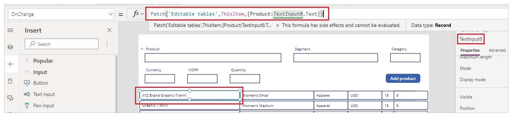

# Add editable tables in canvas apps

Designing a productivity application to have related data and functions in one place enables you to achieve more without having to switch back and forth between the screens. Microsoft Excel is one such example that allows editing data real time in fast and efficient way.

Using Power Apps, you can apply the same concept by providing it as a front end to any data source. You're also able to customize it even more.


This tutorial uses the following components to make a sample app:

- A data source (Microsoft Dataverse, you can also use Excel instead)
- Form&mdash;For new items
- Gallery&mdash;To display existing items and
- Text input controls&mdash;To update existing items

## Prerequisites

To follow this tutorial, you'll need access to a [Power Platform environment](/power-platform/admin/environments-overview#types-of-environments), and the ability to create tables in Microsoft Dataverse.

The tutorial uses the following structure to create the sample app:


To learn about how to add columns, see [Work with table columns](/powerapps/teams/table-columns).

A new main form has been created to add sample data:


To learn about how to create a main form with the required columns, see [Create a form](/powerapps/maker/model-driven-apps/create-and-edit-forms#create-a-form). Be sure to use the correct [form order](/powerapps/maker/model-driven-apps/control-access-forms#set-the-form-order) for adding records using the new form.

## Step 1: Create blank app

1. Sign in to [Power Apps](https://make.powerapps.com).
1. Select **Canvas app from blank** under **Make your own app** in Power Apps Home.
1. Enter a name for the app, such as "Catalog Management App".
1. Choose **Tablet** format.
1. Select **Create**.

## Step 2: Add a data source

This section shows how to add a Dataverse table as the data source for the sample app. You can also use an Excel file from a SharePoint site, or OneDrive as the data source; or any other data source type of your choice.

1. From the left-pane, select **Data** > **Add data**.
1. Select **See all tables**.
1. Select **Editable tables**, or the table that you created earlier.

    

For more information about adding a connection to a canvas app, see [Add data source](add-data-connection.md#add-data-source).

## Step 3: Set up a form control

This step adds a form control to add new items.

1. Select **+** (Insert) > **Edit form**.

    

1. On the right-pane, choose the table as the data source for the edit form control.

    

1. Use the **Edit fields** properties option to select the columns to show on the edit form control. You can also change the column order as appropriate.

    

1. Choose the **Default mode** for the form to **New**.

    

1. Adjust the **Width**, **Height** properties for size of the data cards to fill the canvas as appropriate.

1. On the left-pane, select **+** (Insert) > **Button**.

1. Update the button text to **Add product**.

1. Select **OnSelect** property for the button control from the top-left side of the screen.

1. In the formula bar, enter the following formula.

    ```powerapps-dot
    SubmitForm(Form1);
    NewForm(Form1);
    ```

    - [SubmitForm](functions/function-form.md) function submits the new product details to the Dataverse table.
    - [NewForm](functions/function-form.md) changes the mode of the form back to new form to add new products after submitting new product details.
    - **Form1** in this formula is the name of the edit form control added earlier. Update the form name in this formula if your form name is different.

    

## Step 4: Set up gallery as editable table

This step adds a blank vertical gallery to edit the items as an editable table.

1. On the left-pane, select **+** (Insert) > **Layout** > **Blank vertical gallery**.

1. Select the table from Dataverse as the data source.

1. Resize the gallery to take over remaining half of the entire canvas since this gallery will contain all editable columns from the data source.

1. Select **Edit gallery**.

    

1. On the left-pane, select **+** (Insert) > **Input** > **Text input**.

1. Align gallery with the following actions:

    

    1. Move the top-most row for text input control to the top-left corner within the gallery. Moving this top-most row automatically moves remaining rows for same column.
    1. Resize the first row height within the gallery to occupy the size of the first row you just moved to top-left.

    At the end, you should see all rows stacked on left-side of the gallery.

1. Update the **Default** property formula for the first text input row within the gallery:

    ```powerapps-dot
    ThisItem.Product
    ```

    - [ThisItem](functions/operators.md#thisitem-thisrecord-and-as-operators) in this formula relates to the item within the selected data source; which in this example is the Dataverse table.
    - "Product" is the name of the column within the table.
    - When this formula is updated for the first row in gallery, it automatically updates the entire column with product names. If you see an error, check if you've connected the gallery to the Dataverse table.

    

1. Repeat previous steps to add a text input control for each column that you want to show up inside the app as editable field. Ensure you choose the correct columns in the formula replacing "Product" with the appropriate column names.

    > [!TIP]
    > To resize width, use **Width** property, or the drag using the buttons around the first row in each column.

1. Select the first row from the first column inside the gallery, and add the following formula to the **OnChange** property with changes to column and control names as appropriate:

    ```powerapps-dot
    Patch('Editable tables',ThisItem,{Product:TextInput8.Text})
    ```

    - [Patch](functions/function-patch.md) function in this formula updates the table selected as the data source with the values when changed.
    - "Editable tables" is the sample data source name.
    - [ThisItem](functions/operators.md#thisitem-thisrecord-and-as-operators) relates to the item within the selected data source for this column.
    - "Product" is the name of the column within the selected data source.
    - "TextInput8" is the name of the text input control added to the gallery attached to the "Product" column for the selected data source.
    - "Text" for "TextInput8" is the text entered in the selected cell within the editable table on the canvas. 

    

1. Repeat the previous step for each text input control added for rest of the columns from the connected data source. Ensure the formula is updated to use the correct column and control names.

## Step 5: Set up edit and cancel options

This step adds the options to edit and cancel the edit progress. Gallery having text input controls editable by default may be subject to unintentional updates. Having an explicit edit option, and then to stop edit capability, ensures the edits are always expected.

1. Select **Insert** from the top menu > **Icons**, and add two icons - **Edit**, and **Cancel (badge)**.

    

1. Select **Tree view** from the left-pane, and then select **App**.

1. Select the app **OnStart** property, and add the following formula with changes to gallery name as appropriate:

    ```powerapps-dot
    Gallery2.DisplayMode = "galleryDisplayMode";
    Set(galleryDisplayMode, DisplayMode.Disabled);
    ```

    - "Gallery2" in this formula is the name of the gallery.
    - **DisplayMode** is the DisplayMode property for the selected gallery.
    - "galleryDisplayMode" is the new variable that this formula creates to store the value of the gallery's display mode.
    - [Set](functions/function-set.md) function sets the "galleryDisplayMode" variable defined in the previous line with the value of "Disabled" using "DisplayMode.Disabled". With disabled display mode, the gallery isn't editable by default when the app starts (app OnStart).

1. Select the blank vertical gallery, and then select the **DisplayMode** property.

1. Update the property value from `Edit` to `galleryDisplayMode`. This change ensures the gallery's mode is always defined using the value of the "galleryDisplayMode" variable created in the previous step.

1. Update the properties and formulas for the icons as below:

    | Icon | Property | Formula |
    | - | - | - |
    | Edit | OnSelect | `Set(galleryDisplayMode, DisplayMode.Edit)` |
    | Edit | Visible | `galleryDisplayMode = DisplayMode.Disabled` |
    | Cancel | OnSelect | `Set(galleryDisplayMode, DisplayMode.Disabled)` |
    | Cancel | Visible | `galleryDisplayMode = DisplayMode.Disabled` |

    - [Set](functions/function-set.md) function sets the display mode of the gallery depending on which icon is selected.
    - The variable "galleryDisplayMode" controls the visibility of the edit or cancel icons. When the gallery is editable, only cancel button appears. And only edit button appears when gallery is disabled.

1. Overlap edit and cancel icons, since we're managing the visibility for both icons depending on the state of the gallery.

    

    > [!TIP]
    > You can use the **Preview** button from top-right side of the screen to preview the app, or use F5 key on the keyboard. Another quick alternative for testing is to press the **Alt** key on the keyboard, and select the button while keeping the key pressed. This method also simulates app's preview functionality for the specific selection while key remains pressed.

## Step 6: Add search capability

As the data in the connected data source grows, it becomes difficult to find a specific row. This step adds search capability to the app to filter the gallery with searched keywords making it easier to find relevant data.

1. Add a text input control in the middle of the canvas, above the gallery.

1. Update the **Items** property for the gallery with the following formula instead of the table name, replacing table, and control names as appropriate.

    ```powerapps-dot
    If(IsBlank(TextInput15.Text),'Editable tables',Filter('Editable tables',(TextInput15.Text in Product) || TextInput15.Text in Segment))
    ```

    - [If](functions/function-if.md) function checks for condition whether the search terms are specified, or blank. The gallery is populated depending on the listed items.
    - [IsBlank](functions/function-isblank-isempty.md) function checks the condition whether the search text is specified, or not.
    - "Editable tables" is the name of the connected sample data source in this example. This value is set as the default if no search term is specified.
    - [Filter](functions/function-filter-lookup.md) function filters the items in the gallery depending on the text criteria set within this function. This function is used to filter the gallery depending on the searched term.
    - "TextInput15" is the name of the text input control being used as the search box to filter the gallery.
    - "Product" and "Segment" are the names of the columns that are searched for using the text defined in the "TextInput15" control using the `.Text` syntax.
    - "In" checks for the value of text input control to the specified column in the connected data source.
    - "||" is the "OR" condition, signifying the search should be performed for Product, or Segment columns. Likewise, you can update formula to suite your specific business needs.

    

    > [!TIP]
    > You can retain older functions, or add comments, using "//" inside the formula bar. This method can be more useful for more complex formulas, or to keep older functionality in case if you'd want to revert later.

## Step 7: Miscellaneous changes such as branding, profile information, and reset

The sample app is complete with the expected functionality in this tutorial. However, extra considerations can be added&mdash;such as&mdash;the ability to reset the filter text input control, branding such as title for the gallery and app, and user profile details. You can also do more, start with [Add, and configure controls in canvas apps](add-configure-controls.md).

The following table summarizes all the branding, profile, and reset information added to the sample app. Use the method described earlier in this article to work with different controls and properties. Ensure to replace the table, connector, and control names as appropriate.

| Capability | Control | Properties | Additional information |
| - | - | - | - |
| App banner/label at the top of the screen | Text label | **Text** - "Admin Catalog Management" <br> **Font size** - 28 <br> **Fill color** - Blue <br> **Text alignment** - Align center | Change all values as appropriate. |
| Add user display name to the top-right side of the screen | Text label | **Text** - `Office365Users.MyProfileV2().displayName` | Connect to Microsoft 365 first by adding a connection to [Office 365 Users](connections/connection-office365-users.md). |
| Add user profile photo on the left-side of the user display name on the top-right side of the screen | Image | **Image** - `Office365Users.UserPhotoV2(Office365Users.MyProfileV2().userPrincipalName)` | Connect to Microsoft 365 first by adding a connection to [Office 365 Users](connections/connection-office365-users.md). |
| Reset the search text box on the top-left corner of the screen | Icon of type "Reload" | **OnSelect** - `Reset(TextInput15)` where "TextInput15" is the text input control used as the search box. | When selected, it will reset the search text box resulting in the gallery to display all data by default. |
| Update text for **Add product** button | Add product button | **Text** - "Add new product" | Change as appropriate. |
| Add a label above the gallery, on the left-side of the search input box to signify current products | Text label | **Text** - "Current products" <br> **Font size** - 16 <br> **Font weight** - Bold | Change as appropriate. |
| Add hint text for search text input box | Text input | **Hint Text** - "Search products or segments" | Change as appropriate, and ensure the list of fields (such as Products, Segments) aligns with the column names in your data source. |

For example, the completed screen looks like this with the controls and properties configured above:


## Step 8: Save, publish and share

Now that you've completed the sample app, [save, publish](save-publish-app.md) and share the app [within your organization](share-app.md), or with [guests](share-app-guests.md).

## See also

- [Control reference](reference-properties.md)
- [Working with formulas](working-with-formulas.md)

[!INCLUDE[footer-include](../../includes/footer-banner.md)]