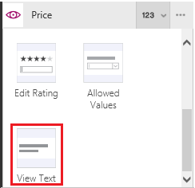

# Show, edit, or add a record from a table in PowerApps

To show all fields in a record, add and configure a **[Display form](controls/control-form-detail.md)** control in a canvas app. To edit any field in a record (or to add a record) and save your changes back to a data source, add and configure an **[Edit form](controls/control-form-detail.md)** control in a canvas app.

## Prerequisites

* Learn how to [add and configure a control](add-configure-controls.md) in PowerApps.
* Download [this Excel file](https://az787822.vo.msecnd.net/documentation/get-started-from-data/FlooringEstimates.xlsx), which contains sample data for this tutorial.
* Upload the Excel file to a [cloud-storage account](connections/cloud-storage-blob-connections.md), such as OneDrive for Business.
* In a new or existing app, [add a connection](add-data-connection.md) to the **FlooringEstimates** table in the Excel file.
* If you're using an existing app, [add a screen](add-screen-context-variables.md) to it.

## Add a form, and show data
1. Add a **[Drop down](controls/control-drop-down.md)** control, name it **ChooseProduct**, and set its **[Items](controls/properties-core.md)** property to this value:

    **FlooringEstimates.Name**

    > [!NOTE]
   > If you're not sure how to add a control, rename it, or set a property, see [Add and configure controls](add-configure-controls.md).

    The list shows names of flooring products from the data source.

2. Add an **Edit form** control, move it below **ChooseProduct**, and then resize the form to cover most of the screen.

    

    > [!NOTE]
   > This topic describes the **Edit form** control, but similar principles apply to the **Display form** control.

3. Set the **[DataSource](controls/control-form-detail.md)** property of the form to **FlooringEstimates** and the **[Item](controls/control-form-detail.md)** property of the form to this formula:

   **First(Filter(FlooringEstimates, Name=ChooseProduct.Selected.Value))**

   This formula specifies that, after you finish configuring the form, it will show the record that the user selects in **ChooseProduct**.

4. In the **Data** pane, click or tap the checkbox for each field to show it.

    > [!NOTE]
   > If the **Data** pane is closed, open it by selecting the form in the left-hand pane and then clicking or tapping **Data** in the right-hand pane.

    

5. In the **Data** pane, drag the **Name** entry to the top of the list.

    

    The **Edit form** control reflects your change.

    

## Set the card type for a field
1. With the form selected, click or tap the card selector for **Price** in the **Data** pane.

    

2. Scroll down, and then click or tap the **View text** option to make the field read-only.

    

    The form reflects your change.

      

## (Edit form only) Save changes
1. In the left-hand pane, select the form, and then click or tap the ellipsis (...).

   

2. Click or tap **Rename**, and then rename the form **EditForm**.

3. Add a **[Button](controls/control-button.md)** control, and set its **[Text](controls/properties-core.md)** property to **Save**.

      

4. Set the **[OnSelect](controls/properties-core.md)** property of the **Save** button to this formula:

   **SubmitForm(EditForm)**

5. Open Preview mode by selecting the play button near the upper-right corner (or by pressing F5).

    

6. Change the name of a product, and then click or tap the **Save** button that you created.

    The **[SubmitForm](functions/function-form.md)** function saves your changes to the data source with which you configured the form.

7. (optional) Select the close icon to close Preview (or press Esc).

    

## Next steps
Learn more about working with [forms](working-with-forms.md) and [formulas](working-with-formulas.md).
