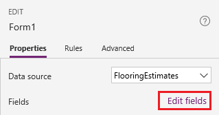
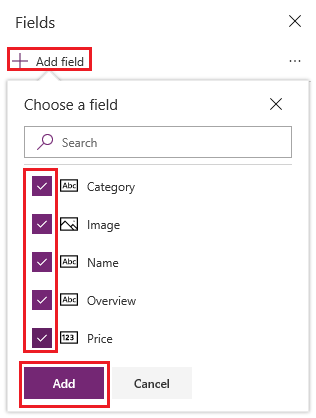
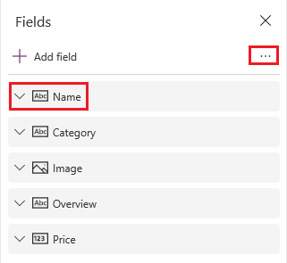
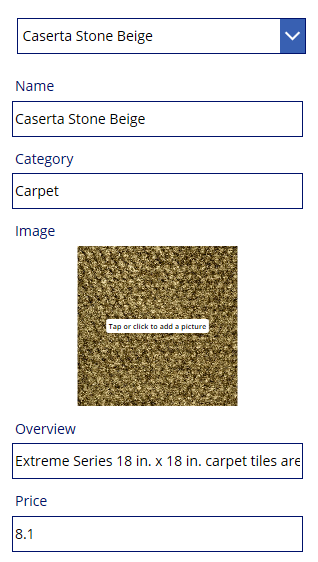
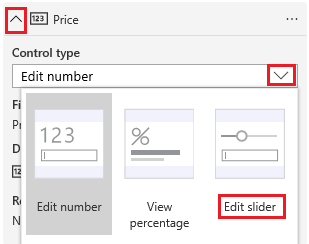

# Show, edit, or add a record in a canvas app

In a canvas app, add and configure a **[Display](controls/control-form-detail.md)** form control to show all fields in a record, You can also add and configure an **[Edit](controls/control-form-detail.md)** form control to edit any field in a record, add a record, and save your changes back to a data source.

## Prerequisites

- Learn how to [add and configure a control](add-configure-controls.md) in Power Apps.
- Download [this Excel file](https://az787822.vo.msecnd.net/documentation/get-started-from-data/FlooringEstimates.xlsx), which contains sample data for this tutorial.
- Upload the Excel file to a [cloud-storage account](connections/cloud-storage-blob-connections.md), such as OneDrive for Business.
- Create or open an app for phones, [add a connection](add-data-connection.md) to the **FlooringEstimates** table in the Excel file.

    You can add a form to a tablet app, but it won't match this article because the form will have three columns by default.

- If you open an existing app, [add a screen](add-screen-context-variables.md) to it.

## Add a form, and show data
1. On a blank screen, add a **[Drop down](controls/control-drop-down.md)** control, and name it **ChooseProduct**.

    > [!NOTE]
   > If you're not sure how to add a control, rename it, or set a property, see [Add and configure controls](add-configure-controls.md).

1. On the **Properties** tab of the right-hand pane, set **Items** to `FlooringEstimates` and **Value** to `Name`.

    

    The list shows names of flooring products from the data source.

1. Add an **Edit** form control, move it below **ChooseProduct**, and then resize the form to cover most of the screen.

    

    > [!NOTE]
   > This topic describes the **Edit** form control, but similar principles apply to the **Display** form control.

1. Set the form's **[DataSource](controls/control-form-detail.md)** property to **FlooringEstimates** and its **[Item](controls/control-form-detail.md)** property to this formula:

    `ChooseProduct.Selected`

   This formula specifies that, after you finish configuring the form, it will show the record that the user selects in **ChooseProduct**.

1. On the **Properties** tab of the right-hand pane, select **Edit fields**.

    

1. In the **Fields** pane, select **Add field**, select the check box for each field, and then select **Add**.

    

1. Select the ellipsis (...) next to **Add field**, select **Collapse all**, and then drag **Name** to the top of the list.

    

    The **Edit** form control reflects your change.

    

## Set the card type for a field
1. In the **Fields** pane, expand the **Price** field by selecting its down arrow.

1. Open the **Control type** list, and then select **Edit slider**.

    

    In the form, the **Price** field shows a **Slider** control instead of a **Text input** control.

1. (optional) Follow the same process to change the control for the **Overview** field to an **Edit multi-line text** control.

## (Edit form only) Save changes

1. Rename the form **EditForm**.

1. Add a **[Button](controls/control-button.md)** control, and set its **[OnSelect](controls/properties-core.md)** property to this formula:

   `SubmitForm(EditForm)`

1. Press F5 to open Preview, change the name of a product, and then select the button that you created.

    The **[SubmitForm](functions/function-form.md)** function saves your changes to the data source.

1. (optional) Close Preview by pressing Esc (or by selecting the close icon in the upper-right corner).

## Next steps
Learn more about working with [forms](working-with-forms.md) and [formulas](working-with-formulas.md).

[!INCLUDE[footer-include](../../includes/footer-banner.md)]