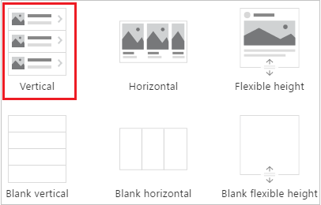
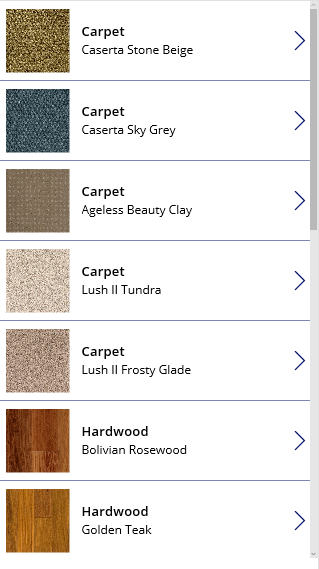
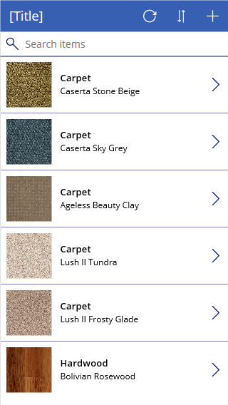
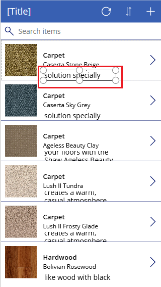
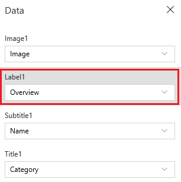
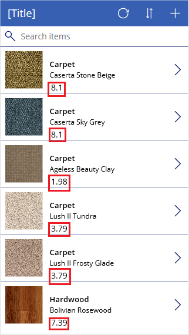
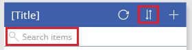

# Show a list of items in canvas apps

Show a list of items from any data source by adding a **[Gallery](controls/control-gallery.md)** control to your canvas app. This topic uses Excel as the data source. Filter the list by configuring the **Gallery** control to show only those items that match the filter criterion in a **[Text input](controls/control-text-input.md)** control.

## Prerequisites

- Learn how to [add and configure a control](add-configure-controls.md) in Power Apps.

- Set up the sample data:
    1. Download [this Excel file](https://az787822.vo.msecnd.net/documentation/get-started-from-data/FlooringEstimates.xlsx), which contains sample data for this tutorial.

    2. Upload the Excel file to a [cloud-storage account](connections/cloud-storage-blob-connections.md), such as OneDrive for Business.

- Open a blank app:
    1. [Sign in to Power Apps](https://make.powerapps.com?utm_source=padocs&utm_medium=linkinadoc&utm_campaign=referralsfromdoc).

    1. Under **Make your own app**, select **Canvas app from blank**.

    1. Specify a name for your app, select **Phone**, and then select **Create**.

    1. If the **Welcome to Power Apps Studio** dialog box appears, select **Skip**.

    1. [Add a connection](add-data-connection.md) to the **FlooringEstimates** table in the Excel file.

## Add a gallery to a blank screen

1. On the **Insert** tab, select **Gallery**, and then select **Vertical**.

    

1. On the **Properties** tab of the right-hand pane, open the **Items** list, and then select **Flooring Estimates**.

    

1. (optional) In the **Layout** list, select a different option.

## Add a gallery in a screen

1. On the **Home** tab, select **New screen** > **List screen**.

    A screen that contains a **Gallery** control and other controls, such as a search bar, appears.

1. Set the gallery's **Items** property to `FlooringEstimates`.

    The **Gallery** control shows the sample data.

    

## Add a control to the Gallery control
Before you do any other customization, ensure that the layout for your **Gallery** control most closely matches what you want. From there, you can further modify the **Gallery** template, which determines how all data in the **Gallery** control appears.

1. Select the template by clicking or tapping near the bottom of the **Gallery** control and then selecting the pencil icon in its upper-left corner.

    

2. With the template still selected, add a **[Label](controls/control-text-box.md)** control, and then move and resize it so that it doesn't overlap with other controls in the template.

    

3. Select the gallery, and then select **Edit** next to **Fields** on the **Properties** tab of the right-hand pane.

4. Select the label that you added earlier in this procedure, and then open the highlighted list in the **Data** pane.

    

5. In that list, click or tap **Price**.

    The **Gallery** control shows the new values.

    

## Filter and sort a gallery
The **[Items](controls/properties-core.md)** property of a **Gallery** control determines which items it shows. In this procedure, you configure that property so that it also determines which records appear based on filter criteria and in what order.



1. Set the **[Items](controls/properties-core.md)** property of the **Gallery** control to this formula:

    ```powerapps-dot
    Sort
        (If
            (IsBlank(TextSearchBox1.Text),
            FlooringEstimates,
            Filter(
                FlooringEstimates,
                TextSearchBox1.Text in Text(Name)
            )
        ),
        Name,
        If(
            SortDescending1,
            SortOrder.Descending,
            SortOrder.Ascending
        )
    )
    ```

    For more information about the functions in this formula, see the [formula reference](formula-reference.md).

1. Double-click the search box, and then type part or all of a product name in it.

    Only those items that meet the filter criterion appear.

1. While pressing the Alt key, select the sort icon one or more times to switch the sort order.

    The records toggle between ascending and descending alphabetical order based on the product name.

## Highlight the selected item
Set the **Gallery** control's **TemplateFill** property to a formula that's similar to this example, but you can specify different colors if you want:

**If(ThisItem.IsSelected, LightCyan, White)**

## Change the default selection
Set the **Gallery** control's **Default** property to the record that you want to select by default. For example, you can specify the fifth item in the **FlooringEstimates** data source:

**Last(FirstN(FlooringEstimates, 5))**

In this example, you specify the first item in the **Hardwood** category of the **FlooringEstimates** data source:

**First(Filter(FlooringEstimates, Category = "Hardwood"))**

## Next steps
Learn how to work with [forms](working-with-forms.md) and [formulas](working-with-formulas.md).


[!INCLUDE[footer-include](../../includes/footer-banner.md)]