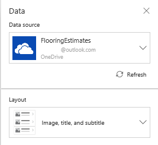
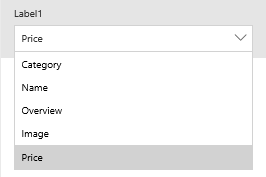

# Show a list of items in PowerApps

Show a list of items from any data source by adding a **[Gallery](controls/control-gallery.md)** control to your canvas app. This topic uses Excel as the data source. Filter the list by configuring the **Gallery** control to show only those items that match the filter criterion in a **[Text input](controls/control-text-input.md)** control.

## Prerequisites

* Learn how to [add and configure a control](add-configure-controls.md) in PowerApps.

* Set up the sample data:
    1. Download [this Excel file](https://az787822.vo.msecnd.net/documentation/get-started-from-data/FlooringEstimates.xlsx), which contains sample data for this tutorial.

    2. Upload the Excel file to a [cloud-storage account](connections/cloud-storage-blob-connections.md), such as OneDrive for Business.

## Add a Gallery control
1. Open PowerApps, and then click or tap **New** near the left edge.

2. On the **Blank app** tile, click or tap **Phone layout**.

3. In the **Welcome to PowerApps Studio** dialog box, click or tap **Skip**.

4. [Add a connection](add-data-connection.md) to the **FlooringEstimates** table in the Excel file.

5. (optional) Add a **Gallery** control to the default screen by clicking or tapping the **Insert** tab, clicking or tapping **Gallery**, and then clicking or tapping a **Gallery** control that's empty (blank) or that contains a default set of controls.

    These options include **Gallery** controls that scroll horizontally or vertically. You can also add a **Gallery** control that automatically bases its size on the amount of content in each item.

    

6. On the **Home** tab, click or tap **New screen**.

    You can add a screen that's empty, that scrolls, that contains a **Gallery** control, or that contains a form.

7. Click or tap **List screen** to add a screen that contains a **Gallery** control and other controls such as a search bar.

    > [!NOTE]
   > Whether you add a **Gallery** control to a new screen or an existing one, you can click or tap near the bottom of the **Gallery** control to select it, click or tap **Flooring Estimates** in the right-hand pane, and then click or tap a different layout in the **Data** pane. For this tutorial, leave the default layout.

    

8. Click or tap the **Gallery** control in the screen that you just added.

9. On the **Properties** tab of the right-hand pane, click or tap **CustomGallerySample**.

10. In the **Data** pane, click or tap **CustomGallerySample**, and then click or tap **FlooringEstimates**.

    

    The **Gallery** control shows the sample data.

    

    You'll configure sort and search later in this topic.

## Add a control to the Gallery control
Before you do any customization, decide on a **Gallery** control layout. The first set of controls in a **Gallery** control is the template, which determines how all data in the **Gallery** control appears.

1. Select the template by clicking or tapping near the bottom of the **Gallery** control and then clicking or tapping the pencil icon in the upper-left corner.

    

2. With the template still selected, add a **[Label](controls/control-text-box.md)** control, and then move and resize it so that it doesn't overlap with other controls in the template.

    
3. Open the **Data** pane by selecting the template and then clicking or tapping **Flooring Estimates** in the right-hand pane.

4. Select the label that you added earlier in this procedure, and then open the highlighted list in the **Data** pane.

    

5. In that list, click or tap **Price**.

    

    The **Gallery** control shows the new values.

    

## Filter the Gallery control
The **[Items](controls/properties-core.md)** property of a **Gallery** control determines which items it shows. In this procedure, you configure that property so that the **Gallery** control shows only those items for which the product name contains the text in **TextSearchBox1**.

1. Select the **Gallery** control by clicking or tapping near the bottom of that control.

2. On the **Advanced** tab, set the **[Items](controls/properties-core.md)** property of the **Gallery** control to this formula:

    **If(IsBlank(TextSearchBox1.Text), FlooringEstimates, Filter(FlooringEstimates, TextSearchBox1.Text in Text(Name)))**

    For more information about the functions in this formula, see the [formula reference](formula-reference.md).

3. Type part or all of a product name in the search box.

    The **Gallery** control shows only those items that meet the filter criterion.

## Sort the Gallery control
The **[Items](controls/properties-core.md)** property of a **Gallery** control determines the order in which it shows items. In this procedure, you configure that property so that the **Gallery** control shows the order of items as set by **ImageSortUpDown1**.

1. Set the **[Items](controls/properties-core.md)** property of the **Gallery** control to this formula:

    **Sort(If(IsBlank(TextSearchBox1.Text), FlooringEstimates, Filter(FlooringEstimates, TextSearchBox1.Text in Text(Name))), Name, If(SortDescending1, SortOrder.Descending, SortOrder.Ascending))**

2. Select the sort icon to change the sorting order of the **Gallery** control by the names of the products.

To sort *and* filter your **Gallery** control:

* Replace both instances of *DataSource* in this formula with the name of your data source.

* Replace both instances of *ColumnName* with the name of the column by which you want to sort and filter.

**Sort(If(IsBlank(TextSearchBox1.Text),** *DataSource*, **Filter(** *DataSource*, **TextSearchBox1.Text in Text(** *ColumnName* **))),** *ColumnName*, **If(SortDescending1, SortOrder.Descending, SortOrder.Ascending))**

## Highlight the selected item
Set the **Gallery** control's **TemplateFill** property to a formula that's similar to this example:

**If(ThisItem.IsSelected, LightCyan, White)**

## Change the default selection
Set the **Gallery** control's **Default** property to the record that you want to select by default. For example, specify the fifth item in the **FlooringEstimates** data source:

**Last(FirstN(FlooringEstimates, 5))**

In this example, you specify the first item in the **Hardwood** category of the **FlooringEstimates** data source:

**First(Filter(FlooringEstimates, Category = "Hardwood"))**

## Next steps
Learn how to work with [forms](working-with-forms.md) and [formulas](working-with-formulas.md).
