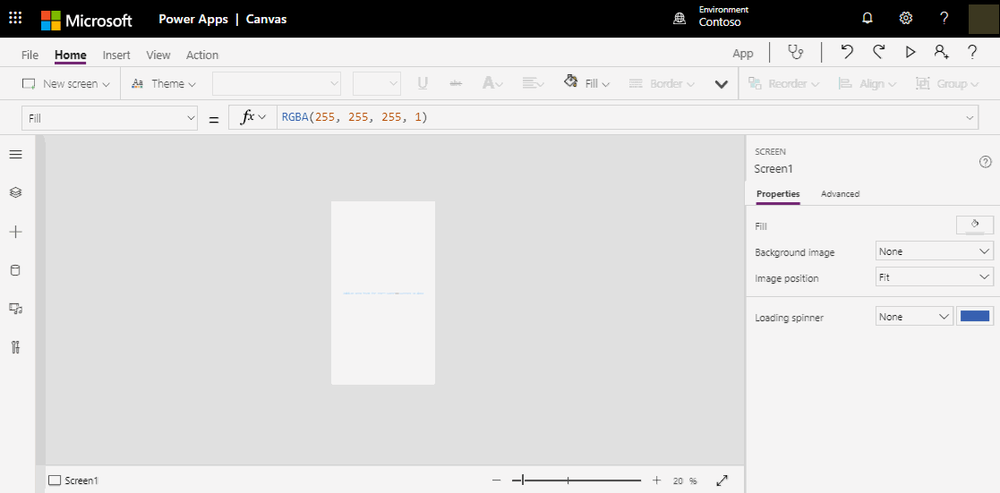
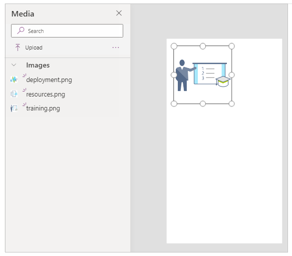
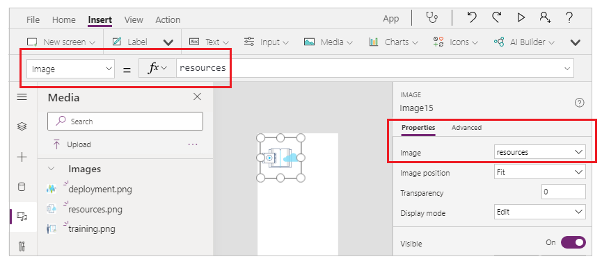

# Using multimedia files in Power Apps

This article shows you how to embed multimedia files in your canvas app, upload pen drawings to a data source, and show images from a data source in your canvas app. The data source used in this article is an Excel file in OneDrive for Business.

## Prerequisites

[Sign up](../signup-for-powerapps.md) for Power Apps, and then [sign in](https://make.powerapps.com?utm_source=padocs&utm_medium=linkinadoc&utm_campaign=referralsfromdoc) using the same credentials that you used to sign up.

## Add images

You can choose the kind of images such as .jpeg, .png, .bmp to add to your app screen. You can add images using the media pane, or using the images control.

### Add images using media pane

To use the **Media** pane to add, remove or use media files in your app:

1. Select **Media** from the left pane.

    

1. Select **Upload** from the media panel.

    

1. Select the file(s) that you want to add, and then select **Open**.

1. Select the file from the media pane to insert into the screen.

    

### Add images using the images control

To add image using the [Image control](./controls/control-image.md):

1. Select **Insert** from the top menu.

1. Select **Media** drop-down.

1. Choose **Image** to add the image control.

1. Select the **Image** property from the property list on top-left, or from the property pane on the right side. 

1. Select the image to insert.

    

## Add 

    > [!NOTE]
   > Play a YouTube video by setting the **Media** property of a video control to the appropriate URL, enclosed in double quotation marks.

## Add media from Azure Media Services
1. From your Azure Media Services account, upload and publish your video asset from **AMS > Settings > Assets**.

2. After the video is published, copy its URL.

3. From Power Apps, add the **Video** control from **Insert > Media**.

4. Set the **Media** property to the URL that you copied.

    As this graphic shows, you can choose any streaming URL that Azure Media Services supports:

    

## Add images from the cloud to your app
In this scenario, you save images in a cloud storage account, OneDrive for Business. You use an Excel table to contain the path to the images, and you display the images in a gallery control in your app.

This scenario uses the [CreateFirstApp.zip](https://pwrappssamples.blob.core.windows.net/samples/CreateFirstApp.zip) that contains some .jpeg files.

> [!NOTE]
> The path to these images in the Excel file must use forward slashes. When Power Apps saves image paths in an Excel table, the path uses backslashes. If you use image paths from such a table, change the paths in the Excel table to use forward slashes instead of backslashes. Otherwise, the images won't display.  

1. Download [CreateFirstApp.zip](https://pwrappssamples.blob.core.windows.net/samples/CreateFirstApp.zip), and extract the **Assets** folder to your cloud storage account.

2. Rename the **Assets** folder to **Assets_images**.

3. In an Excel spreadsheet, create a one-column table, and fill it with the following data:

    

4. Name the table **Jackets**, and name the Excel file **Assets.xlsx**.

5. In your app, add the **Jackets** table as a data source.  

6. Add an **Image only** control (**Insert** tab > **Gallery**), and set its **Items** property to `Jackets`:  

    

    The gallery is automatically updated with the images:  

    

    When you set the **Items** property, a column named **PowerAppsId** is automatically added to the Excel table.

    In the Excel table, the image path can also be the URL to an image. An example is the [Flooring Estimates](https://pwrappssamples.blob.core.windows.net/samples/FlooringEstimates.xlsx) sample file. You can download it to your cloud storage account, add the `FlooringEstimates` table as a data source in your app, and then set the gallery control to `FlooringEstimates`. The gallery is automatically updated with the images.

## Upload pen drawings to the cloud

In this scenario, you learn how to upload pen drawings to your data source, OneDrive for Business, and examine how the drawings are stored there.

1. In Excel, add **Image [image]** to cell A1.

2. Create a table using the following steps:    

   1. Select cell A1.

   2. On the **Insert** ribbon, select **Table**.

   3. In the dialog box, select **My table has headers**, and then select **OK**.

       

       Your Excel file is now in a table format. For more information about table formatting in Excel, see [Format the data as a table](https://support.office.com/article/Format-an-Excel-table-6789619F-C889-495C-99C2-2F971C0E2370).

   4. Name the table **Drawings**:

       

3. Save the Excel file to OneDrive for Business as **SavePen.xlsx**.

4. In Power Apps, create a [blank app](get-started-create-from-blank.md).

5. In your app, add the OneDrive for Business account as a [data source](add-data-connection.md):

   1. Click or tap the **View** tab, and then click or tap **Data sources**.

       

   2. Click or tap **Add data source**, and then click or tap **OneDrive for Business**.

       

   3. Click or tap **SavePen.xlsx**.

   4. Select the **Drawings** table, and then click or tap **Connect**.

         

       Now, the Drawings table is listed as a data source.

6. On the **Insert** tab, select **Text**, and then select **Pen input**.

7. Rename the new control **MyPen**:  

    

8. On the **Insert** tab, add a **Button** control, and set its **OnSelect** property to this formula:

    **Patch(Drawings, Defaults(Drawings), {Image:MyPen.Image})**

9. Add an **Image gallery** control (**Insert** tab > **Gallery**), and set its **Items** property to `Drawings`. The **Image** property of the gallery control is automatically set to `ThisItem.Image`.

    Arrange the controls so that your screen resembles as shown below:  

    

10. Press F5, or select Preview (  ).

11. Draw something in MyPen, and then select the button.

    The first image in the gallery control displays what you drew.

12. Add something else to your drawing, and select the button.

    The second image in the gallery control displays what you drew.

13. Close the preview window by pressing Esc.

    In your cloud storage account, a **SavePen_images** folder has been automatically created. This folder contains your saved images with IDs for their file names. To show the folder, you may need to  refresh the browser window by, for example, pressing F5.

    In **SavePen.xlsx**, the **Image** column specifies the path to the new images.

### Known limitations
For information about how to share Excel data within your organization, [review these limitations](connections/cloud-storage-blob-connections.md#known-limitations).

## For more information
Be sure to test your app on different platforms, including in [a browser window](https://home.dynamics.com/) and on a phone.

For information about more advanced scenarios that involve uploading multimedia directly to a different data source, see [image capture pro tips](https://powerapps.microsoft.com/blog/image-capture-pro-tips/) and [custom connectors for image upload](https://powerapps.microsoft.com/blog/custom-api-for-image-upload/).

Another way to upload files to a data source is to use the [Patch](functions/function-patch.md) function.

[1]: ./media/add-images-pictures-audio-video/add-image-video-audio-file.png
[3]: ./media/add-images-pictures-audio-video/add-intro-sound.png
[4]: ./media/add-images-pictures-audio-video/add-picture.png
[5]: ./media/add-images-pictures-audio-video/camera-gallery.png
[6]: ./media/add-images-pictures-audio-video/audio-gallery.png
[7]: ./media/add-images-pictures-audio-video/pen-gallery.png
[8]: ./media/add-images-pictures-audio-video/mediaoptions.png
[9]: ./media/add-images-pictures-audio-video/imageproperty.png
[10]: ./media/add-images-pictures-audio-video/mediaproperty.png
[11]: ./media/add-images-pictures-audio-video/renamecamera.png
