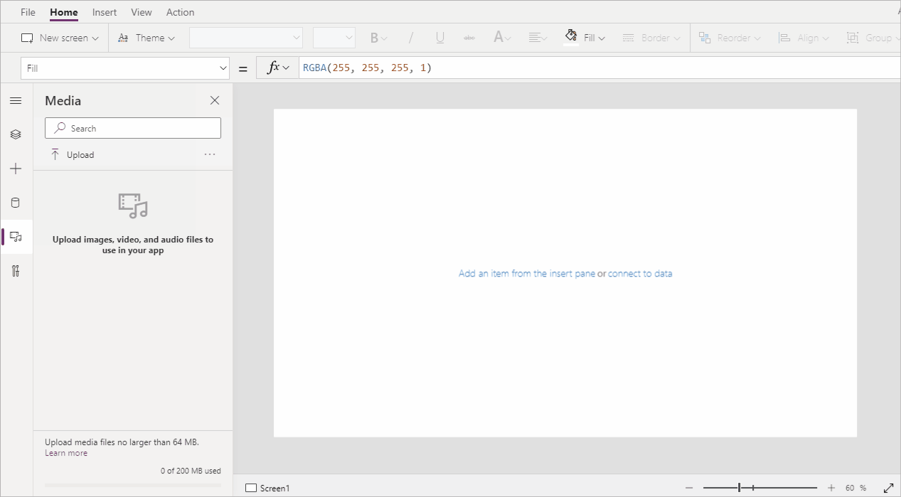
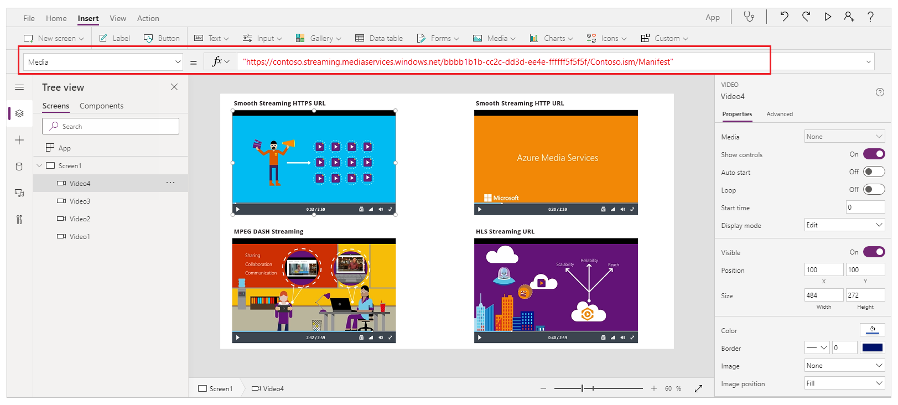

# Using multimedia files in canvas apps

You can add images, audio and video files to a canvas app. Add video from streaming services such as [Microsoft Stream](/stream/), [Azure Media Services](/azure/media-services/), or 3rd party streaming services, such as YouTube. Or use input controls such as **Pen Input** to collect signatures.

This article walks you through working with multimedia, streaming, and input control scenarios. The data source used in this article is an Excel file in OneDrive for Business.

## Prerequisites

[Sign up](../signup-for-powerapps.md) for Power Apps, and then [sign in](https://make.powerapps.com?utm_source=padocs&utm_medium=linkinadoc&utm_campaign=referralsfromdoc) using the same credentials that you used to sign up.

Watch this video to learn how to use multimedia files in canvas apps:
> [!VIDEO https://www.microsoft.com/videoplayer/embed/RWLAk7]

## Add media from a file or the cloud

You can choose the kind of media file to add (for example, images, video, or audio). You can add images using the media pane, or using the images control.

### Add images, audio, or video using the media pane

To use the **Media** pane to add, remove or use media files in your app:

1. Select **Media** from the left pane.

    

1. Select **Upload** from the media panel.

    

1. Select the file(s) that you want to add, and then select **Open**.

1. Select the file from the media pane to insert into the screen.

    

1. [Save](save-publish-app.md#save-changes-to-an-app) and [Publish](save-publish-app.md#publish-an-app) you app.

1. [Share app](share-app.md) with others.

### Add images, audio, or video using the controls

To add images, audio or video using the [Image](./controls/control-image.md), [Audio or Video](./controls/control-audio-video.md) controls:

1. Select **Insert** from the top menu.

1. Select **Media** drop-down.

1. Choose from **Image**, **Audio**, or **Video** controls.

For **Image** control, update the *Image* property with the image file name, without extension. For **Audio** or **Video** control, update the *Media* property with the file name, or the URL such as YouTube video URL in double quotation marks.

## Add media from Azure Media Services

1. From your Azure Media Services account, upload and publish your video asset from **AMS > Settings > Assets**.

1. After the video is published, copy its URL.

1. From Power Apps, add the **Video** control from **Insert > Media**.

1. Set the **Media** property to the URL that you copied.

    As this graphic shows, you can choose any streaming URL that Azure Media Services supports:

    

1. [Save](save-publish-app.md#save-changes-to-an-app) and [Publish](save-publish-app.md#publish-an-app) you app.

1. [Share app](share-app.md) with others.

## Add Microsoft Stream media

To learn how to add a Microsoft Stream video control, go to [Microsoft Stream video control example](controls/control-stream-video.md#example).

## Add images from the cloud to your app

In this scenario, you save images in a cloud storage account, OneDrive for Business. You use an Excel table to contain the path to the images, and you display the images in a gallery control in your app.

This scenario uses the [CreateFirstApp.zip](https://pwrappssamples.blob.core.windows.net/samples/CreateFirstApp.zip) that contains some .jpeg files.

> [!NOTE]
> The path to these images in the Excel file must use forward slashes. When Power Apps saves image paths in an Excel table, the path uses backslashes. If you use image paths from such a table, change the paths in the Excel table to use forward slashes instead of backslashes. Otherwise, the images won't display.  

1. Download [CreateFirstApp.zip](https://pwrappssamples.blob.core.windows.net/samples/CreateFirstApp.zip), and extract the **Assets** folder to your cloud storage account.

1. Rename the **Assets** folder to **Assets_images**.

1. In an Excel spreadsheet, create a one-column table, and fill it with the following data.

    

    To copy the file path from **OneDrive for Business**, select a file, and then select **Path** (*Copy direct link*) from the details pane on the right side of the screen.

1. Name the table **Jackets**, and name the Excel file **Assets.xlsx**.

1. In your app, add the **Jackets** table as a [data source](add-data-connection.md).  

1. Optionally, update your app [orientation](set-aspect-ratio-portrait-landscape.md) to Landscape.

1. Select **Insert** > **Gallery**, and then select **Horizontal**.

1. Optionally, select text field and then the heading field under the first image, and delete them to keep only images on the screen.

    

    If you see a formula error, press **Ctrl+Z** to undo the delete and then ensure to first delete the *Subtitle* field and then the *Title* field.

1. Set the gallery's **Items** property of the gallery to `Jackets`.

    

1. Select the first image in the gallery, and set its **Image** property to `ThisItem.Images`:

    

    The gallery is automatically updated with the images:  

    

    When you set the **Items** property, a column named **PowerAppsId** is automatically added to the Excel table.

1. [Save](save-publish-app.md#save-changes-to-an-app) and [Publish](save-publish-app.md#publish-an-app) you app.

1. [Share app](share-app.md) with others.

## Upload pen drawings to the cloud

In this scenario, you learn how to upload pen drawings to your data source, OneDrive for Business, and examine how the drawings are stored there.

1. In Excel, add **Image [image]** to cell A1.

1. Create a table using the following steps:

   1. Select cell A1.

   1. On the **Insert** ribbon, select **Table**.

   1. In the dialog box, select **My table has headers**, and then select **OK**.

       

       Your Excel file is now in a table format. For more information about table formatting in Excel, see [Format the data as a table](https://support.office.com/article/Format-an-Excel-table-6789619F-C889-495C-99C2-2F971C0E2370).

   1. Name the table **Drawings**:

       

1. Save the Excel file to OneDrive for Business as **SavePen.xlsx**.

1. In Power Apps, create a [blank app](get-started-create-from-blank.md) with Tablet layout.

1. In your app, add the OneDrive for Business account as a [data source](add-data-connection.md):

   1. Select **View** menu, and then select **Data sources**.

       

   1. Select **Add data source**, and then select **OneDrive for Business**.

   1. Select **SavePen.xlsx**.

   1. Select the **Drawings** table, and then select **Connect**.

         

       Now, the Drawings table is listed as a data source.

1. Select **Insert** > **Input**, and then select **Pen Input**.

1. Rename the new control **MyPen**:  

    

1. On the **Insert** tab, add a **Button** control, and set its **OnSelect** property to this formula:

    **Patch(Drawings, Defaults(Drawings), {Image:MyPen.Image})**

    

1. Add a **Horizontal** gallery control (**Insert** tab > **Gallery**).

1. Optionally, select text field and then the heading field under the first image, and delete them to keep only images on the screen.

    

    If you see a formula error, press **Ctrl+Z** to undo the delete and then ensure to first delete the *Subtitle* field and then the *Title* field.

1. Set gallery **Items** property to `Drawings`. The **Image** property of the gallery control is automatically set to `ThisItem.Image`.

    Arrange the controls so that your screen resembles as shown below:  

    

1. Press F5, or select Preview (  ).

1. Draw something in MyPen, and then select the button.

    The first image in the gallery control displays what you drew.

1. Add something else to your drawing, and select the button.

    The second image in the gallery control displays what you drew.

1. Close the preview window by pressing Esc.

    In your cloud storage account, a **SavePen_images** folder has been automatically created. This folder contains your saved images with IDs for their file names. To show the folder, you may need to  refresh the browser window by, for example, pressing F5.

    > [!NOTE]
    > The folder name may be different if your Excel file name is different. For example, if your file name is Pen.xlsx, the folder name will be Pen_images.

    In **SavePen.xlsx**, the **Image** column specifies the path to the new images.

1. [Save](save-publish-app.md#save-changes-to-an-app) and [Publish](save-publish-app.md#publish-an-app) you app.

1. [Share app](share-app.md) with others.

## Remove unused media

If you want to clean up or reduce the app size by removing media not used by the app, use **Media** > **Remove unused media** option. When selected, all media not used by the app are removed from the app.

:::image type="content" source="media\add-images-pictures-audio-video\remove-unused-media.png" alt-text="Remove unused media from the app":::

## Known limitations

- To enable better performance while loading an app, following size restrictions apply:
    - The total size of all media files uploaded to an app can't exceed 200 MB.
    - Maximum size of an individual media file in an app can't exceed 64 MB.
- Supported media file types: `.jpg, .jpeg, .gif, .png, .bmp, .tif, .tiff, .svg, .wav, .mp3, .mp4, .wma, .wmv`.
- [Cloud-storage known limitations](connections/cloud-storage-blob-connections.md#known-limitations) apply when connecting your app with cloud-based storage.

## See also

- [Control reference](reference-properties.md)
- [Working with formulas](working-with-formulas.md)

[!INCLUDE[footer-include](../../includes/footer-banner.md)]