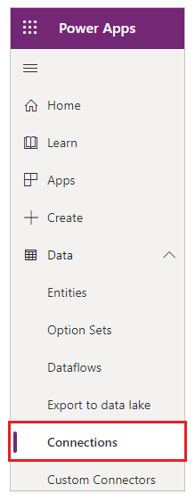
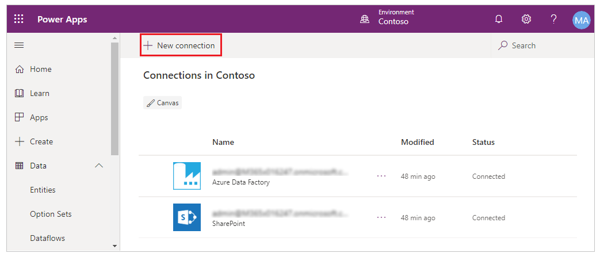
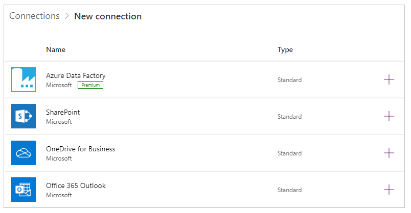
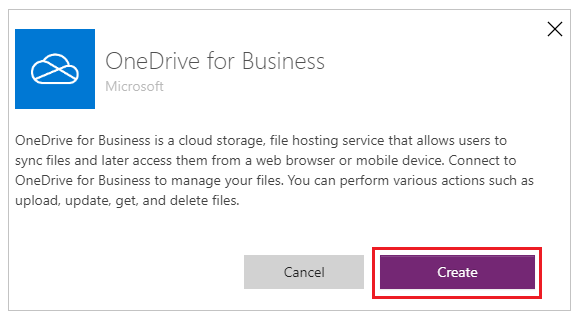
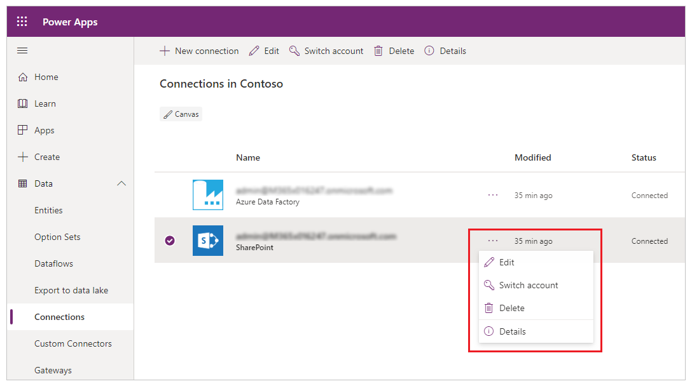
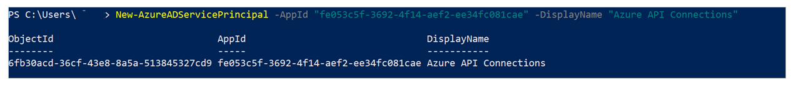
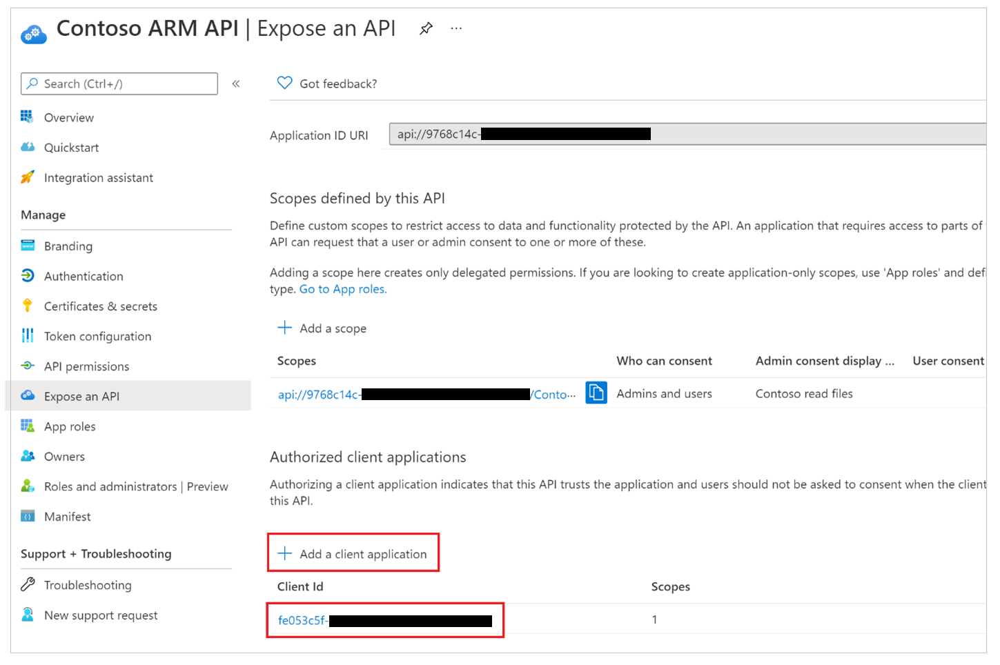
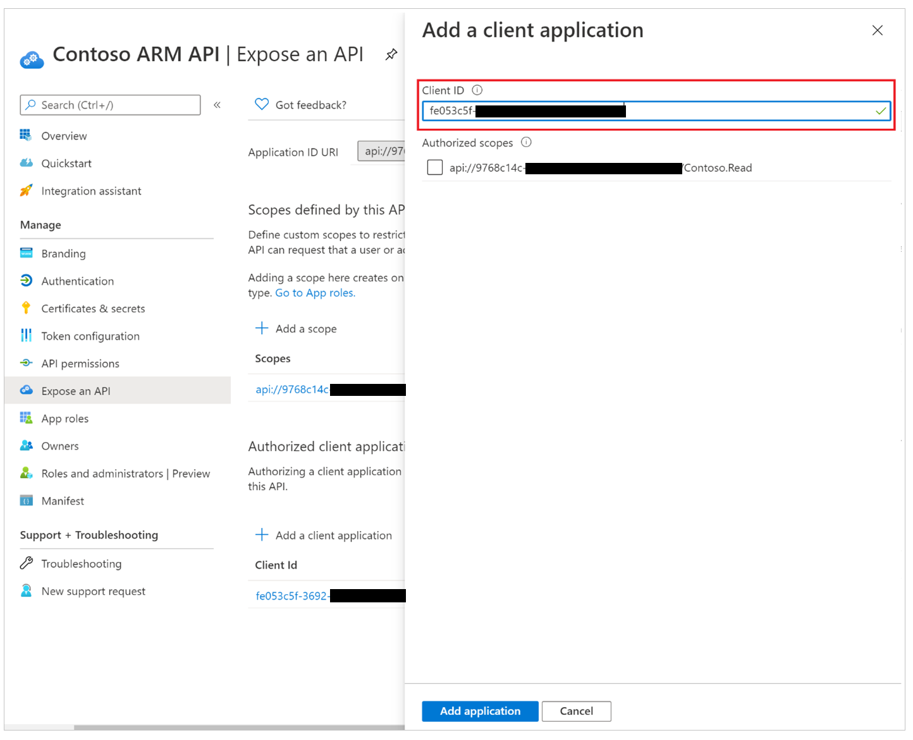
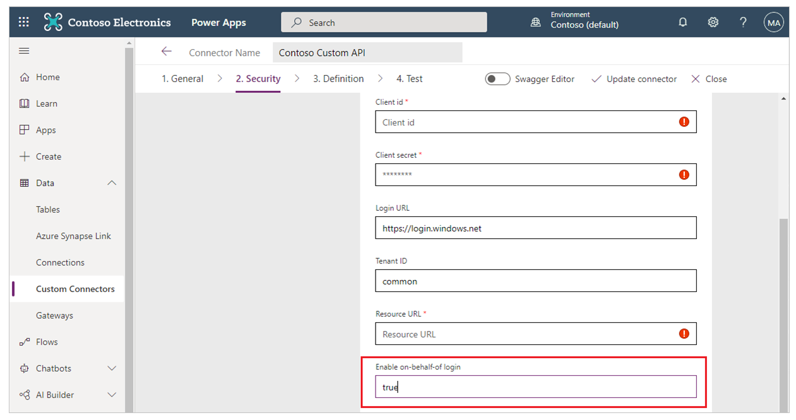

# Manage connections in canvas apps

In [powerapps.com](https://make.powerapps.com?utm_source=padocs&utm_medium=linkinadoc&utm_campaign=referralsfromdoc), create a connection to one or more data sources, delete a connection, or update its credentials.

Your canvas app's data connection can connect to SharePoint, SQL Server, Office 365, OneDrive for Business, Salesforce, Excel, and many other [data sources](connections-list.md).

Your next step after this article is to display and manage data from the data source in your app, as in these examples:

* Connect to OneDrive for Business, and manage data in an Excel workbook in your app.
* Update a list on a SharePoint site.
* Connect to SQL Server, and update a table from your app.
* Send email in Office 365.
* Send a tweet.
* Connect to Twilio, and send an SMS message from your app.

## Prerequisites
1. [Sign up](../signup-for-powerapps.md) for Power Apps.
2. Sign in to [make.powerapps.com](https://make.powerapps.com?utm_source=padocs&utm_medium=linkinadoc&utm_campaign=referralsfromdoc) using the same credentials that you used to sign up.

## Background on data connections
Most Power Apps apps use external information called **Data Sources** that is stored in cloud services. A common example is a table in an Excel file stored in OneDrive for Business. Apps are able to access these data sources by using **Connections**.

The most common type of data source is the table, which you can use to retrieve and store information. You can use connections to data sources to read and write data in Microsoft Excel workbooks, SharePoint lists, SQL tables, and many other formats, which can be stored in cloud services like OneDrive for Business, DropBox, and SQL Server.

There are other kinds of data sources that aren't tables, such as email, calendars, twitter, and notifications.

Using the **[Gallery](controls/control-gallery.md)**, **[Display form](controls/control-form-detail.md)**, and **[Edit form](controls/control-form-detail.md)** controls, it's easy to create an app that reads and writes data from a data source. To get started, read the article [Understand data forms](working-with-forms.md).

In addition to creating and managing connections in [powerapps.com](https://make.powerapps.com?utm_source=padocs&utm_medium=linkinadoc&utm_campaign=referralsfromdoc), you also create connections when you do these tasks:

* Automatically generate an [app from data](app-from-sharepoint.md), such as a custom SharePoint list.
* Update an existing app, or create one from scratch as [add a connection](add-data-connection.md) describes.
* Open an app that another user created and [shared with you](share-app.md).

> [!NOTE]
> If you want to use Power Apps Studio instead, open the **File** menu, and then click or tap **Connections**, [powerapps.com](https://make.powerapps.com?utm_source=padocs&utm_medium=linkinadoc&utm_campaign=referralsfromdoc) opens so that you can create and manage connections there.

## Create a new connection
1. If you haven't already done so, log in to [make.powerapps.com](https://make.powerapps.com?utm_source=padocs&utm_medium=linkinadoc&utm_campaign=referralsfromdoc).
2. In the left navigation, expand **Data** and select **Connections**.
   
    
3. Select **New connection**.
   
    
4. Select a connector in the list that appears, and then follow the prompts.
   
   
5. Select the **Create** button.
   
   
6. Follow the prompts. Some connectors prompt you to provide credentials, specify a particular set of data, or perform other steps. Others such as **Microsoft Translator**, don't.
   
   For example, these connectors require additional information before you can use them.
   
   * [SharePoint](connections/connection-sharepoint-online.md)
   * [SQL Server](connections/connection-azure-sqldatabase.md)

The new connector appears under **Connections**, and you can [add it to an app](add-data-connection.md).

## Update or delete a connection
In the list of connections, find the connection that you want to update or delete, and then select the ellipsis (...) on the right of the connection.



* To update the credentials for a connection, select the key icon, and then provide credentials for that connection.
* To delete the connection, select delete.
* Select the information icon to see the connection details.

## Manage the consent dialog appearance for custom connectors using Azure Active Directory OAuth

By default, when end-users launch Power Apps apps they’re presented a connection consent dialog before they’re able to access the app experience for the first time. It’s possible for admins to suppress this consent dialog for select connectors: Microsoft First Party connectors (like SharePoint, Office 365 Users) and custom connectors using OAuth.

### Suppress consent dialog for apps that use custom connectors using OAuth

To suppress consent dialog for apps created using Power Apps that connect through custom connectors using OAuth, follow the below steps.

#### Step 1. Provision Microsoft’s Azure API connections service principal in your Azure AD tenant

Microsoft’s Azure API connectors service is used by all Power Apps using connectors. Provisioning this service in your tenant is a prerequisite for your custom applications, and custom connectors to pre-authorize this service to exercise single-sign-on capabilities with your custom applications and allow Power Apps to suppress the consent dialog.

A tenant admin must run the following PowerShell commands:

```Powershell
 Connect-AzureAD -TenantId <target tenant id>
 New-AzureADServicePrincipal -AppId "fe053c5f-3692-4f14-aef2-ee34fc081cae" -DisplayName "Azure API Connections"
```

Example successful output:



#### Step 2. Pre-authorize Microsoft’s Azure API connections service principal in your Azure AD app
  
For each custom connector where consent is expected to be suppressed, authorize "Microsoft’s Azure API Connections" service principal to one of the scopes defined in your app.

The owner of the Azure AD custom application used by a custom connector must add the app ID “fe053c5f-3692-4f14-aef2-ee34fc081cae” to one of the application scopes. Any scope can be created and used for single-sign-on to succeed.

To set the scope using Azure portal, go to [Azure portal](https://portal.azure.com) > Azure Active Directory > App Registrations > Select the relevant app > Expose an API > Add a client application > Add the app ID “fe053c5f-3692-4f14-aef2-ee34fc081cae” to one of the application scopes.


  

  
#### Step 3. Grant admin consent the client third-party Azure AD app
  
For each custom connector using OAuth where consent is expected to be suppressed, an admin must use [Azure AD’s grant tenant-wide admin consent to an application](/azure/active-directory/manage-apps/grant-admin-consent).

> [!NOTE]
> Admins have granular control on which custom applications, and the corresponding custom connector consent may be suppressed.  

#### Step 4. Update custom connector in Power Platform to attempt single-sign-on
  
For each custom connector using OAuth where consent is expected to be suppressed, a user with edit permissions on the custom connector must change the "Enable on-behalf-of login" value to "true".
  
The owner of the custom connector must choose to edit the connector, go to the **Security** section, and change the value in **Enable on-behalf-of login** from "false" to "true".


  
#### Step 5. Admin configures consent bypass for the Power Apps app

In addition to the admin consent granted on a custom application in Azure AD, which is used by a custom connector, an admin must also configure an app to bypass consent. For each app where consent is expected to be bypassed an admin must run the following command:

 ```Powershell
  Set-AdminPowerAppApisToBypassConsent -AppName <Power Apps app id>
```

### Remove consent suppression for apps that use custom connectors using OAuth

To remove consent suppression for a custom connector, an admin must perform at least one of the following actions:

1. Remove the tenant-wide admin consent grant to the application in Azure: [Azure AD’s grant tenant-wide admin consent to an application](/azure/active-directory/manage-apps/grant-admin-consent).
1. Use the following Power Apps admin cmdlet to disable Power Apps’ attempt to suppress the consent dialog. [Clear-AdminPowerAppApisToBypassConsent](/powershell/module/microsoft.powerapps.administration.powershell/clear-adminpowerappapistobypassconsent)


[!INCLUDE[footer-include](../../includes/footer-banner.md)]
