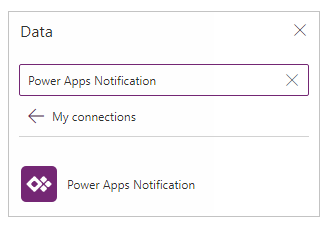
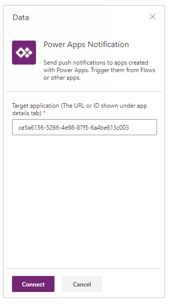
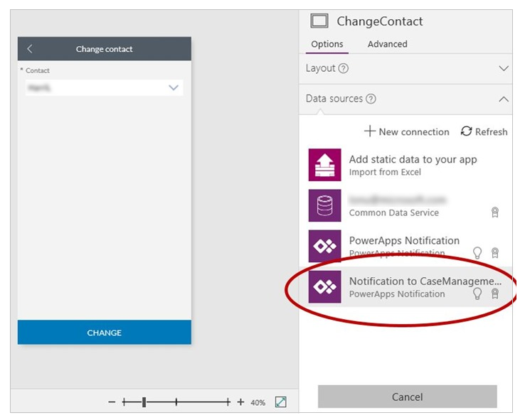
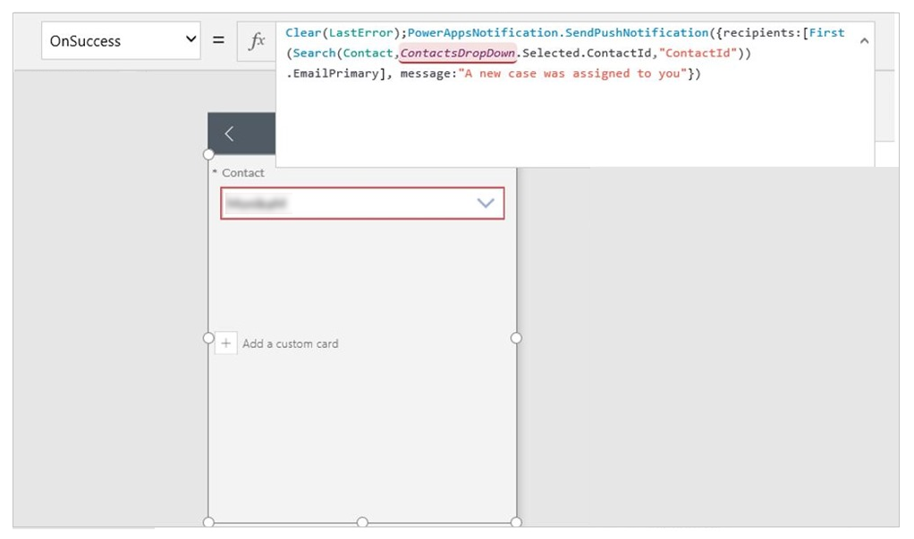

# Send notification from an app

You can send a push notification from one app to another or to the same app. In canvas apps, you can send notifications by using the Power Apps Notification connector.

In this article, the sample app used for notifications is built from the default **Case Management** app template.

> [!NOTE]
> Before you begin, create push notifications for the Power Apps mobile app. More information: [Create push notifications for the Power Apps mobile app](../../mobile/power-apps-mobile-notification.md).

1. In [Power Apps](https://make.powerapps.com?utm_source=padocs&utm_medium=linkinadoc&utm_campaign=referralsfromdoc), go to the app to which you want to send push notifications.

1. Copy the app ID. More information: [Get an app ID](get-sessionid.md#get-an-app-id)

1. In the left pane, select **Data** - **Connections**.

1. Edit the app. More information: [Edit an app](edit-app.md)

1. Select **View** - **Data sources**.

1. Select **Add data source**.

1. Select **New Connection**.

1. Select **Power Apps Notification**.

    

1. Paste the app ID copied from the previous step.

    

1. Select **Connect**.

1. Add the push notification connection to the trigger app using the similar steps.

    In our example, we use the same app as the trigger app. The user who reassigns the case also triggers a push notification to the new case owner.

    

1. From the push notification connection, call the **SendPushNotification** method.

    In our example, we trigger this notification by using the **OnSuccess** property in a form.

    


## Syntax

| Name | Description |
| --- | --- |
| SendPushNotification |Sends a push notification to the app that's specified in the connection settings for the notification. |

### Parameters

| Name | Type | Description |
| --- | --- | --- |
| recipients |String array, required |A list of: <ul> <li>Email addresses for users or security groups</li> <li>Object IDs for users or security groups in Azure Active Directory</li></ul> |
| message |String, required |The message body of the push notification. |
| openApp |Boolean, optional |Whether to open the app when the user taps the push notification. |
| params |Parameters, optional |Key-value parameters to pass with the notification. These can be further processed in the app to open a specific page and load a specific state. |

### Sample formulas
Send a basic notification.

```powerapps-dot
PowerAppsNotification.SendPushNotification(
	{
		recipients: ["f60ccf6f-7579-4f92-967c-2920473c966b", "72f988bf-86f1-41af-91ab-2d7cd011db47"],
		message: "A new case was assigned to you."
	}
)
```

Send a notification that opens an app and passes along specific parameters.

```powerapps-dot
PowerAppsNotification.SendPushNotification(
	{
		recipients: ["email1@contoso.com", "email2@contoso.com"],
		message: "message in the notif toast",
		params: Table({key:"notificationKey", value:"The value for notificationKey"}),
		openApp: true
 	}
)
```

### See also

- [Create push notifications for the Power Apps mobile app](../../mobile/power-apps-mobile-notification.md)
- [Power Apps Notification reference](/connectors/powerappsnotification/)


[!INCLUDE[footer-include](../../includes/footer-banner.md)]