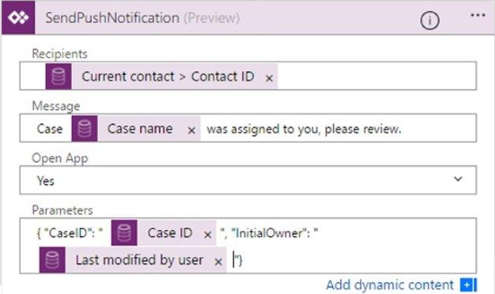
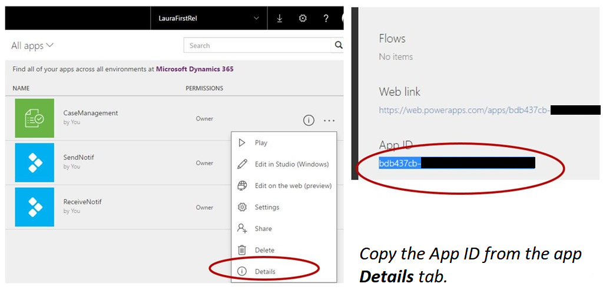
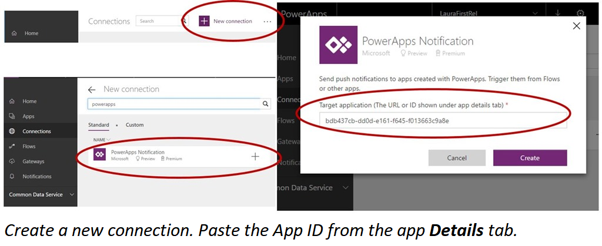

# Send a push notification in PowerApps
Push notifications are used in mobile apps for consumer and business scenarios primarily to engage app users and help them prioritize key tasks. In PowerApps, you can send notifications by using the PowerApps Notification connector. You can send native push notifications to any app that you create in PowerApps. We plan to add more notification types in the future.


Add a push notification to your app if:

* Your users need to know information immediately.
* Your users must complete important tasks by using your app, in a preloaded context.
* You want to engage your users on a specific interval, or you need users to enter the app in a specific context.

> [!NOTE]
> To receive push notifications, each user must have opened the app in PowerApps Mobile once or gotten the app from AppSource in [Dynamics 365](https://home.dynamics.com/).

## Before you start
In an app for which you have the **Contributor** permission, add a PowerApps Notification connection. If you don't already have an app, you can quickly [create one from a template](get-started-test-drive.md), and you'll have the required permission by default. That tutorial and this one use an app based on the Case Management template.

## Send a notification from a flow
> [!NOTE]
> If you trigger a push notification from a flow, you can send the notification to only one user or security group at a time currently.

1. In [Microsoft Flow](https://flow.microsoft.com), create a trigger that specifies when the push notification is sent.

    For example, you might want to send a notification when a record is added to the **Case** entity in the Common Data Service.

    
2. Create an action for the flow by using the **PowerApps Notification** connector, and enter the **App ID** of the app to which you want to send notifications.

    You can also rename the connection to reflect your scenario.

    
3. (optional) Pass parameters to the app when it opens (after the user taps the push notification).

    In our example, we pass along the **Case ID** and **Initial Owner** fields for the selected contact.

    

## Send a notification from an app
You can send a push notification from one app to another or to the same app.

1. In [PowerApps](https://web.powerapps.com?utm_source=padocs&utm_medium=linkinadoc&utm_campaign=referralsfromdoc), go to the app to which you want to send push notifications.
2. On the **Details** tab, copy the **App ID** of that app.

    
3. On the **Connections** tab, create a connection to the PowerApps Notification connector, and paste in the app ID from the previous step.

    
4. Add the connection to the trigger app.

    In our example, we use the same app as the trigger app. The user who reassigns the case also triggers a push notification to the new case owner.

    
5. From the push notification connection, call the **SendPushNotification** method.

    In our example, we trigger this notification by using the **OnSuccess** property in a form.

    

## Load a specific page and context when a user taps the notification
### Pass parameters
Your push notification can pass specific parameters to the app. For example, to read the **CaseID** value, use *Param("CaseID")*. To quickly identify this parameter, add a **Label** control to your app. Set the **Text** property of that control to **Param("CaseID")**. If the user opens the app from the **All apps** list, the value is empty. If the user opens the app from another location on the device, the value is populated with the **CaseID** value.

### Set the start page
You can set your app to open, for example, the **Case details** page as soon as the app opens:

1. Add a **Timer** control, and set its **OnTimerEnd** property to this formula:
   <br>**Navigate(EditCase, ScreenTransition.None)**
2. (optional) Hide the **Timer** control by setting its **Visible** property to **false**.
3. Set the **OnVisible** property of the screen to **Timer.Start()**.

> [!TIP]
> It's a good idea to create a unique first page in the app for the notification:
> 
> 1. Create an empty page that your app doesn't already open, add a **Text Input** control, and set its **timer.Duration** value.
> 2. When you create the app, set the timer to a non-zero value. When you're ready to publish the app, set the value to **0** to immediately trigger the timer.

## Syntax

| Name | Description |
| --- | --- |
| SendPushNotification |Sends a push notification to the app that's specified in the connection settings for the notification. |

### Parameters

| Name | Type | Description |
| --- | --- | --- |
| recipients |String array, required |A list of: <ul> <li>Email addresses for users or security groups</li> <li>Object IDs for users or security groups in Azure Active Directory</li></ul> |
| message |String, required |The message body of the push notification. |
| openApp |Boolean, optional |Whether to open the app when the user taps the push notification. |
| params |Parameters, optional |Key-value parameters to pass with the notification. These can be further processed in the app to open a specific page and load a specific state. |

### Sample formulas
Send a basic notification.

```
PowerAppsNotification.SendPushNotification(
{
  recipients: [""f60ccf6f-7579-4f92-967c-2920473c966b", 72f988bf-86f1-41af-91ab-2d7cd011db47],
  message: "A new case was assigned to you."
 }
)
```

Send a notification that opens an app and passes along specific parameters.

```
PowerAppsNotification.SendPushNotification(
{
  recipients:["email1@contoso.com", "email2@contoso.com"],
  message:"message in the notif toast",
  params:Table({key:"notificationKey", value:"The value for notificationKey"}),
  openApp:true
 }
)
```

## Known limitations
* Currently, notifications aren't displayed on PowerApps Mobile for Windows Phone.
* Currently, we don't provide push notifications for users who run apps only in a web browser.
* Notifications show the generic PowerApps icon instead of a specific app icon.
* When you use Microsoft Flow, you can send a push notification to only one recipient at a time.

For reference information, see [PowerApps Notification reference](https://docs.microsoft.com/connectors/powerappsnotification/).

