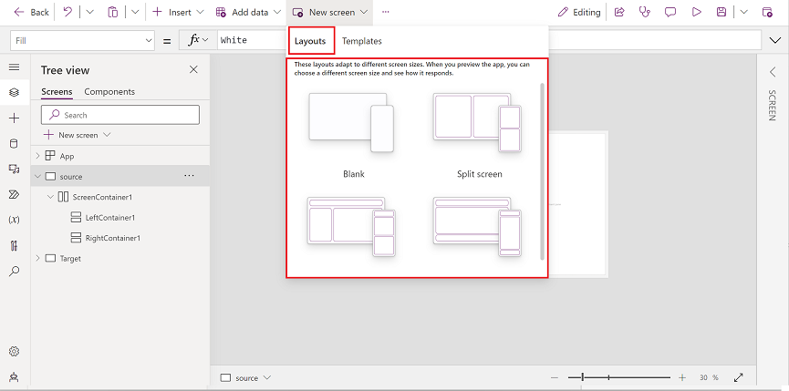

# Add a screen using screen layouts

When you add a new screen, you can choose from various screen layouts and [templates](./screen-templates/calendar-screen-overview.md). When the **[Scale to fit](create-responsive-layout.md#disable-scale-to-fit)** option is turned off, the screen layout of the app adapts to the size of the device's screen it is being run on.

> [!div class="mx-imgBorder"]
> 

## Add a new screen

1. Sign in to [Power Apps](https://make.powerapps.com?utm_source=padocs&utm_medium=linkinadoc&utm_campaign=referralsfromdoc).
2. Create a canvas app in tablet format. 
3. In Power Apps Studio, on the command bar, select **New screen** and then select a screen layout.

When you're done, you can preview the app and see how the app displays on different devices. More information, see [Preview an app](preview-app.md).

## Reorder screens

When you have more than one screen, you can reorder them.

In the left pane, hover over a screen that you want to move up or down, and then select **Move up** or **Move down**.

> [!NOTE]
> Use the **[StartScreen](/power-platform/power-fx/reference/object-app#startscreen-property)** property set which screen will be displayed first.

## Add navigation

When you create a canvas app with multiple screens, you can add navigation so your users can navigate between screens.

1. With the screen selected, select **Insert** and in the search box type **Next arrow** and then select it.

2. (optional) Move the arrow so that it appears in the lower-right corner of the screen.

3. With the arrow selected, set the **[OnSelect](controls/properties-core.md)** property to the **Navigate** function.

    

    When a user selects the arrow, the **Target** screen fades in.

4. On the **Target** screen, add a **Back arrow** icon, and set its **[OnSelect](controls/properties-core.md)** property to this formula:

    `Navigate(Target, ScreenTransition.Fade)`

   > [!NOTE]
   > In the formula above where it says **Target** enter the name of the screen that you're navigating to. 

## More information

[Screen-control reference](controls/control-screen.md)

[!INCLUDE[footer-include](../../includes/footer-banner.md)]

